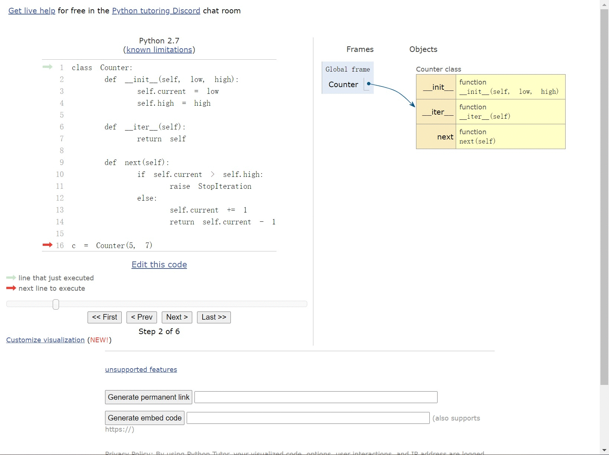

> Cpython虚拟机学习笔记系列  
> 油管视频：[CPython internals: A ten-hour codewalk](https://pg.ucsd.edu/cpython-internals.htm)  
> github博客：[zpoint/CPython-Internals](https://github.com/zpoint/CPython-Internals)  
> github源码：[python/cpython](https://github.com/python/cpython)  

## 继承与元类

在日常的编码中，经常会使用到继承，但是可能很少会用到元类。不过实际上这个概念在大多数面向对象的语言中都存在，比如在Java中就有Class类型，用于保存一个类型的信息，使用时可以通过反射拿到Class并且直接新建对象，这为Java增添了许多灵活性。

在Python中则更进一步，在Python语言中，一切内容都是对象，那么类定义本身肯定也是对象。再加上Python是一种动态语言，它提供了非常方便的方式动态创建新类，比如像下面这样：

```python
new_class = type("new_class", (), {"message": lambda self: "hello world"})
x = new_class()
print x.message()

output:
hello world
```

我们就动态的创建了一个叫new_class的类，其中有一个叫message的方法，返回了"hello world"的信息。这个类和平时定义的类一样，都可以直接实例化，并且调用它的函数，但是似乎这有点多此一举，相比继承元类有哪些好处呢？

### 用元类实现策略模式

策略模式是一种常见的设计模式，如果使用继承的方式实现，那么通常会需要使用一个映射表来保存策略和其对应的处理类，或者由每个类自己去注册，但是更进一步的话，使用元类可以让整个流程变得更加优雅：

```python
class StrategyFactory:
    strategy_map = {}

    @classmethod
    def register(cls, name, obj):
        cls.strategy_map[name] = obj

    @classmethod
    def get(cls, name, *args, **kwargs):
        return cls.strategy_map[name](*args, **kwargs)


class StrategyMeta(type):
    def __new__(mcs, what, bases=None, attrs=None):
        new_class = super().__new__(mcs, what, bases, attrs)
        StrategyFactory.register(what, new_class)
        return new_class


class Pet(metaclass=StrategyMeta):
    def __init__(self, name):
        self.name = name


class Cat(Pet):
    def call(self):
        print(f"{self.name}: miao miao")


class Dog(Pet):
    def call(self):
        print(f"{self.name}: wang wang")
```

这一段代码中我们创建了一个策略仓库、策略元类还有几个宠物类型，其中元类简单地使用了类名作为策略名称并且注册到策略仓库中。这样，我们可以不用写任何一个if来实现策略模式，比如我们希望生成一个名字是candy的猫并让她叫一声：

```python
StrategyFactory.get('Cat', 'Candy').call()

output:
Candy: miao miao
```

### 框架中的元类

> 元类就是深度的魔法，99%的⽤户应该根本不必为此操⼼。  
> 如果你想搞清楚 究竟是否需要⽤到元类，那么你就不需要它。  
> 那些实际⽤到元类的⼈都⾮常 清楚地知道他们需要做什么，⽽且根本不需要解释为什么要⽤元类。  
> —— TimPeters  

其实元类最多的用途在于编写框架，比如Django框架里的ORM定义方式：

```python
class Person(models.Model):
    name = models.CharField(max_length=30)
    age = models.IntegerField()
```

当你创建一个Person对象并且获取age时，系统将返回给你一个int对象，而不是models.IntegerField对象。并且框架同时还可以完成关联字段绑定、生成migration等一系列操作，Django通过复杂的元类定义让整个api变得非常简单易用。

## 探寻类定义

我们编写一段简单的代码来研究Python定义类的过程：

```python
class Counter:
    def __init__(self, low, high):
        self.current = low
        self.high = high

    def __iter__(self):
        return self

    def next(self):
        if self.current > self.high:
            raise StopIteration
        else:
            self.current += 1
            return self.current - 1

c = Counter(5, 7)
```

首先，和之前一样使用[Python Tutor](http://www.pythontutor.com/visualize.html#mode=display)进行可视化分析：



在第一步定义了Counter这个类之后，全局变量中新增了一个同名变量，并且包含了定义在类中的三个方法。由于这个可视化工具是代码层级的，并没有深入类创建的细节，可以在后面的源码分析中看到这部分。

然后定义一个Counter对象的实例，这里实际上直接进入了\__init\__方法，并且初始化了两个self的成员变量。最后\__init\__方法调用结束，实例创建完毕，并且赋值给了变量c。

### 类与实例的绑定关系

在上面的分析中，可以很明显的看到类定义中的两个方法是不在实例中的，并且实例中的两个成员也不出现在Counter类定义里面。关于类和实例的绑定关系，在Python官方文档中有详细的说明：[Python Document - Classes](https://docs.python.org/3/tutorial/classes.html)。

官方文档中前面大段的内容都在描述Python中作用域相关的问题，简单做下翻译和总结，有几个要点：

1. Python中的变量、方法等内容都会被命名空间包裹，比如可以使用模块名.方法名来调用某个方法
2. Python中的代码块和命名空间并不是一致的，在代码执行时可以动态地给某个命名空间增加变量和方法等信息
3. 当某个变量或者方法在当前命名空间不存在时，会向外层命名空间查找对应内容
4. 类也是一种特殊的命名空间，挂在在模块之下；实例也是一种特殊的命名空间，挂在在类之下

通过这样的设计，python实现了面向对象的诸多特性，比如继承、多态等等，从而让python变成一种面向对象语言。

### 再看bytecode

有了上面的知识，我们再来看类定义部分的字节码：

```bash
  1           0 LOAD_CONST               0 ('Counter')
              3 LOAD_CONST               5 (())
              6 LOAD_CONST               1 (<code object Counter at 0x7f79def34930, file "TEST/class.py", line 1>)
              9 MAKE_FUNCTION            0
             12 CALL_FUNCTION            0
             15 BUILD_CLASS
             16 STORE_NAME               0 (Counter)

 16          19 LOAD_NAME                0 (Counter)
             22 LOAD_CONST               2 (5)
             25 LOAD_CONST               3 (7)
             28 CALL_FUNCTION            2
             31 STORE_NAME               1 (c)
             34 LOAD_CONST               4 (None)
             37 RETURN_VALUE
```

这一段字节码中最重要的部分就是BUILD_CLASS和CALL_FUNCTION，虽然CALL_FUNCTION在上一章节已经讲过，但是这次会进入该方法的另一个分支调用。

### BUILD_CLASS

上面的字节码其实只有两个部分：创建一个类和创建一个类的实例，我们先来看创建类的过程：

1. 读取字符串常量：Counter；读取一个空白的Tuple常量；读取一个代码块常量
2. 从代码块常量创建一个方法并调用
3. 创建一个类对象并保存到名字是Counter的变量中

```cpp
case BUILD_CLASS:
    u = TOP();
    v = SECOND();
    w = THIRD();
    STACKADJ(-2);
    x = build_class(u, v, w);
    SET_TOP(x);
    Py_DECREF(u);
    Py_DECREF(v);
    Py_DECREF(w);
    break;
```

BUILD_CLASS方法一共有三个参数，和前面使用type来创建一个类的参数相同，分别是：methods、bases和name，调用build_class方法获取结果之后放入栈中。

#### build_class方法

这段代码用于创建一个类对象，当然这里还是以PyObject的形式返回的。

```cpp
static PyObject *
build_class(PyObject *methods, PyObject *bases, PyObject *name)
{
    PyObject *metaclass = NULL, *result, *base;

    if (PyDict_Check(methods))
        metaclass = PyDict_GetItemString(methods, "__metaclass__");
    if (metaclass != NULL)
        Py_INCREF(metaclass);
    else if (PyTuple_Check(bases) && PyTuple_GET_SIZE(bases) > 0) {
        base = PyTuple_GET_ITEM(bases, 0);
        metaclass = PyObject_GetAttrString(base, "__class__");
        if (metaclass == NULL) {
            PyErr_Clear();
            metaclass = (PyObject *)base->ob_type;
            Py_INCREF(metaclass);
        }
    }
    else {
        PyObject *g = PyEval_GetGlobals();
        if (g != NULL && PyDict_Check(g))
            metaclass = PyDict_GetItemString(g, "__metaclass__");
        if (metaclass == NULL)
            metaclass = (PyObject *) &PyClass_Type;
        Py_INCREF(metaclass);
    }
    result = PyObject_CallFunctionObjArgs(metaclass, name, bases, methods,
                                          NULL);
    Py_DECREF(metaclass);
    if (result == NULL && PyErr_ExceptionMatches(PyExc_TypeError)) {
        ...
    }
    return result;
}
```

代码的核心内容在于创建类对象的过程，其中用于创建类对象的只有一行：

> result = PyObject_CallFunctionObjArgs(metaclass, name, bases, methods, NULL);

即通过调用metaclass来创建一个类对象，传入的参数与使用type创建新的类对象时一致，接下来就是如何寻找元类信息了，有这么几种情况，按优先级列举：

1. 如果有直接定义的元类，那么直接使用
2. 如果有父类，那么找到父类的元类作为当前类的元类
3. 如果都没有那么找全局变量中的元类，最后用PyClass_Type进行兜底

### CALL_FUNCTION

这个方法在上一章节就遇到了，如果不熟悉的朋友可以再去看一下上一篇博客，这里重提是由于在创建类的实例对象的时候，再次用到了这个opcode，不同的是，这次会进入方法的另一个分支：

```cpp
static PyObject *
call_function(...)
{
    ...
    if (PyCFunction_Check(func) && nk == 0) {
        ...
    } else {
        ...
        if (PyFunction_Check(func))
            x = fast_function(func, pp_stack, n, na, nk);
        else
            x = do_call(func, pp_stack, na, nk);
        READ_TIMESTAMP(*pintr1);
        Py_DECREF(func);
    }
    ...
}
```

由于类不是PyCFunction，也不是PyFunction，这里会进入判断的最后一个分支，调用do_call方法。

#### do_call方法

这个方法和fast_call方法为什么要这么命名就不太清楚了，但是从名字上并不能看得出来这两个方法究竟是干什么的，还得从源码来分析：

```cpp
static PyObject *
do_call(PyObject *func, PyObject ***pp_stack, int na, int nk)
{
    PyObject *callargs = NULL;
    PyObject *kwdict = NULL;
    PyObject *result = NULL;

    if (nk > 0) {
        kwdict = update_keyword_args(NULL, nk, pp_stack, func);
        if (kwdict == NULL)
            goto call_fail;
    }
    callargs = load_args(pp_stack, na);
    if (callargs == NULL)
        goto call_fail;
#ifdef CALL_PROFILE
    /* At this point, we have to look at the type of func to
       update the call stats properly.  Do it here so as to avoid
       exposing the call stats machinery outside ceval.c
    */
    if (PyFunction_Check(func))
        PCALL(PCALL_FUNCTION);
    else if (PyMethod_Check(func))
        PCALL(PCALL_METHOD);
    else if (PyType_Check(func))
        PCALL(PCALL_TYPE);
    else if (PyCFunction_Check(func))
        PCALL(PCALL_CFUNCTION);
    else
        PCALL(PCALL_OTHER);
#endif
    if (PyCFunction_Check(func)) {
        PyThreadState *tstate = PyThreadState_GET();
        C_TRACE(result, PyCFunction_Call(func, callargs, kwdict));
    }
    else
        result = PyObject_Call(func, callargs, kwdict);
 call_fail:
    Py_XDECREF(callargs);
    Py_XDECREF(kwdict);
    return result;
}
```

这里主要是针对参数的初始化和调用数量的记录，核心调用代码是：PyObject_Call，这部分代码在Objects/abstract.c中：

```cpp
PyObject *
PyObject_Call(PyObject *func, PyObject *arg, PyObject *kw)
{
    ternaryfunc call;

    if ((call = func->ob_type->tp_call) != NULL) {
        PyObject *result;
        if (Py_EnterRecursiveCall(" while calling a Python object"))
            return NULL;
        result = (*call)(func, arg, kw);
        Py_LeaveRecursiveCall();
        if (result == NULL && !PyErr_Occurred())
            PyErr_SetString(
                PyExc_SystemError,
                "NULL result without error in PyObject_Call");
        return result;
    }
    PyErr_Format(PyExc_TypeError, "'%.200s' object is not callable",
                 func->ob_type->tp_name);
    return NULL;
}
```

这里通过传入的func找到了对应类型信息，再调用对应的tp_call变量：func->ob_type->tp_call，然后直接调用了对应的方法。

### 找到PyClass_Type，破解答案

PyClass_Type属于PyTypeObject类型，在includes/typestruct.h中定义了PyTypeObject，由于成员众多，这里只列出了和本次议题相关的内容：

```cpp
typedef struct _typeobject {
    /* More standard operations (here for binary compatibility) */
    ternaryfunc tp_call;
    /* Attribute descriptor and subclassing stuff */
    newfunc tp_new;
} PyTypeObject;
```

上面有两个方法tp_call和tp_new，分别是用于实例化和定义类时调用。PyClass_Type还有PyInstance_Type的定义都在Objects/classobject.c中，它们分别定义了所有类的类型信息和所有实例的类型信息：

```cpp
PyTypeObject PyClass_Type = {
    PyInstance_New,                             /* tp_call */
    class_new,                                  /* tp_new */
};

PyTypeObject PyInstance_Type = {
    instance_call,                              /* tp_call */
    instance_new,                               /* tp_new */
};
```

另外还有一个相关内容——PyType_Type，它定义在了Objects/typeobject.c中：

```cpp
PyTypeObject PyType_Type = {
    (ternaryfunc)type_call,                     /* tp_call */
    type_new,                                   /* tp_new */
};
```

结合上面的CALL_FUNCTION可以知道，根据对象类型信息的不同，会调用不同的方法：

1. 调用一个元类（type对象），会调用type_call方法
2. 调用一个类（class对象），会调用PyInstance_New方法
3. 调用一个实例（instance对象），会调用instance_call方法

因此，这三种不同的对象调用也产生了不同的结果：

1. 调用元类可以获得类
2. 调用类可以获得实例
3. 调用实例则是调用实例本身（这里比较拗口，可以理解为调用实例的\__call\__方法）

#### type_call方法

```cpp
static PyObject *
type_call(PyTypeObject *type, PyObject *args, PyObject *kwds)
{
    PyObject *obj;

    if (type->tp_new == NULL) {
        PyErr_Format(PyExc_TypeError,
                     "cannot create '%.100s' instances",
                     type->tp_name);
        return NULL;
    }

    obj = type->tp_new(type, args, kwds);
    if (obj != NULL) {
        /* Ugly exception: when the call was type(something),
           don't call tp_init on the result. */
        if (type == &PyType_Type &&
            PyTuple_Check(args) && PyTuple_GET_SIZE(args) == 1 &&
            (kwds == NULL ||
             (PyDict_Check(kwds) && PyDict_Size(kwds) == 0)))
            return obj;
        /* If the returned object is not an instance of type,
           it won't be initialized. */
        if (!PyType_IsSubtype(obj->ob_type, type))
            return obj;
        type = obj->ob_type;
        if (PyType_HasFeature(type, Py_TPFLAGS_HAVE_CLASS) &&
            type->tp_init != NULL &&
            type->tp_init(obj, args, kwds) < 0) {
            Py_DECREF(obj);
            obj = NULL;
        }
    }
    return obj;
}
```

这个方法会找到类型的tp_new方法并进行调用，这也是tp_new唯一被调用的地方，即形成一个新的类定义时被调用。

#### PyInstance_New方法

```cpp
PyObject *
PyInstance_New(PyObject *klass, PyObject *arg, PyObject *kw)
{
    register PyInstanceObject *inst;
    PyObject *init;
    static PyObject *initstr;

    if (initstr == NULL) {
        initstr = PyString_InternFromString("__init__");
        if (initstr == NULL)
            return NULL;
    }
    inst = (PyInstanceObject *) PyInstance_NewRaw(klass, NULL);
    if (inst == NULL)
        return NULL;
    init = instance_getattr2(inst, initstr);
    if (init == NULL) {
        if (PyErr_Occurred()) {
            Py_DECREF(inst);
            return NULL;
        }
        if ((arg != NULL && (!PyTuple_Check(arg) ||
                             PyTuple_Size(arg) != 0))
            || (kw != NULL && (!PyDict_Check(kw) ||
                              PyDict_Size(kw) != 0))) {
            PyErr_SetString(PyExc_TypeError,
                       "this constructor takes no arguments");
            Py_DECREF(inst);
            inst = NULL;
        }
    }
    else {
        PyObject *res = PyEval_CallObjectWithKeywords(init, arg, kw);
        Py_DECREF(init);
        if (res == NULL) {
            Py_DECREF(inst);
            inst = NULL;
        }
        else {
            if (res != Py_None) {
                PyErr_SetString(PyExc_TypeError,
                           "__init__() should return None");
                Py_DECREF(inst);
                inst = NULL;
            }
            Py_DECREF(res);
        }
    }
    return (PyObject *)inst;
}
```

这段代码用于实例的创建，并且在实例创建之后调用了对应的\__init\__方法，这里还对\__init\__方法的返回值做了判断，即必须返回None，否则会报错。

#### instance_call方法

```cpp
static PyObject *
instance_call(PyObject *func, PyObject *arg, PyObject *kw)
{
    PyObject *res, *call = PyObject_GetAttrString(func, "__call__");
    if (call == NULL) {
        PyInstanceObject *inst = (PyInstanceObject*) func;
        if (!PyErr_ExceptionMatches(PyExc_AttributeError))
            return NULL;
        PyErr_Clear();
        PyErr_Format(PyExc_AttributeError,
                     "%.200s instance has no __call__ method",
                     PyString_AsString(inst->in_class->cl_name));
        return NULL;
    }
    /* We must check and increment the recursion depth here. Scenario:
           class A:
           pass
           A.__call__ = A() # that's right
           a = A() # ok
           a() # infinite recursion
       This bounces between instance_call() and PyObject_Call() without
       ever hitting eval_frame() (which has the main recursion check). */
    if (Py_EnterRecursiveCall(" in __call__")) {
        res = NULL;
    }
    else {
        res = PyObject_Call(call, arg, kw);
        Py_LeaveRecursiveCall();
    }
    Py_DECREF(call);
    return res;
}
```

这段代码用于调用一个实例，可以看到它直接查找\__call\__方法，如果不是None的话则进行调用。注释中还有一个很有意思的例子：由于如果实例没有\__call\__方法就会去找对应类的\__call\__方法，因此如果手动定义类A的\__call\__方法为A()，那么直接调用A的实例a()就会产生一个死循环，并且不会进入系统栈帧，而是会在instance_call和PyObject_Call中循环直到栈溢出。

#### 题外话：type和object

在python2中，如果不是显式继承object，那么就不会继承object。但是在python3中所有的类都默认继承于object，即object是所有类的基类。因此，由于type本身也是一个对象，所以type是object的实例。

从另外一个角度来说，type是所有类的元类，所有的类都是type的实例。因此，由于object本身也是一个类，所以也是type的实例。这里就会产生一个有趣的问题——先有鸡还是先有蛋（即先有type呢，还是先有object），并且使用isinstance来进行判断的话不管谁先谁后结果都为True。

```python
isinstance(object, type)
isinstance(type, object)
issubclass(type, object)
issubclass(object, type)

output:
True
True
True
False
```

## 结语

由于最近工作忙起来了，也没有太多的时间深入研究了，目前为止python虚拟机的三个重要部分已经看的差不多了：虚拟机运行的基础逻辑、方法调用链条、类和实例创建，接下来如果有时间的话，还有一些有兴趣的话题可以深入：

1. 内存管理模型和GC方式
2. 多线程运行的逻辑和GIL
3. 迭代器和生成器的实现

算是挖了几个坑，未来有机会再来填。