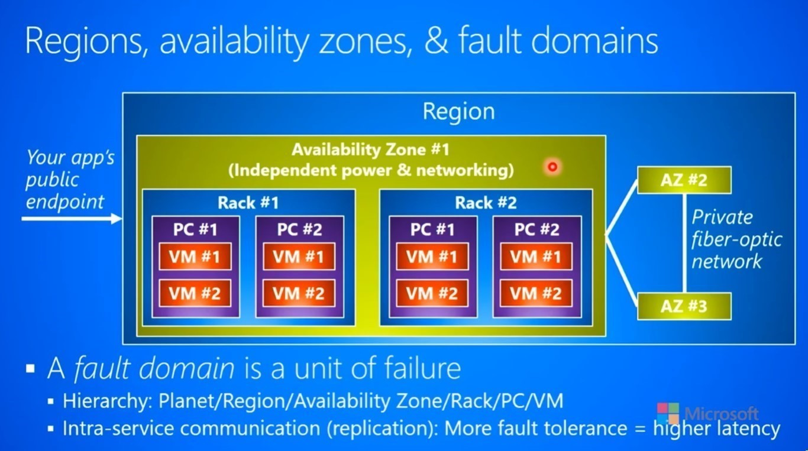
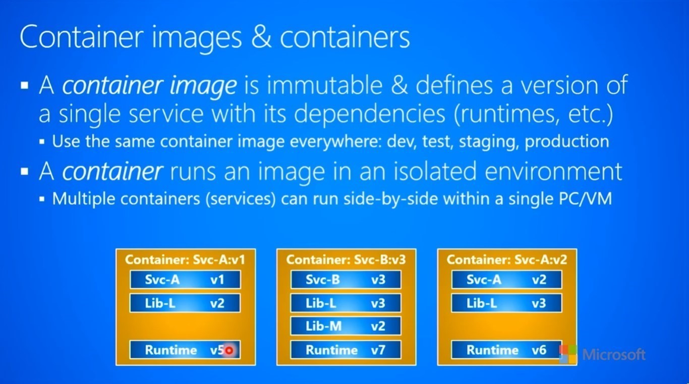
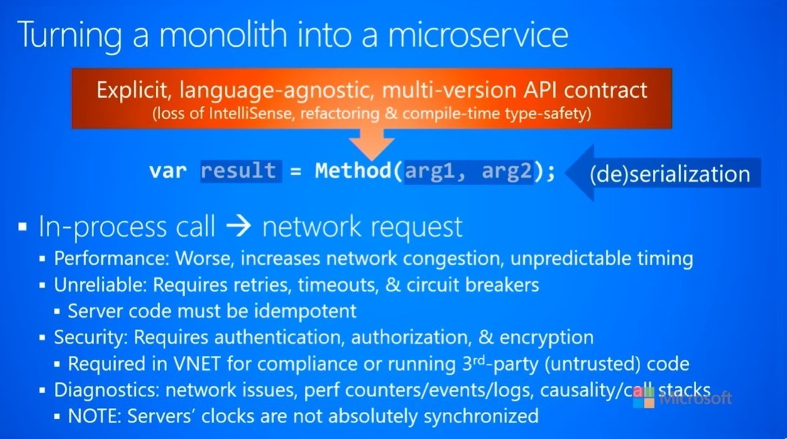

> 本篇主要内容来自于油管系列视频课程：[Architecting Distributed Cloud Applications](https://www.youtube.com/playlist?list=PL9XzOCngAkqs0Q8ZRdafnSYExKQurZrBY)  
> 主要包含：基础认知、微服务、容器、网络、消息、服务更新、领导选举、数据存储等内容

## 分布式云服务

### 基础认知

#### 为什么要使用云服务

| 特点 | 过去 | 现在 |
| --- | --- | --- |
| 客户端 | 企业/内网 | 公共/互联网 |
| 业务量需求 | 稳定（少量） | 动态（少量->大量） |
| 数据库 | 单节点 | 多节点 |
| 运维手段 | 人力（贵） | 自动化（便宜） |
| 物理机 | 少量昂贵且专用的服务器 | 大量廉价的普通机型 |
| 故障 | 极少发生 | 非常容易发生 |
| 服务器掉线 | 灾难性的影响 | 正常（不是啥大事） |

上述表格列举了计算机软件在最近二十年发生的一些重要变化，举例说明：

1. 现代的系统需要面对成千上万的用户，并且在服务设计之初就需要考虑之后业务量的增长，因此从一开始就需要为吞吐量的扩容留下余地
2. 由于服务的客户可能遍布全球，数据库会从单节点或者私有化部署转到云上部署，变成多地多节点部署
3. 针对机器、网络、升级、部署等运维工作，由于云服务的存在，许多也可以自动化运行，不再需要人工参与
4. 当然这一切都是有代价的，以前可以默认假定机器极少出现掉线、崩溃的情况（尤其硬件不会轻易挂掉），但是现在必须把这些当成常见的情况来处理

由于上面的一些要求和变化，构建服务的时候，也必须和以前有不同的设计。比如在处理异常的时候，不能再简单地catch异常而不进行处理；需要允许服务崩溃，还要提供一整套应对措施，让服务可以自动重启。

#### 拥抱异常

一些可能会导致服务异常的情况：

1. 代码中没有catch的异常，导致服务宕机
2. 扩缩容导致没有足够的实例提供服务，或者请求到了没有完全启动的实例上
3. 服务升级时，代码没有完全兼容上个版本，请求被打到了两种不同的代码上，导致异常
4. 服务之间进行协作时导致异常，比如负载均衡和另一个服务不兼容产生bug
5. 物理打击：比如断网、断电；外部攻击：数据库被黑等以外情况

既然异常是一定会发生的，那么不如拥抱异常，假设服务宕机是经常发生的，从而需要做出不少习惯上的改变：

1. 编写的代码不能依赖硬件设施，在通用硬件环境下都需要可以运行
2. 当遭遇异常情况的时候，可以自动重试而不影响原有业务
2. 使用框架设计来解决单点故障，同时服务在发生异常的时候可以自动重启
3. 使用备用服务器来保障服务的可用性，当某些服务器宕机的时候，这些备用服务器可以立刻顶上

#### 资源编排服务（orchestrators）


**资源编排服务**：用于统筹管理一个计算机集群的组件或者框架。这里的计算机可以是物理机，也可以是虚拟机，资源编排服务通常会完成以下工作：

1. 管理计算机实例的生命周期，比如新建、初始化、销毁等
2. 管理网络系统，让同一个组内的实例可以相互访问，而不在一个组实例的即使是同一台物理机上，也无法访问
3. 提供监控服务，比如cpu、内存用量等，有的框架还可以提供监控相关的接口，用于自动化处理
4. 提供代码升级、部署、服务扩缩容服务，比如滚动升级代码、将两个非常消耗资源的服务在物理机层面分割等

随着时间的推移，资源编排服务和业务代码逐渐解耦，因此在大部分情况下，写代码并不需要去考虑资源编排服务的内容。另外，资源编排服务的存在也导致了开发和部署会在完全不同的环境中，代码会在本地电脑开发，然后通过资源编排服务部署到集群中。应该尽量保持两个环境的相似性，这样才可以减少服务上线之后出问题的概率。

#### 地域（regions）和可用区（availability zones）



由于全球化服务的需求，往往在不同的地方建立不同的区域级数据中心，因此地域是一个地点概念。可用区指的是在同一个地域内，会再独立架设电力、网络等设备，保障可用区之间相互独立，这样就不会形成地域单点故障。另外在同一个地域的可用区，一般会使用光纤高速网络连接，这样就保证了在一个地域内的服务响应速度。

举例来说，一个外部请求过来，最终要打到某一个具体的服务实例上。通常服务会部署在虚拟机（VM）上，虚拟机会运行在某个特定的物理机（PC）上，物理机又会在某一个机架（rack）上，一组机架可能会属于同一个可用区，多个可用区组成一个地域，然后所有的地域都在地球上。

因此，某个级别的东西挂了之后，它以及它的下层都不再能提供服务。从这个角度来说，地球就是最大的单点故障，如果某天地球boom了，那么所有的服务都不复存在了。

这里会引发容错率和延迟之间的取舍，比如同样的数据如果放在不同的虚拟机，但是在同一台物理机上，它们共享数据的时间成本很低，不过只要这台物理机挂了，那么这些数据就丢失了；同理，如果放在不同的物理机，但在同一个可用区，那么数据同步的成本就更高了，但同时容错级别就提高到了可用区级别。

### 微服务（micro-services）

#### 微服务示例


微服务架构与以往的大型复杂软件架构不同，它一般由许多相互协作的小型服务构成。上图就是微服务架构的一个示例，图中由三个服务构成：web服务、库存服务和订单服务，由于不同服务的吞吐量要求不同，它们启动的虚拟机实例数量也不同。

另外微服务架构要求微服务之间不应该存在公共数据库，即每个服务都需要管理自己的数据库。因为一般来说每个服务会要求维护自己的数据库schema版本，甚至不同的数据库底层，比如有的服务使用sql数据库，而有的使用nosql数据库。这样进行数据迁移和升级的时候，每个服务仅需要考虑自身的数据需求即可，不存在外部依赖。

#### 迁移到微服务的好处


在服务建立初期，一般都使用一个巨大的服务来实现所有的功能，那么在什么时候应该考虑迁移到微服务架构呢？通常，微服务相对于传统软件架构会有**四个优势**，在考虑架构迁移的时候可以对照是不是当前软件架构遇到的瓶颈：

- 不同服务可能会有不同的吞吐量和延迟要求，划分成微服务之后，可以对单个服务进行扩缩容操作
- 对于不同的服务，可以使用完全不同的技术栈（比如一个使用node.js技术栈，另一个使用java技术栈）
- 不同客户的软件版本不同，但都需要使用一部分同样的功能，如果使用微服务的话就可以将这部分内容剥离形成一个独立服务
- 在同技术栈中也可以使用不同版本的类库，比如某些服务使用v1版本，另一些则使用v2版本的类库

但是，微服务也不应该被神话，有很多好处并不是微服务带来的，比如：

1. 微服务让代码跟简洁易读：这应该是通过oop或者其他的编码规范带来的，而不是微服务的好处
2. 微服务让每个服务的异常不影响其他服务：这并微服务的好处也并不能真正实现，比如用户认证服务异常了，那么所有与用户身份相关的服务都将失败，因为它们不知道用户的身份
3. 其他一些微服务不具备的规范：比如加速迭代、减少的bug率之类的需求，微服务都无法满足

#### SLA服务可用性的计算


在改造成微服务之后，对应SLA是有不利影响的，参照上面的表格，分别假设每个服务的SLA都是 $99.99\%$ 和 $99.999\%$ ，那么多个服务相互依赖的情况下，整体的SLA就会下降，最后的结果是：如果有n个有依赖关系的服务，那么最终的SLA分别是 $99.99^n\%$ 和 $99.999^n\%$ 。

#### 自动扩缩容


**自动扩缩容**：根据服务的负载不同，自动增加/减少虚拟机实例的数量，自动扩缩容一般会使用以下几种方法：

1. 如果在客户端和服务之间有一个消息队列的话，可以监控消息队列的长度，如果队列增长，那么扩容，如果队列空闲那么缩容
2. 如果在客户端和服务之间是一个负载均衡的话，可以监控各个虚拟机的cpu、内存用量情况，如果都处于繁忙状态，那么扩容，如果相对空闲那么缩容
3. 根据设定好的schedule来执行，比如在节日、日常和周末使用不同的虚拟机数量，但是这种情况需要格外小心，因为调整的结果可能和预期非常不符

#### 12条标准

引用自网站：[The Twelve Factors](https://12factor.net/)，这12条标准是构建微服务的一个参考标准，在这里不会深入每一条标准讲述，而只是介绍这12条标准内容和思想，为构建微服务作为参考：


第一条：使用统一的代码仓库，但是不同的服务之间不分享代码。  
第二条：每一个服务在部署时会自动带上自己依赖的类库，也就是说单个服务不应该依赖外部包，这保障了服务的独立性，会对开发、测试和部署都带来很多好处。  
第三条：不要将配置文件放到代码里，而是读取运行实例的环境变量。  
第四条：在处理另一个服务无响应的异常时，要使用容错方案，不能让当前服务轻易崩溃。  
第五条：严格区分build、release和run的流程，这条标准对三者做出了不同的定义：build——将代码和依赖一起打包并确定版本；release——将打好的包和环境变量绑定，形成镜像；run——把镜像放到执行环境中运行。  


第六条：微服务由一个或多个无状态的进程组成，它们之间也不应该共享数据，这一条是为了保障服务可以被随时停掉或者启动，而不会产生副作用。  
第七条：应该监听端口号，而不是特定的host地址，这样便于数据编排服务进行网络资源管理。  
第八条：非并发情况使用单进程，并发情况使用多进程，尽量避免多线程编程，因为多线程非常复杂也极容易出错。  
第九条：微服务进程应该可以快速销毁和重启，避免使用过于复杂的初始化和销毁代码。  
第十条：保持开发、测试和发布环境的相似性，从而减少环境问题。  
第十一条：开发时把日志打到stdout中，在正式环境里重定向到个文件中，并统一收集——也就是keep logging simple。  
第十二条：所有需要执行的命令行代码，都应该写到脚本中和代码一同发布，而不是手动登录线上机器执行，并且要在所有的环境中测试这些脚本。  

**标准总结**

如果深入理解这12条标准，其实就只有一个核心准则：make things simple，让开发、测试、部署的每一步都变得简单，微服务也应该是轻量级的，这样就方便每个步骤的执行，并且每一步都是代码层面可见的，没有附加的黑魔法。

### 容器（container）

#### 镜像和容器



**镜像**：一个镜像包含了某个版本的服务以及它所有的依赖类库，它本身是一个只读对象。
**容器**：独立运行镜像的环境，即可以装载和运行镜像并保障容器之间是相互隔离的。

使用镜像最大的好处在于每一个版本的服务都可以放置于镜像中，并且不同的镜像之间是相互独立的，因此可以方便地切换镜像的版本，从而进行服务的升级和降级。另外，多个镜像可以运行在同一台物理机或者虚拟机上，这为部署增加了更多的灵活性。

#### 隔离级别的选择


上面的图片将隔离级别分为三种：硬件级别、操作系统级别和资源级别。其中隔离级别最高的是物理机，不同物理机之间所有的东西都不共享，最低的是进程级别，它共享了所有内容，容器属于资源级别的隔离。

由于视频作者来自微软，因此特别介绍了微软的Hyper-V容器，它比虚拟机更轻量但是使用了独立的操作系统底层。在这之后微软又推出了WSL（Windows Subsystem for Linux），目前我也在使用WSL进行后端开发，另外最新版本地docker desktop也也可以使用WSL作为底层引擎。

#### 容器启动的流程


这里使用了Docker作为资源编排服务的例子，整个启动一个容器的过程分为几个步骤：

1. 从客户端发起命令：docker run Svc-A:v1
2. 服务端根据命令在本地镜像仓库中寻找 Svc-A:v1 对应的镜像，如果本地没有找到的话，则会去外部的镜像仓库中拉取镜像
3. 服务端找到镜像之后，会根据命令启动一个容器，并将 Svc-A:v1 的镜像载入到容器中运行

就像前面介绍的那样，资源编排服务还提供了资源监控，限制容器资源用量的功能，在docker中可以使用相关命令进行监控和限制。

#### 持续集成、持续交付、持续部署


现代的开发流程中，经常会遇到持续集成、持续交付和持续部署这几个词，这一整套流程大概是这样：

1. 首先需要一个公共的代码仓库和镜像仓库，开发人员将代码push到这个代码仓库中
2. 触发持续集成，持续集成的服务检测到代码更新，自动打包并生成镜像，完成后将镜像push到镜像仓库中
3. 触发持续交付，持续交付的服务开启一个小的集群，运行所有的单元测试和集成测试用例
4. 测试通过之后，再进入预发布环境测试，对于toC的服务而言，这可能是一部分线上机器和真实用户
5. 最后是持续部署，这里一般是手动执行的，因为会影响到所有的用户，必须确保万无一失才能执行

上面的任意一个步骤都有可能失败，只要任意一个步骤失败了，都会导致整体流程失败，此时必须检查失败的原因，修复之后重新执行整体流程。

## 网络（networking）

### 基础认知

#### 常见的8种误区

| 误区 | 实际上 |
| --- | --- |
| 网络是可靠的 | 必须在代码里捕获网络异常并重试 |
| 请求和本地一样没有延时 | 必须减少远程请求的调用次数 |
| 不需要考虑网络带宽 | 每次请求都需要考虑如何减少传递的数据 |
| 网络是安全的 | 在某些情况下必须使用加密传输 |
| 网络拓扑是不变的 | 延迟、带宽、机器ip等都会变化 |
| 有超级管理员可以管理网络 | 服务的配置可能是分散的，配置变更会导致服务不可访问 |
| 网络耗时可以不考虑 | 网络耗时会在整个请求时常中占到一定的比例 |
| 网络状态是稳定的 | 延迟、带宽等各种网络状态都随时可能会变化 |

集群内部网络并不是传统意义上的内网，其中的关键点在于：云端代码会运行在虚拟机上，而虚拟机又会在不同的实体机和可用区甚至不同的地域，因此网络的本身就是不可靠的，表格中的某些内容可能需要具体说明：

1. 由于服务之间的通信最后还是会落到某个物理连接上，而这些连接是共享的，因此服务之间减少传递的数据不仅仅是为当前服务考虑，也是为其他服务考虑
2. 对于集群来说，如果创建了一个内网环境，那么外部是无法访问内部的，但是由于第三方插件和第三方库的存在，内部的流量有可能被监听，那么所有的服务都不安全了
3. 网络拓扑会由于资源编排服务的自动调整而导致变化，比如某些虚拟机会由系统自动回收，这样它的ip地址就不可达了

#### 服务的注册与发现

以前，我们的服务总是在某台计算机上监听某个端口，因此通过ip和port就可以打到对应的服务上，但是在资源调配服务的框架下，服务的注册和发现会复杂的多：

- 一台实体机会启动许多的虚拟机，每个虚拟机中又可能启动多个服务，每个服务都会监听一个或者多个端口
- 许多服务可能监听同样的端口，为了保障服务的正常运行可能需要使用：路由表、SNAT/DNAT等技术，甚至直接修改客户端代码，但是最终的结果就是不停的加入新的黑魔法

再加上网络还有网卡、路由、DNS等等现有系统的掣肘，服务在网络上的注册、发现与通信远比想象中的复杂。另外，在此基础之上，还需要提供服务的自动扩容、缩容，服务的失败自动重启等功能，这就更增加了网络系统的复杂度。

**解决方案**

好消息是，现在可以通过反向代理来解决上面提到的这些问题。客户端可以记录反向代理的地址，并且将所有的请求打到反向代理上，再由反向代理负责转发，但是由于所有的请求都要经过反向代理，这就增加了整个服务的请求延迟，这个方案的本质是用系统延迟的代价换来了更好的可扩展性。

#### 正向代理和反向代理


**正向代理（Forward Proxies）**

正向代理是客户端的代理，有的时候也直接被称为代理，某些公司会提供一个统一的代理，这样公司内的所有机器流量都会经过这个代理，正向代理一般用于：

- 过滤用户请求，比如屏蔽某些网站，禁止访问
- 提供缓存服务、日志服务、监控服务
- 对服务端匿名访问（以代理的ip访问服务端），这个功能爬虫防止封禁会用的比较多

**反向代理（Reverse Proxies）**

反向代理是服务器端的代理，一般会提供以下功能：

- 向客户端提供一个稳定的入口，并将入口映射到对应服务上
- 负责负载均衡、服务选择或者A/B测试
- 提供跳板机服务、缓存服务、用户认证服务、流量计费服务
- 防御DDos攻击或者减少其影响

#### 集群内DNS服务


上图是一个使用了集群内DNS服务的例子，一个客户端请求进入集群，首先来到了负载均衡，负载均衡转交到了一台web服务器上，然后需要调用库存服务，但是由于资源编排服务的存在，库存服务的入口随时可能发生变化，因此引入集群内DNS服务，它的本质是一张映射表，把一个服务名称和它对应的地址映射在一起。有了DNS之后，就可以找到库存服务的反向代理地址了，然后请求就会由这个反向代理，转发到某一个具体的库存服务实例上，由这个实例处理这一次请求的内容。

在上述的流程中，有几个需要考虑的问题，主要还是和请求时发生错误有关：

1. 当web服务器的请求打到库存服务的时候，处理请求的实例可能会报错崩溃，此时DNS服务就需要知道这个变化，并且让这个实例从DNS中移除，并且web服务要重试该请求
2. 还有一种可能是库存服务正常处理了，但是返回的时候web服务器已经宕机，此时客户端的这次请求就已经直接失败了，客户端需要重试这次请求
3. 另外上面的设计中，集群内DNS本身是一个单点故障，它挂了会导致整个集群服务不可用；各个服务的反向代理也是一个单点故障，只要挂了它所代理的服务也就不可用了，因此这些服务也虽好设置多个实例来保障服务的可用性

#### 服务状态探针


如上图所示，对于某些反向代理来说，每个实例的状态是很重要的。比如负载均衡：为了避免请求打到压力过大甚至宕机的实例上，负载均衡必须知道每一个实例的状态，从而更好地转发请求。通常方案是每个实例都暴露一个专门用于检查服务健康状态的接口，由负载均衡定时检查这些接口的状态：

- 如果延迟过大，或者有503这样的错误，就需要减少或停止发往该实例的请求
- 如果实例没有响应，就需要将这个实例从可用的列表中删除，并向资源编排服务申请新的资源

### 远程函数调用

#### 从本地函数迁移到远程函数



在把一个大型复杂软件转化成众多微服务的过程中，需要把很多进程本地方法调用转化成远程函数调用，即通过网络调用另一个微服务的函数，在这过程中，许多事情都会发生变化：

1. 首先会丢失很多语言特性，原先的编译时异常会变成运行时异常，单元测试也不能像以前一样检查函数内部逻辑
2. 在调用的时候，会涉及到序列化和反序列化的过程，这就要求传递的数据必须支持序列化，另外序列化和反序列化的效率基本由框架决定，耗时可能会很严重
3. 相比进程内调用，远程调用本质上是不可靠的，比如：会受到延迟和掉线等网络的问题影响、有可能被监听或者被未授权的服务调用、报错的调用栈会非常难追踪等，这些都是需要做额外处理的

#### API版本控制


本质上来说，微服务是没有API升级的说法的，因为一旦API已经暴露给其他服务，任何的升级都必须保持向前兼容，比较推荐的做法是在调用的时候指明需要调用的API版本号。

另外，在做API版本变更的时候，一般都是需求、功能变化或者代码重构等情况导致，在这些情况发生的时候，必须和客户端用户做好沟通，指导他们更新代码配合API版本更新，同时明确新版API发生的变化，避免出现服务不可用的情况。

#### API设计建议

设计一个微服务API时，有几条基本的建议：

1. 定义明确的、跨语言可用的API，不能依赖于某种语言特性（因为远程调用可能是跨语言的）
2. 使用openapi或者swagger之类的API定义工具，自动生成各语言的客户端代码
3. 使用跨语言的数据结构定义框架，比如JSON/XML、Thrift等，另外可以考虑在数据结构中加入版本号

#### RPC封装的缺陷

千万小心封装后的远程调用，现实中已经存在了许多这样的标准和类库，根据之前对于网络的介绍，这些封装的类库大多数时候都不能解决以下问题：

- 处理网络异常问题，比如：重试、超时、无限递归调用等
- 处理语言之间变量类型差异问题
- 处理API版本控制问题
- 处理加密和认证问题
- 处理日志记录问题

#### Exactly-once语义

一般来说，在执行一个函数或者处理数据时，会有三种语义：

1. 最多一次（At-most-once）
2. 至少一次（At-least-once）
3. 精确一次（Exactly-once）

其中最常用也是最困难的就是最后一种：**精确一次**（Exactly-once），这种语义要求调用函数的效果是正好调用一次，这种语义并不是说函数仅调用一次并且保证不在任何环节出问题，而是包含了客户端和服务端两者的结合：

- 对于客户端：在分布式服务的环境中，是充满了失败和报错的，因此在遇到错误时必须重新请求，直到调用成功或者达到最大重试次数
- 对于服务端：由于客户端会不停地尝试，并且由于资源编排服务的存在，重试的请求很可能会打到不同的服务实例上，因此服务端必须保证该调用是幂等的，即多次调用都可以正确执行并且不会产生副作用

由此可见，Exactly-once语义并不是函数仅调用一次并且不出问题，相反分布式环境中充斥着各种异常，而它的实现方式就是客户端重试+服务端幂等的结合。

#### 常见的幂等处理

一般来说常见的操作就是增删改查（CRUD），其中除了新增以外，其他的方法都有比较好的幂等方案：

- 查询，不做额外操作的话天然是幂等的
- 修改，不管如何修改，最后一次的修改会被记录
- 删除，如果对应元素已经被删除，那么不做任何修改


问题在于新增数据的时候，容易出现多次请求导致新增多条数据的情况，因此引入**幂等设计模式**，一般包含三个步骤：

1. 客户端：获取一个唯一ID，可以由客户端生成或者客户端请求服务端获取
2. 客户端：将ID和需要执行的函数和参数同时发送到服务端，等待返回，失败的话重试
3. 服务端：检查ID是否存在、执行函数、将ID记录到日志中，这三个操作必须是原子的

有两个需要注意的操作，一是服务端的三个操作必须是原子的，否则可能出现执行报错但是把ID记录到日志中、或者多次执行的情况，就无法保证幂等性；另外一个是不要忘记定期清理服务端记录的ID历史，否则会导致历史无限增长，占用存储空间。

## 消息（messaging）

### 基础认知

#### 为什么要使用消息模式

原有请求-响应模式在分布式环境下有一些先天不足：请求可能会打到挂起或者繁忙的服务实例、当请求完成之后，客户端也可能会宕机或者被缩容。如果在系统中遇到了这些问题，并且难以解决的话，可以考虑切换为消息模式，消息模式会有以下好处：

**效率更高**

客户端不需要等待返回，只要消息队列返回插入成功即可；服务端更空闲的实例自动就会拉取更多任务，因此负载均衡效果也更好；客户端服务端不再需要与服务端直接交互，和消息队列交互即可。

**容错率更强**

服务端某个实例处理失败之后可以直接由另一个实例再次处理，不再需要客户端重试，但是消息模式下同样要求服务端处理消息时保持幂等性。

**扩缩容更容易**

直接监控消息队列的长度即可决定是否要进行扩缩容处理，不再需要周期探测和统计每个实例的状态。

#### 消息队列的使用


上图是一个使用了消息队列的分布式服务案例，可以通过这个案例来了解消息队列的应用方式，从客户端发起一个web请求开始：

1. 客户端发起请求后，由负载均衡分发到某个web服务上，这一步还是一个http请求，再打到某一个web服务实例上，假设是WS1
2. web服务调用服务A，这里改为发送一条消息到服务A的消息队列，服务A的三个实例都可以从消息队列拿到消息并处理
3. 服务A调用服务B，这里改为发送一条消息到服务B的消息队列，服务B的两个实例都可以从消息队列拿到消息并处理
4. 服务B处理完的结果再返回给服务A，同样发消息到服务A的消息队列处理，此时可能和上一次处理的并不是同一个服务A实例
5. 最后服务A将处理完的结果发送给WS1的消息队列，然后WS1接收到返回的数据，并返回给客户端

上面的设计中，只有web服务是每一个实例都有一条消息队列，这是因为web服务对接的客户端可能需要同步返回结果，此时就需要等待消息队列中出现请求对应的返回消息。让每个实例绑定自己的消息队列，就可以在扩缩容和web服务实例报错重启的时候，不需要做额外处理就可以让消息队列随着web服务实例重启。

相比原有的请求模型，消息队列模型在效率上有以下几个优势：

- 服务A不需要再等待服务B的返回，只需要将请求发送到服务B的消息队列中，就可以接着处理下一个请求，节约了等待返回的时间
- 如果服务A本身不需要对服务B的返回数据做处理，那么服务B就可以直接将结果发送到WS1的消息队列中，WS1就可以直接返回给客户端，这样流程更灵活也减少了一次网络开销
- 同时在服务层也不需要重试请求的代码了，因为直接交给了另一个消息队列，会由另一个微服务保证它能够被正确处理，当然了，web服务还是需要重试机制的

#### 高容错的消息处理


可以发现，在之前对于消息模式的介绍中，都要求每个微服务本身对消息可以进行高容错的处理，这里给出了一种高容错的消息处理方案：

- 给每一条消息新增一个字段：DequeueCount，用于标记该消息经历过几次弹出操作
- 当有一个实例拉取一条消息时，将该消息的DequeueCount + 1，并隐藏该消息一定时间（类似于重试请求等待的超时时间）
- 拿到消息的服务，检查消息的DequeueCount字段，如果大于某阈值，那么记录下这条消息和失败信息，并且标记消息处理结果为失败
- 如果服务正常处理完消息，没有任何报错或者异常，将该消息从消息队列中删除

#### 额外特性

一般而言，消息模式除了上面提到的好处之外，不少框架还可以支持一些额外特性：

**订阅者**

在订阅某个topic之后，该topic内的消息可以同时被多个订阅者接收，通过这个特性可以实现广播或者多实例任务处理。

**消息超时**

设置每一条消息的超时时间，在经过这个时间之后，消息会自动销毁，这可以避免在极端情况下消息队列无限增长。

**隐藏时间设置**

有些消息队列可以在运行中修改消息的隐藏时间，这给消息处理提供了很多便利，比如：可以设置一个很短的消息隐藏时间来减少延迟，但是在处理过程中周期性地增加隐藏时间，避免两个实例同时处理；另外，可以通过将隐藏时间设置成大于消息自动销毁的时间，从而实现At-most-once语义。


## 更新与配置（upgrade & Config）

### 服务版本控制

对于分布式云服务而言，有三种主要的服务升级方式，假设我们需要把服务从V1升级到V2，该服务一共有6个实例：

1. 直接升级，删除6个V1的服务实例，成功之后启动6个V2的服务实例，升级过程中服务不可用
2. 滚动更新，每次删除1个V1实例并启动1个V2实例，重复6次直到所有的实例都被替换，升级过程中能保持服务可用，但是吞吐量下降
3. 蓝绿部署，启动另一个有6个实例的V2集群，成功之后让负载均衡切一部分流量到V2集群，确认无误后切换所有流量并删除V1集群

#### 更新方式对比

对比三种方式的特性，可以形成如下表格：

| 特性 | 直接升级 | 滚动更新 | 蓝绿部署 |
| --- | --- | --- | --- |
| 额外消耗 | 无 | 无 | 升级时需要额外同等数量的机器 |
| 服务可用性 | 升级时不可用 | 可用，但吞吐量下降 | 完全可用（可用性不变） |
| 失败后恢复耗时 | 直到V1集群重新启动期间不可用 | 直到回滚完之前吞吐量下降 | 流量切换回V1集群后立刻可用 |
| V1和V2的对比测试 | 不可用 | 不可用（或者说实现非常复杂） | 可用 |
| 服务接口变化 | 无影响 | 需要两段式更新 | 无影响 |

当然，不同版本之间升级的内容都不同，也可以换用不同的升级方式，可以通过上面表格中的优缺点选择某一种升级方式。

#### 滚动更新的两段式更新

在滚动更新的时候，如果有API版本的变化，会存在这样的问题：V1版本的实例如果收到了V2版本的请求有可能会导致V1版本的实例直接崩溃，进而造成大面积宕机，这肯定是需要避免的。因此，引入了两段式更新：

1. 首先需要保证V2版本的服务也能发送/接收V1版本的参数，同时加入一个版本号，让每个实例知道应该使用哪个版本的接口
2. 刚开始整个集群都使用V1版本的接口，逐步更新所有实例到V2版本，更新完毕之后，统一切换成V2版本的接口
3. 再下一个更新中，将V1版本接口的兼容代码移除，达到平滑升级的目的

#### 版本对比测试

版本对比测试：在升级的时候，刚开始只让很小的一部分请求打到V2的服务上，让用户和内部QA确认没有问题之后，再进行大面积更新。这种测试在直接升级的方式下是不可用的，因为不存在V1和V2版本共存的时间，只在滚动更新和蓝绿部署的方案中可行。

但是，一旦API发生变化，在滚动更新时最好使用两段式更新来保障集群的可用性，在这种情况下V1和V2的接口也是不共存的，那么版本对比测试也失去了它的意义，即使不使用两段式更新，也需要在代码层面加入版本对比测试的相关代码，不仅复杂还很可能出各种问题。因此如果需要版本对比测试的话，一般都会选用蓝绿部署的方式，让负载均衡来控制请求的比例，并且在确认无误后由负载均衡全部切换到V2版本。

### 关闭和重配实例

#### 优雅地停止实例

在升级过程中一定会涉及到关闭实例的问题，当然可以选择直接通过资源编排服务删除实例，在12条标准里面就有说到要求微服务应该保障自己没有副作用，因此直接删除理论上不会有太大问题。

但是在直接升级和滚动更新这两种更新方式下，在删除实例的时候可能会有许多请求正在执行，这将导致大量的请求异常，因此还需要一种优雅的停止实例方案：

1. 服务维护一个原子变量，用于计数正在处理的请求数量，假设是RequestCount，初始化为1（收到请求时+1，完成请求后-1）
2. 当接收到系统的停止信号或者Ctrl-C信号之后，再次处理负载均衡的状态探针请求时直接返回服务异常代码，并且将RequestCount - 1，此后负载均衡不会再发请求到该实例
3. 当RequestCount变为0时，可以认为已经没有任何正在处理的请求，此时服务进程就可以结束了

注意，需要长时间处理的请求可能会影响关闭实例的速度，需要在发送停止信号之后执行一个定时关闭实例的操作，避免关闭实例花费过长的时间。

#### 处理服务配置

对于服务的配置信息的处理方式，需要注意以下几点：

1. 服务通过读取环境变量来获得对应的配置（这一条在12条标准中也有阐述）
2. 敏感信息不应该明文放在代码中，使用环境变量配置或者使用加密的方式保存
3. 如果只更新了配置，依旧需要重启服务并重新载入配置文件
4. 当回滚服务的时候，不要忘记回滚配置文件到对应版本

现在部分资源编排服务已经提供了配置更新的系统信号，从而实现更新配置不用重启服务的功能。不推荐使用这种方案，因为大多数时候配置信息会保存在系统的各种内存变量中，并不能保障整个实例原子级别地更新所有配置。

另外，如果有非常敏感的配置信息，可以将密文写在代码里，再把密钥保存到配置文件中，在启动实例的时候获取环境变量中的密钥解密后获取真实的配置信息，这样在任何地方都不会存在明文存储的敏感信息。

## 领导选举（leader election）

### 基础认知

#### 什么是领导选举

在某些场景下，服务的集群可能需要一个实例来执行特定任务，比如：

- 聚合所有实例的数据：在每天凌晨的时间，生成一个当天的服务状态报告
- 保存一些集群公用的数据，那么一般会需要某一个特定实例来保存和分发
- 某些任务只需要集群中的一个实例运行即可，多实例运行会浪费计算资源

由于在分布式服务的环境中，报错和崩溃时时刻刻都存在，因此不能通过直接指定一个实例来完成这些任务，在指定的实例宕机之后，必须快速地从集群中选择一台机器来执行之前的任务，这个过程就是领导选举。一般情况下，不应该手动地去写一个领导选举算法，如果需要，尽量选择已有的算法和框架去完成这一任务。

#### 通过租约选举

该算法基于一个数据库的原子操作，用一行数据作为一个租约，所有的实例争抢这个租约，由争抢到租约的实例执行任务，直到目标任务完成，下面的代码描述了这一过程：

```python
while not AskDb_ProcessIsDone():
    bool isLeader = RequestLease()
    if isLeader:
        ProcessAndRenewLease()
        TellDb_ProcessIsDone()
    else:
        delay()
```

从代码中可以看到，首先检查了任务是否完成，如果没有则尝试获取租约，然后分为两种情况：

- 拿到租约，那么执行任务并且不停刷新租约结束时间，任务完成后更新任务的状态
- 没有拿到租约，那么等待一段时间之后再次检查任务状态

假设有三个实例：s1、s2、s3，使用的数据库租约结构如下：

| work time | done | lease | lease expire |
| --- | --- | --- | --- |
| 2020-01-01 | false | None | None |

当s1实例争抢到租约之后，更新租约的状态，并且开始执行任务：

| work time | done | lease | lease expire |
| --- | --- | --- | --- |
| 2020-01-01 | false | s1 | false |

此时如果s1宕机，但是任务没有完成，那么等待一段时间之后，租约会过期：

| work time | done | lease | lease expire |
| --- | --- | --- | --- |
| 2020-01-01 | false | s1 | true |

然后其他实例开始新一轮争抢租约，假设由s3争抢到租约：

| work time | done | lease | lease expire |
| --- | --- | --- | --- |
| 2020-01-01 | false | s3 | false |

在s3完整地执行完任务之后，会更新租约中任务的状态，这样整个任务执行完毕了，其他实例也不会再争抢租约：

| work time | done | lease | lease expire |
| --- | --- | --- | --- |
| 2020-01-01 | true | s3 | true |

#### 通过消息队列选举

该算法使用消息队列来实现选举的过程，选举的目的和之前一致，也是执行一个任务，可以看下面的伪代码：

```python
while True:
    Msg msg = TryDequeueMsg()
    if msg is not None:
	    ProcessMsg()
	    DeleteMsg()
	else:
		delay()
```

整个流程和争抢租约的方式略有不同，需要执行一个任务的时候，把这个任务打包放到消息队列里，然后所有的实例从消息队列中拉取消息，由拿到消息的实例执行任务，并且在执行完毕之后删除该消息。

需要注意的是：获取消息时必须将消息隐藏，使其对其他实例不可见，防止多个实例同时运行一个任务，并且设置隐藏的时间，在隐藏时间超时后消息会自动恢复，防止任务执行失败后没有其他实例可以再次执行，这种技术已经在[消息队列](#额外特性)中介绍过。

### 相关算法

上面介绍的两种方案很容易就可以实现，但在某些复杂的场景下并不适用，而在业内对于分布式一致性问题已经有了一些成熟的算法，下面做一些简单的介绍。

#### Paxos

Paxos本质是一种分布式一致性协议，而不是领导选举方式，这种算法比较复杂，这里只简单介绍其最基本的流程：

1. 算法的目的是为了达成多个一致性提案，每个提案拥有一个递增且不互相同的提案号
2. 每个节点可以提出一个提案，也可能接受其他节点的提案，当接收的提案号小于等于本地最大提案号时，拒绝该提案，否则接受该提案
3. 当一个提案通过半数节点通过时，认为该提案通过，提出提案的节点将结果广播，并由其他节点各自确认合法性，最后形成一个一致的结果

另外在该算法的过程中如果每个节点都可以发起提案的话可能会导致活锁的问题（某种极端情况下会导致永久循环而无法达成一致），因此在改版的算法中引入了一个Leader，由Leader发布提案，其他节点来选择通过或者不通过。

#### Raft

由于Paxos的实现非常复杂，现在许多系统都会使用Raft算法来进行领导选举，Raft算法内部由一个状态机实现，每个节点都可能是三种状态之一：


- Follower状态，初始状态，并且当一段时间没有收到Leader的心跳包，那么切换到Candidate状态
- Candidate状态，选举过程中收到半数以上投票，那么进入Leader状态；收到新Leader的心跳或者新term则进入Follower状态
- Leader状态，需要定时给所有节点发送心跳包，当收到新term后则进入Follower状态

其中term指的是任期号，与Paxos中的提案号类似，也是一个递增的编号，整个选举会经历两个过程：

**发现集群中没有Leader**

即一段时间没有收到Leader的心跳包，那么认为集群中已经没有Leader了，此时增加自己的term，并向其他节点发起投票请求

**等待选举结果**

选举结果有三种可能性：

- 收到半数以上的节点确认给予投票，那么自己成为Leader，并开始发送心跳包
- 收到新的term或者来自其他节点的心跳包（需要判断心跳包的term是不是大于自己的term），那么成为Follower
- 等待一段时间后，该轮选举依然没有形成结果，也没有新的Leader产生，此时其他节点可能也已经超时，会进入新一轮的选举，如果不加限制极端情况下可能陷入无限选举，因此Raft增加了一个随机等待机制，一般为150-300ms，这样就可以让各节点的超时时间错开

Raft算法相比Paxos提供了更明确的分工，并且算法也更好理解，目前有很多开源实现。这种算法对Leader采取了完全信任的态度，并且也信任了Leader到每一个实例之间的通信，因此是不能解决拜占庭将军问题的。

## 数据存储

### 基础认知

#### 考量范围

构建一个有很强可靠性和可扩展性的有状态服务是一个非常大的挑战，它比无状态服务要更难以处理，需要考虑问题有很多：

- 数据规模和传输速度要求
- 数据分组、副本、一致性和安全性问题
- 容灾、备份/恢复、存储价格、管理权限问题
- ……

因此，不推荐自建数据库，尽量使用现有已经被广泛采用的数据库框架。在选取框架的时候，需要根据服务要求的业务量和特点来选取，尽量使用多实例的部署方式，避免单节点部署。

#### 冷热数据


并不是所有的数据都拥有一样的重要性和热度，因此提出了冷热数据的概念，不同数据的对比如上图，举例来说：缓存就是一种最热的数据，它速度极快，丢失对数据安全没有任何影响；而用户大量的行为、点击、日志数据则可以作为冷数据保存。

冷热数据可以放在不同的存储设备上，从而减少存储的开支，另外许多重要的数据也需要定期放到冷数据中进行备份，这样出问题的时候可以及时恢复到热数据的存储中。

#### 用缓存来加速


上图是一个请求的执行图，图中每一个箭头都是一个请求，为了加快无状态服务到数据库的请求，一般会在无状态服务上加入一个缓存，在一段时间内缓存部分数据库中的数据，这个行为的本质就是改变了原有数据库的热度，从而让它的访问更快。

#### 文件存储服务

文件存储服务可能是目前使用的最广泛的数据存储了，有的地方也被称为对象存储服务，一般的云服务提供商都会提供此类服务：

- 它可以存储文档、图片、视频、音频等诸多类型的文件
- 它很便宜，通常是基于存储量、带宽或者请求次数计费

**使用CDN加速**

CDN也是一种大多数云服务提供商都会提供的服务，主要用于对文件服务进行加速，比如数据中心位于四川，对于上海的用户就可以启动一个位置在上海的CDN服务，当请求到CDN服务器时，CDN会首先检查本地有没有对应资源，没有才会取数据中心拉取，资源也可以设定其过期时间，这样不仅可以为上海的用户加速，还可以减少数据中心的压力。

### 数据库框架

#### 关系型和非关系型数据库

关系型数据库：一般用于存储有关联关系的数据，大多数关系型数据库都对数据量有严格要求，如果需要更大的容量，就必须采取手动多实例部署的方案。另外，关系型数据库对运行的服务器也有一定的硬件要求，通常价格比较高。

非关系型数据库：不会关心数据之间的关联属性，上手成本也更低，一般对服务器没有什么要求，在扩展性、效率和价格上都有优势。但是，非关系型数据库一般不支持关系型数据库中的join操作，以及事务和原子性相关功能。

在未来几年甚至十几年里，这两种数据库都会同时存在，另外在一个服务中也是可以根据不同数据的需求部署不同的数据库的，下图展示了在微服务中使用两种数据库的不同架构：


如图，左侧是一个关系型数据库，所有的服务实例都访问同一个关系型数据库节点，在数据库中可以执行关联、排序、分组、统计等等操作，如果要扩容数据库，通常情况下也是选择升级更大更好的硬件，以满足更大的流量需求。

右侧是一个非关系型数据库，不同的数据可以被存储到不同的数据库节点上，在数据库中只负责最基本的CRUD操作。因为数据会保存在不同的节点里，对于数据的关联、排序等操作都需要在服务的实例上执行，但是好处是只要简单地增加数据库节点就可以对数据库进行扩容，并且成本更低。

#### 数据分片和副本

数据分片架构通常是整个系统设计中最复杂的部分，数据的分片通常基于两个基本的需求：

1. **数据量级**，对于少量的数据，可能一个单机的数据库就足够，但是对于非常大量的数据，就难免用到分片技术，在非关系型数据库中一般天然都支持分片技术
2. **数据速度**，这往往也会受到数据量级的影响，另外在吞吐量增大或者用户地域增加时，增加数据分片可以减少每个用户获取数据的时间

另外，在最初设计数据库和数据库结构的时候，就必须要考虑到以后的业务量级发展，尤其是数据模型，如果发现数据模型不能满足业务需求的时候，就必须对现有数据进行迁移。数据迁移可能导致业务下线，甚至不得不停机更新，对于不能停机的业务还需要执行在线数据迁移，这会使得数据迁移的复杂度大大增加。


在分布式环境中，报错和宕机是非常常见的，因此在处理数据问题时，需要考虑加入副本。例如，假设有三个副本正在运行，那么其中一个宕机时，剩下两个就可以进行领导选举，由其中一个对外提供服务。当然错误也可能是人为故意触发的，比如需要对服务进行升级或者缩容的时候，人为造成一个副本停机。

使用副本还可以加速数据的读取，因为有了多个副本，客户端可以从其中任意一个获取数据。不过这是有代价的，因为数据需要在副本之间进行同步，那么多副本情况下，要么提高写入数据的延迟，要么降低数据的一致性，这是必须要考量的。另外由于同步机制的存在，副本数量也不是越多越好，太多的副本数量会导致网络拥塞，甚至拖垮整个集群。

上图是一个由三个副本组成的数据集群的例子，当外部有一个写入请求进入时，对外提供服务的实例就必须同时对其他的副本进行写操作，当所有副本的写入都完成时，才可以对外返回完成，否则就会影响到集群内的数据一致性，但是这种做法也导致增加了写入延迟。

### 数据一致性

#### 强一致性：ACID

ACID是一个缩写，包含了：Atomicity、Consistency、Isolation、Durability，即原子性、一致性、隔离性和持久性。这个要求的本质是：一个事务发生之后，对于其他事务来说是瞬间完成的，不会有中间状态，如果事务失败也不会有其他副作用，事务完成后其影响也会被永久保留。

一般而言，这种一致性需要由分布式事务、全局的数据库锁等方式来实现，但是这些方式都会有很大的性能损失，并且容错性不高，比如使用全局锁的时候，遇到失败就必须要等到锁超时。

#### 弱一致性：BASE

BASE也是一个缩写，包含了：Basically Available、Soft State、Eventual consistency，即基本可用、软状态和最终一致性。这种一致性要求和强一致性不同，不要求时时刻刻都能保持一致性，而是要求数据库最终能达到一致的结果，因此也被称为最终一致性级别。

为了实现最终一致性，数据库不会在请求时强制要求同步，因此需要加入失败重试机制来保障每个请求都能被正确执行，这又对同步操作的幂等提出了要求，可以参考之前的内容：[常见的幂等处理](#常见的幂等处理)。由于系统只保证了最终是一致的，可能会出现有依赖关系的数据部分被更新的情况，此时代码需要处理这种问题（比如忽略部分更新的数据）并正确返回给客户端。

#### CAP理论

CAP是数据库三个维度的衡量标准，包含了：Consistency（一致性）、 Availability（可用性）、Partition tolerance（分区容错性）。CAP理论的核心在于：任何的数据库或者设计都不能同时满足CAP的三个要求，而只能满足其中两个的要求。

举例来说明这个问题：假设数据库系统设置了两个分片，某个时刻出现了网络故障导致这两个分片无法交换数据，假设提供分区容错性，那么现在只有两种解决方案：

1. 阻止所有的写操作，那么保持了数据一致性，但是失去了可用性
2. 放开写操作，但是不进行数据同步，那么保持了可用性，但是失去了一致性

反过来如果同时要求可用性和一致性，就必须要求两个分片能够同步数据，这样就失去了分区容错性，即一定要保障这两个分片是联通的。


由于CAP理论，必须在一致性、可用性和分区容错性三者之间做出平衡和选择，使用之前描述数据库副本时的案例来说明，假如某个副本掉线导致数据无法同步，那么此时有两种选择：

1. 反馈给客户端并且拒绝客户端的修改操作，保持一致性，失去可用性
2. 暂时不进行同步操作，标记同步任务失败，那么返回给客户端的数据就是不可知的，可能是修改前的也可能是修改后的，保持可用性，失去一致性

#### 讨论：可用性和一致性的取舍

对于客户和工程师来说，最后的选择可能大相径庭：

- 客户：可用性优先，这点是毋庸置疑的，谁也不希望下了单没法支付，付了钱不能发货
- 工程师：一致性优先，因为工程师更多时候需要保障逻辑的完整性，当数据不一致时逻辑可能会出各种奇怪的问题

**现实情况**

实际上一致性逻辑是一定会遭到破坏的，比如发货过程中可能会有货物损坏的情况，这样即使逻辑没有任何漏洞也会导致数据库里的库存数据与实际库存不一致，从这个角度来说，接收可能存在的一致性问题似乎是一种更好的解决方案，再加上BASE一致性的标准，在保障可用性的基础上，将一致性问题的风险降低到可接受的范围内即可。

**基于道歉的服务**

当出现货物损坏问题时，最常见的解决方法是由客服道歉并说明问题，最后延迟发货或者发放一些其他补偿，这里课程作者的观点是：既然现实中也会存在不一致，那不如接受这种不一致，并且满足客户对于可用性的要求。

### 数据设计模式

#### CQRS模式


通常数据库的写入可能涉及许多验证、检查和其他逻辑，而读取会涉及大量的分组、聚合、统计等需求，为了应对这种场景，提出了CQRS模式。CQRS是一种基于命令的数据库设计模式，它将读库和写库操作分开，分为两个服务：

- 写库服务，也是命令执行服务，它接收客户端的命令，处理后将变更发送给数据库，并写入到数据表中
- 读库服务，它跟据客户端发起的请求，到读库中拉取相应的数据，一般来说会根据客户端需求的种类优化出不同的缓存表

另外还会有一个定时任务专门同步读库和写库，将写库里面的数据同步到读库中，并根据需求生成新的缓存表。这种设计方式可以实现读写分离，在读写的吞吐量需求不同的时候可以配置不同的实例数量，另外这种模式还可以和最终一致性保障结合使用。

#### 事件溯源（Event Sourcing）


事件溯源常常会和CQRS模式一同使用，事件溯源是基于事件的设计模式，事件是整个系统中的一等公民也是该模式的基础，这个模式有几个基本要点：

1. 有一张事件表用于存储所有事件，它只支持增加操作，并且新增以后的事件是不可变的
2. 所有的领域的状态可以通过事件的聚合得到，但是在大数据量下是不可能实时聚合的，因此引入聚合资源库
3. 聚合资源库中根据需求生成各种视图表，这种表只能由事件聚合得到，因此对外是只读的

从上面可以看出，写入事件库和读取资源库的代码逻辑都非常简单，因此很少会出现问题，bug率最高的地方一般都是通过事件库生成视图的逻辑，这里出现bug的话，修复后可以通过直接重建视图来解决所有的脏数据问题。

事件溯源可以和CQRS很好地结合，即将服务分为写入事件服务和读取视图的服务，另外有一个任务定期执行聚合算法，并更新数据视图。在这样的设计下，会有许多好处，比如：bug和数据修复都会变得轻松、数据可以很容易地回滚到某个历史版本、读和写操作都会有很高的吞吐量。不过这种方案对代码和框架设计会有不小的挑战，另外目前也没有开源框架可以很好地支持这种架构模式。

#### SAGA模式


SAGA模式是一种用于实现分布式事务的方式，假设一个分布式事务由N个子事务组成，其中每个事务都有一个补偿事务，用于抵消它们本身所产生的影响，可以按照一定的顺序执行这N个子事务，当有事务失败时，可以有两种解决方式：

1. 向后恢复，即执行每一个事务的补偿事务，来抵消所有的影响
2. 向前恢复，不停地重试剩下的事务，直到所有的事务都完成，这种方式假设每个事务最终都会成功

处理每一个事务和补偿事务时都可能失败，因此需要重试和幂等机制。子事务可能也是有执行顺序要求的，比如：扣减库存、用户支付和下单给仓库发货，下单给仓库发货可能就需要扣减库存和用户支付都完成以后才能执行。SAGA模式实现了最终一致性，对于ACID中的一致性和隔离性是不能完全满足的。

#### 并发控制

针对数据库的并发控制和多线程的悲观锁、乐观锁很类似，本质上也是两种控制方式：

- **悲观控制**：修改数据的实例必须拿到该数据对应的锁，修改完成之后再释放锁
- **乐观控制**：给数据增加版本号，在更新之前记录版本号，只有当所有要更新的数据都和记录的版本号相同时才同时执行更新

这两种控制方式都有其对应的问题：悲观控制本质上对于一条数据在同一时间就只能有一个实例在更新，其他的实例必须等待，另外释放锁时如果发生错误可能要一直等待直到锁超时；乐观控制的话如果有大量的数据需要更新，那么可能会有很多实例在不停地计算和尝试，最后又会大量的失败，大大浪费计算资源。

### 数据鲁棒性

#### 数据备份和恢复

由于代码bug和网络攻击的存在，某些情况下必须对数据库进行恢复操作，因此也就必须要对数据库进行备份，对于备份操作可能会遇到许多问题：

1. 检测数据是否正确是一件很困难的事情，因为服务中可能并行执行各种复杂的逻辑，另外很多行为是没有日志的，因此追溯数据bug也比较困难
2. 但是由于数据是实时更新的，因此不论数据备份周期如何设置，都有丢失一部分数据或者失去一致性的风险
3. 某些数据库框架在分片之后不支持整体备份，必须每个实例单独备份，这可能带来更多的不一致问题
4. 增量备份在备份的时候会有很好的效率，但是在恢复的时候就需要耗费大量的时间

由于上面的诸多问题，在执行数据恢复操作之后，必须要加上测试和QA的环节，来保障数据恢复的准确性。

#### RPO和RTO

**RPO（Recovery Point Objective）**：数据恢复节点目标，指数据恢复时，最大允许数据回滚的时间节点，在节点之后的数据都将丢失。

**RTO（Recovery Time Objective）**：数据恢复时间目标，指数据恢复时，需要消耗的最大时间，在这段时间之内，数据服务不可用。

这两个参数通常由业务决定，由技术负责执行。由于地球就是最大的单点故障，这两个目标只能下降，但是不可能降低到0，越高要求的RPO和RTO需要越高的设计和维护费用。

#### 多集群容灾

对于用户地域分别很广的服务来说，通常需要架设多地机房，另外由于单个地域或者单个可用区都有可能出现集体掉线的风险，因此如果对可用性有很高要求，通常也需要进行多集群容灾的设计。在进行多集群容灾设计的时候，服务代码是很容易迁移的，因为之前对服务有无状态的要求，只需要复制代码即可达到服务版本的统一，问题在于数据库的设计。

当数据在一个集群中写入时，需要同步到另一个集群中，通常可以使用批量修改或者定期同步来处理。当集群数量越多时，鲁棒性就越强，同时也会提高RTO，但是机器的开销和服务延迟就越高，当然鲁棒性也是有极限的，毕竟谁都无法解决地球这个单点故障。

**Active-Passive模式**


主动-被动模式由一个集群负责处理所有的流量，在处理完流量之后将数据库的结果定时同步到另一个集群，当主集群发生意外整体下线时，可以由管理员手动将所有的流量切换到另一个集群。由于这两个集群使用同样的服务代码，并且数据也会定时同步，因此理论上切换之后整个服务就可以立刻恢复。

这种模式的问题在于：浪费了备份集群的算力，通常备份集群也要保持和主集群一样的配置，这会是很大一笔钱。而且由于备份集群很少被用到，在切换到备份集群的时候，就可能因为缺少测试而出现问题。

**Active-Active模式**


主动-主动模式下，所有的集群都会处理客户端发来的请求，并且周期性的把自己的数据同步到其他的集群中，这样有任何一个集群发生意外而下线时，它的流量就会自动切换到其他集群上，从而避免服务的中断。相比较主动-被动的模式而言，这种方案对集群的要求更小，减少了额外集群的开销，如果部署在不同的地域，还可以减少客户端的延迟，并且由于每个集群都处于使用状态，它们的可用性也可以得到保障。

但这种模式最主要的问题在于代码编写非常困难，还要实时处理集群之间的数据一致性问题，对于某些对双向同步支持不是很好的数据库框架，需要大量的额外工作才可以实现这种模式，并且bug率可能很高，处理起来还很棘手。