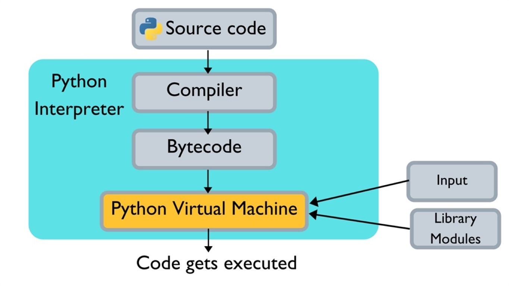

> 本篇参考了Github上诸多开源的学习资料：  
>
> [Snailclimb/JavaGuide](https://github.com/Snailclimb/JavaGuide)  
> [CyC2018/CS-Notes](https://github.com/CyC2018/CS-Notes)  
> [taizilongxu/interview_python](https://github.com/taizilongxu/interview_python)  
> [zpoint/CPython-Internals](https://github.com/zpoint/CPython-Internals)  
> [donnemartin/system-design-primer](https://github.com/donnemartin/system-design-primer)  

# 前言

**简单介绍一下我自己**

我从毕业以后都算是在创业公司摸爬滚打，因此技能点一直比较散乱，大部分时候都处于摸着石头过河的状态。工作中除了深度的运维以外，其他都做过，不过也恰恰是因为运维的事情做的太少了，导致很多知识整合的也比较慢。下面我列举一些知识点，都会在这次的笔记中提到：

- 语言类：Python，Java
- 框架类：Django，系统设计，Thrift
- 数据库：Mysql，Redis，ElasticSearch，MongoDB
- 大数据：Spark，Flink，Kafka

**对，暂时没有算法**

理由并不是因为算法不重要，而是因为网络上已经有了各种总结，也有很多刷题和练习网站，想要提高必须一步一个脚印地刷题。推荐学习的内容有：算法复杂度（结合各类排序）、图的深度宽度优先遍历、堆栈和链表、动态规划、递归与递推、二分查找、二叉树等内容。

# 操作系统

**为什么操作系统基础重要**

操作系统其实是一门计算机的基础课，也是最应该学好的课，因为太多的东西都可以在操作系统中找到影子，很多系统的设计都可以借鉴操作系统中对应功能的设计。从这个角度来看，软件开发就是在不停地重复造定制化的轮子，或者说必须站在成熟系统的基础上，才有可能做出优雅的设计、开发出健壮的系统。

## 虚拟内存

虚拟内存是操作系统中最重要的概念之一，但是这里把它作为所有系统的开篇，原因是绝大部分程序员都忽略了虚拟内存这个概念。

### 虚拟内存是什么

维基百科中这么定义[虚拟内存](https://zh.wikipedia.org/wiki/%E8%99%9A%E6%8B%9F%E5%86%85%E5%AD%98)：

> 虚拟内存是计算机系统内存管理的一种技术。它使得应用程序认为它拥有连续可用的内存（一个连续完整的地址空间），而实际上，它通常是被分隔成多个物理内存碎片，还有部分暂时存储在外部磁盘存储器上，在需要时进行数据交换。与没有使用虚拟内存技术的系统相比，使用这种技术的系统使得大型程序的编写变得更容易，对真正的物理内存（例如RAM）的使用也更有效率。

假设没有虚拟内存的存在，所有的程序直接访问实际内存，那么会有许多问题：

1. 由于直接访问物理内存，那么所有的程序都不可能突破物理内存大小的限制
2. 更致命的问题是对于每个程序来说，都可以直接读取其他程序的内存，并且要小心避开它们否则会导致天下大乱

这也可以理解为虚拟内存产生的背景，假设每个程序员都要考虑这些问题，那么程序员应该早就秃了，而且各类安全问题应该永远也解决不完。为了解决这个问题，在这里引用一句大佬话：

> All problems in computer science can be solved by another level of indirection. 
> 计算机科学里的任何问题都可以通过额外增加一个中间层来解决。  
> —— Butler Lampson  
> [Wiki：Fundamental theorem of software engineering](https://en.wikipedia.org/wiki/Fundamental_theorem_of_software_engineering)

因此操作系统在硬件和程序之间增加了虚拟内存这个中间层，让每个进程都可以相互独立，从而避免了相互访问、相互影响的问题，所有的程序都可以被看作在一块独立的内存中运行。

### 实现虚拟内存

为了实现虚拟内存，会涉及以下问题：

**物理地址和虚拟地址**

物理地址：计算机系统的主存（包含内存、硬盘、其他IO等等）被组织成一个连续的长度为 $M$ 的字节数组，每一个字节都有唯一的物理地址。  
虚拟地址：现代CPU通过生成一个虚拟地址来访问主存，在使用虚拟地址访问内存之前，会被转换成实际的物理地址。

有了虚拟地址以后就解决了上面提出的问题2，即每个程序都不能随便访问其他程序的内存地址了，因为有系统级别的防御。

**虚拟页（页式管理）**

与物理内存类似，虚拟内存也可以被组织成一个连续的长度为 $N$ 的字节数组。为了方便管理，系统将寻你内存分割成许多个大小为 $P$ 的虚拟页，物理内存也分割成许多个大小为 $P$ 的虚拟页，这样可以方便地管理虚拟内存，并将虚拟内存与物理内存进行映射。

一个虚拟页可能在物理内存上，也可能在其他主存上（比如硬盘等），当一个访问一个虚拟页但是它不在物理内存上时，会发生**缺页中断**：由CPU通知操作系统将相应的页面或段调入到内存，然后继续执行程序。

**Linux虚拟内存系统（段式管理）**


段式管理把虚拟内存的整个数组分割成多个不连续的分段，这里面就包含了我们熟知的：代码、数据、堆、共享库以及栈。段式管理的底层数据结构是一个链表，其中的每一个节点都代表了一个不相连的分段，这样每一个段都是相互独立的，并且可以动态增长。

另外操作系统可以对部分段的虚拟内存进行共享，但是在操作系统层面杜绝程序对该段的修改，这样既保证了安全性，又提高了创建进程和使用系统调用的效率，减少了额外开销。

**缺页置换算法**

当系统发生缺页中断时，需要把页调入到物理内存中，如果物理内存空间不足，那么就必须替换物理内存中已有的页。这种情况和现代的缓存系统非常类似，或者说现代缓存系统基本都使用了下面置换算法的一种或几种：

- FIFO（First In First Out），先进先出，总是淘汰最早进入系统的页
- LRU （Least Currently Used），最近最少使用，每个页记录一个最近访问时间T，每次淘汰T最小的页
- LFU （Least Frequently Used），最不经常使用，每一个页记录一个访问次数C，每次淘汰C最小的页

这里还有一种不能实现的算法：OPT，最优置换，这种算法每次选择的被淘汰页将是以后永不使用的，或者是在最长时间内不再被访问的页，但是由于后续的页使用情况是无法估计的，因此这种算法只能作为衡量缺页置换算法效率的标准。

### 题外话：局部性原理

乍一看可能会觉得分页和调度的这种方式对性能有很大损失，但是实际上并不会，这是由于**局部性原理**的存在

> 局部性原理：在某个较短的时间段内，程序执行局限于某一小部分，程序访问的存储空间也局限于某个区域。

基于这个理论，计算机里面的存储从快到慢分为了好多层：寄存器、高速缓存、内存、硬盘、网络等等。根据这个理论，在数据仓库处理数据的时候，也可以把数据按照冷热程度不同，分开存储以节约成本。

## 进程和线程

进程：进程是操作系统对一个正在运行的程序的一种抽象，在一个系统上可以同时运行多个进程，而每个进程都好像实在独占地使用硬件。

线程：现代的系统中，一个进程实际上可以由多个称为线程的执行单元组成，每个线程都运行在进程的上下文中，并共享同样的代码和全局数据。

### 进线程区别

进程和线程的区别主要体现在几个方面：

1. 资源，进程拥有独立的资源，线程本身不拥有资源，由进程决定其资源
2. 调度，线程是CPU调度的基本单位，在进程内切换线程不会引发进程切换
3. 开销，切换进程的开销要比切换线程的开销大得多
4. 通信，由于进程的独立性，需要引入额外的通信方式

**并行和并发**

并行指的是同时执行多个任务，对于多核CPU来说这是可行的，但是对于以前的单核CPU来说，只存在并发的概念。因为每个程序看似单独占用所有硬件，但本质是由CPU管理时间片而导致的假象，这种多个程序同时执行的方式被成为并发。由于并发的存在，就引入了上下文切换。

### 上下文切换

在Linux系统中按照特权等级，把进程的运行空间分为内核空间和用户空间（在[虚拟内存](#实现虚拟内存)的图例中也有相关内容）：

- 内核空间具有最高权限，可以直接访问所有资源
- 用户空间只能访问受限资源，必须通过系统调用陷入到内核中，才能访问特权资源

进程上下文切换：由于进程是由系统内核管理的，进程上下文切换只能发生在内核态（处于内核空间的进程被成为内核态进程）。因此从一个进程切换到另一个进程至少要经过下面的步骤：

- 保存用户态资源，进入内核态
- 保存内核态资源，切换到另一个进程并进入用户态
- 刷新进程的虚拟内存和用户栈

线程上下文切换：相比进程而言，线程切换的代价就小得多，因为线程本身也不拥有虚拟内存区域，也不需要进行到内核态再到用户态的切换。但是进程本身的栈和寄存器等也是需要进行切换的，因此也会有一定的开销。

### 进程通信

由于不同的进程之间拥有不同的虚拟内存，因此它们也是不能直接访问其他进程内存中的内容的，想要在进程之间交换信息，就必须引入进程的通信方式：

1. 管道（Pipe）和命名管道（Named Pipe），消息队列（Message），信号量（Semaphore），内存映射（Mapped Memory）
2. 信号（Signal），用于系统通知进程某个事件的发生，进程也可以给自己发信号，在分布式系统设计时，可以对系统的停止信号做出相应，从而优雅地结束服务
3. 共享内存（Shared Memory），速度最快的同步方式，可以让多个进程访问同一块物理内存，但是需要信号量等外部同步机制。
4. 套接字(Sockets) ，即进行网络IO同步，这也是最常见的同步方式，可用于不同机器之间的进程间通信。

## 并发模型

假设有两个客户端，一个服务器的场景，来介绍三种不同的并发模型：

### 进程并发

构造并发程序最简单的方法就是进程，对于案例中的内容来说，可以这样处理：

- 由一个主进程监控所有的客户端请求
- 当一个请求到来时，新建一个子进程并让其处理客户端请求

优点：模型清晰，共享了文件表但不共享其他内容；子进程的虚拟内存相互独立，不容易出问题  
缺点：共享信息困难，并且进程间通信的速度也很慢；进程新建和切换代价高昂，导致并发量上不去  

### 线程并发

线程并发对于进程并发来说，最大的区别只在于监听的是主线程，而新建的是子线程，并且还可以使用线程池做优化，从而可以重复使用线程。

优点：相对进程线程更轻量，因此效率也更高，可以获得更高的并发量  
缺点：一旦有共享数据或者内存，就会引发各种并发和同步问题，代码bug难以排查  

### IO多路复用

IO多路复用是一种事件驱动模型，它基于Linux文件系统提供的非阻塞文件IO接口实现。服务的主进程是一个无限循环，它检测两种事件：

1. 有客户端请求到达时，将请求插入到请求池
2. 当请求池里有描述符已经可以读取时，读取内容并处理

优点：由于网络请求大部分时间都在等待IO，因此如果处理请求速度很快，那么效率极高  
缺点：编码复杂，事件处理会让代码复杂、逻辑割裂；另外也不能充分利用多核处理器  

## 文件系统

文件就是字节序列，每个IO设备，包括磁盘、键盘、显示器、网络等等都可以看成时文件。文件这个简单而精致的概念是非常强大的，因为它像应用程序提供了一个统一的视图，来看待各式各样的IO设备。

### 文件描述符


在Linux系统中，每个文件都会在系统的v-node表中保存一项记录，里面包含了文件访问、大小、类型等信息。此时如果有一个进程打开了某个文件，那么会在两个表中加入相应内容：

1. 打开文件表，包含文件位置、引用计数和到v-node表的指针，这是所有进程共享的表
2. 描述符表，包含打开文件的偏移量、读写状态和一个到打开文件表的指针，这是进程独有的

一个进程可以多次打开同一个文件，这就会在描述符表中建立多个描述符，父子进程就是通过复制描述符来共享文件的。打开文件表中会有一个引用计数，直到引用为零时，才可以删除表格中的这一项，因此打开文件一定要正确释放，否则会引用计数无法归零。另外每个文件都有最大支持的描述符数量限制，如果超过这个限制会遇到系统报错，这个限制也是可以调整的。

# Python

Python的语言体系相比Java而言，知识点更琐碎，给我最深印象的Python书是[《Python Cookbook》](https://book.douban.com/subject/26381341/)，里面记录了大量的语法糖和黑科技，就和Python语言本身的特性一样，都极具实用性。后面我会尽量将其中的难点挑出，而其他大众化的问题则会略过。

## 语言特性

### 可变与不可变对象

Python中的基础容器有四种：dict、set、list、tuple，其中只有tuple是不可变对象，因此也只有它可以作为dict的Key，另外基础类型：int、str、float等都是不可变对象，这听起来似乎有点奇怪，比如：

```python
i = 10
i += 1
```

看起来变量i从10变成了11，但是实际上并不是这样，在Python语言中所有的代码都会转化成字节码，再交给Python虚拟机运行，如果使用Python自带的dis命令就可以知道，常量在虚拟机里是先载入到系统中，再赋值给变量的，而数字之类的内容都属于常量的一部分，它们也会参与引用计数和垃圾回收，通过下面的例子可以方便理解：

```python
x = 1
y = 1
id(x)  --- 9784864 (这个id在不同的虚拟机中会不同)
id(y)  --- 9784864 (和x的结果一样，它们指向同一个常量)
```

### 元类（Metaclass）

简单来说，元类就是类的类，类定义了一个对象应该有哪些统一的属性和表达，元类则定义了类应该有哪些统一的属性和表达。除了这个所说的定义以外，Python中的元类还有以下特别之处：

- 假设A1类继承于A类型，那么A1类型的元类必须继承于A类型的元类
- 类和元类都可以当作方法直接调用，调用类可以获得一个实例，调用元类可以获得一个类

在Python3中，所有的类最终都继承于Object，另外所有的类都有一个默认元类Type，因此Type继承于Object，而Object又是Type的实例，这听起来有点拗口，并且还会有一个先有鸡还是先有蛋的问题，可以通过代码琢磨它们的关系：

```python
isinstance(object, type)  --- True
isinstance(type, object)  --- True
issubclass(type, object)  --- True
issubclass(object, type)  --- False
```

一般来说，在日常代码中不太会用到元类，但是在框架或者ORM系统中，就很常见了，比如Django的ORM就是使用元类实现的。另外，像注册工厂、策略模式等都可以通过元类类实现。

### 命名空间（Namespace）

在Python中是按照命名空间来组织变量的，比如：全局命名空间中的系统函数、某个模块中的模块级变量、某个函数中的内部变量等等。但是和其他语言不同的是，Python里面的命名空间是动态的，也就是说，命名空间与代码块并不是完全对应的关系，在运行的过程中，完全可以修改其他命名空间中的变量。

**nonlocal和global标识符**

当一个变量在当前命名空间中找不到时，会向外层命名空间中寻找，但是如果看源码就会发现，Python在外部命名空间向内部命名空间传递变量时，传递的是变量的引用，因此在并不能在命名空间内部直接修改外部变量的值，比如：

```python
def setC():
    # global c
    c = 2

c = 1
setC()
print(c)  --- 1
```

这段代码将global c的注释去掉，程序就可以获得想要的结果了，因为这个参数会告诉解释器c并不是一个局部变量而是在全局命名空间中，同样的还有在python3加入的nonlocal标识符，它表示变量在外层命名空间中。

PS：Python的官方文档里有关于[类和命名空间](https://docs.python.org/3/tutorial/classes.html)的详细解释，推荐阅读。

### 类方法的绑定关系

首先，类本身也是一种特殊的命名空间，这在官方文档中有相应的介绍，而实例的命名空间是类命名空间的子空间，因此类的方法和变量会有一种神奇的绑定关系：

- 类方法会绑定在类的命名空间下
- 类变量会通过init函数绑定在实例的命名空间下，并且self就是实例本身

假设有类A和它的实例a，在调用a.func()时，Python虚拟机首先会找a的命名空间里面有没有func这个成员，发现没有，然后就会去找A的命名空间，发现有func这个成员，并且是一个类绑定的方法，那么就会改变调用参数，最后相当于进行了一次A.func(a)调用。Python使用这种巧妙的方法，实现了面向对象很重要的一个特性：动态绑定。

**classmethod和staticmethod**

这两个装饰器由Python内核提供，它们会改变类绑定方法的调用方式，使其在调用是传入的是A或者不传入额外参数，从而实现了类方法和静态方法的效果。

### AOP和装饰器

大名鼎鼎的AOP在Spring的框架中到处都在使用，面向切面的基本思想是在一个方法调用时，可以动态地添加一些额外操作，比如：根据配置文件内容，决定是否要将某个方法的运行时间、结果和报错记录到日志中。

在Python中想要实现一个AOP的话其实很简单，只要使用装饰器的语法糖就可以了：

```python
def log(func):
    def wrapper(num):
        print("before func")
        func(num)
        print("after func")
    return wrapper

@log
def print_num(num):
    print(num)

print_num(3)
```

在上面这个例子中，装饰器语法糖的本质是：将原有的print_num函数，替换成log(print_num)数，在装饰器内又是一个闭包结构，最后返回了一个新函数。

## Python虚拟机

计算机、Python虚拟机或者JVM，其存在的目的是让使用者可以通过编码的方式解决所有的可计算问题，本质上是[图灵机](https://zh.wikipedia.org/zh-cn/%E5%9B%BE%E7%81%B5%E6%9C%BA)的一种实现。Python虚拟机有多种实现形式，比如：cpython、pypy，Jython等等，这里所描述的虚拟机指的是最常用的cpython。



简单描述一下一个Python脚本放入cpython虚拟机后的执行过程：

1. 首先会代码会经历一个预编译过程，将代码转化成字节码
2. 字节码和汇编代码很类似，每一行会包含两个部分：对应的操作码和参数
3. cpython虚拟机会加载字节码，然后使用一个巨大的for循环逐条执行，最终得到结果

在cpython执行字节码的时候，还会涉及到一些基本概念，比如：系统栈（临时存放系统常量和返回结果）、方法栈（保存当前调用方法的上下文）、堆内存（方法栈中保存的都是变量的指针，最终内容会存在堆内存中）等等。

### GIL线程全局锁

GIL是一把在cpython中最著名的锁，它也几乎是Python多线程程序的死亡宣告，扼杀了程序员们想用多线程加速计算的美梦。如果想要了解Python的多线程机制，就必须理解GIL的存在，那么不妨从它诞生的环境开始了解它：在Python诞生之初，那还是一个单核CPU的时代，因此设计者本着实用思想，并没有对多核心做额外的优化，多线程存在的价值仅仅是为了能让程序并发运行。


要知道，复杂的线程同步机制本身是会伤害单线程程序运行效率的，那么既然都只有一个CPU能运行，不如简单直接地加一把CPU级别的锁，保证同时只有一个线程在使用CPU就可以了，这种设计在当时看来也是非常高效优雅的，直到多核心CPU的出现和大力发展。

由于GIL的存在，每一个字节码在执行时都是原子的，因此cpython内部的许多模块都是无锁的，比如大名鼎鼎的内存管理，也因此在使用Python多线程的时候，大部分系统库天生就是线程安全的，也不需要考虑多线程竞争问题。

#### 为什么不放弃GIL

即使升级到了没有向前兼容的Python3，cpython也没有放弃GIL，这个问题本质有两个原因：

**性能问题**：如果要删除GIL，那么势必要把原来cpython中不支持多线程的部分都加入多线程的支持，这种操作会大大影响单线程运行时的性能，有人在1999年就做出过努力想要删除GIL，多线程程序的确加速了，但是代价是单线程程序效率减少了40%，这种代价所有人都无法接受，就不了了之了。

**历史问题**：许多库都专门为cpython设计，因此很多都依赖于GIL的存在以保证其线程安全性，一旦GIL消失，那么非常比例的Python库都无法使用，试问谁会愿意用一个找不到库的Python语言呢？

**规避GIL的影响**

其实GIL本身没有非常可怕，它的限制仅在于想要通过多线程处理并行计算时，对于网络请求一般不会产生太大的影响（因为绝大部分时间都在等待IO，真正的计算时间很少），那么真的要使用Python多线程的话，可以有几个方法：

- 切换到多进程库，使用多进程来进行计算
- 使用生产者消费者模型，启动多个消费者进程
- 将核心部分更换为C语言实现，并在C语言中释放GIL

### 垃圾回收（GC）

在[《深入理解计算机系统》](https://book.douban.com/subject/26912767/)中介绍虚拟内存时，还介绍了两种编程语言可以提供的动态内存分配器：

1. 显示分配器，要求必须在代码中显示地释放之前申请的内存，否则会导致泄露（C语言和C++使用的方式）
2. 隐式分配器，要求分配器自动检测不在使用的内存，自动释放（Python和Java都使用这种方式）

为了实现隐式分配器，cpython做了以下设计：

#### 引用计数

在cpython的实现中，每个对象都是一个PyObject对象，这个对象的结构很简单，其中只有一个参数：ob_refcnt用于统计当前对象被引用的次数。在整个cpython虚拟机中，这个引用计数都被小心地维护着，每次有引用新增时，计数加一，引用被删除时，计数减一。当引用计数为零时，则直接触发一次垃圾回收，回收这个没有任何引用的对象。

**引用计数的弊端**：引用计数有一个很小的额外开销，但是没有用的垃圾对象会被立刻回收，有很好的回收效果。但是，引用计数无法解决循环引用的问题，比如：

```python
class A:
    pass

a1 = A()
a2 = A()
a1.next = a2
a2.next = a1
```

在这种情况下，a1和a2的引用计数都是2，如果在local_namespace里面删除这两个对象，它们的引用计数都是1，都不会触发系统的垃圾回收，cpython通过加入了分代回收来解决这个问题。

#### 分代回收机制

其实分代回收包含了两个部分的算法：

**分代回收**：在cpython中默认包含3代，如果某个对象在当前代的垃圾回收中存活，那么自动移动到下一代中。垃圾回收时，选择好需要回收的代之后，会把它和比它年轻的代都合并，再进行回收。

**标记清除**：标记清除的本质是利用搜索标记出那些不可达的对象，并且进行垃圾回收，这种方法需要遍历整个堆内存。假设将所有要回收的代合并，成为yong，不回收的称为old，cpython中的标记清除算法实现细节有几个步骤：

1. 遍历yong中所有对象并且删除它们之间的引用计数，即消除所有yong内变量之间引用关系的影响，当引用计数为0时，把对象加入到待删除链表中
2. 再次遍历所有yong中的对象，如果它的引用计数大于0，那么找到它引用的所有对象，重新加上引用计数，如果这些对象已经在待删除链表中了，把它们捞回来
3. 最后回收所有待删除链表中的对象

# Java

Java是一种非常严谨和工整的语言（当然它也在发生着变化，尤其Java8加入了非常多的流式操作以后），我在大学里通过[《Java编程思想》](https://book.douban.com/subject/2130190/)第一次系统地学习了Java编程语言，这本书从面向对象编程开始讲起，和Java语言本身一样，都非常的严谨工整。

## 语言特性

### 反射机制

Java中的反射机制可以类比Python中的元类，在Java中每个类都有一个Class对象，包含了与类有关的信息。当编译一个新类时，会产生一个同名的.class文件，该文件内容保存着Class对象。获取Class的方法大致有下面几种：

```java
// 通过类获取
Class alunbarClass = TargetObject.class;

// 通过类名获取
Class alunbarClass1 = Class.forName("cn.javaguide.TargetObject");

// 通过实例获取
Employee e = new Employee();
Class alunbarClass2 = e.getClass();

// 通过类加载器获取
Class clazz = ClassLoader.LoadClass("cn.javaguide.TargetObject");
```

获取了类型信息后，就可以通过反射来直接操作对象，比如：给成员变量赋值、调用成员方法、直接创建一个新对象等。使用反射机制的动态类加载为Java增添了许多灵活性，和Python中的元类比较相似的是：日常开发中很少会用到，但是在框架和ORM中就会经常出现，比如JDBC中使用反射加载数据库驱动、Spring中的AOP和IOC都和反射有关。

但是这种灵活性的好处不是没有代价的，主要问题有两个：

1. 性能劣势，反射的内容JVM无法事先得知，因此也无法进行优化，要比静态代码中的类慢很多
2. 安全问题，反射甚至可以直接操作私有成员变量，这会导致很多意外情况，并且被反射的类如果更新，就只能在运行时抛出异常了

### 动态代理

#### 设计模式：代理模式

代理模式是设计模式的一种，一般所讲的代理模式都是静态代理，简单来说就是创建一个代理对象来屏蔽对正式对象的访问，这样就可以在不改变原有对象的基础上提供新功能的扩展，与之相类似的还有**适配器模式**。

不过恕我直言，工作的这几年中，还没有要使用静态代理的时候，尤其在针对已有代码做扩展的时候，很容易被人当成是不愿意对原有代码进行重构，而强行加的补丁。

#### 动态代理：JDK动态代理和CGLIB的选择

动态代理就和Python中的装饰器非常相似了，它们都是可以实现AOP的一种途径。在Java中，动态代理还有两种常见的实现方式，即Java原生支持的JDK动态代理和第三方开源库CGLIB支持的动态代理。

**JDK动态代理**：为了使用JDK动态代理，首先需要创建一个接口，然后继承系统的InvocationHandler，复写其中的invoke方法来代理接口的方法，新增的功能可以直接写在invoke方法中。  
**CGLIB动态代理**：使用CGLIB动态代理就不需要接口，但是同样需要继承库提供的MethodInterceptor，并重写intercept方法，新增的功能就写在intercept方法中。

两种代理的对比：

1. JDK动态代理的被代理对象必须继承于某个接口，而CGLIB则是通过生成一个被代理类的子类来拦截调用，因此CGLIB不能支持final的类型和方法
2. 绝大部分时候JDK动态代理性能更强，并且随着JVM的升级，性能差距会进一步拉大

### BIO、NIO和AIO

在进程读取文件的时候，必须发起一个系统调用，这个步骤会导致进入进程进入内核态，然后系统会将文件的内容放到用户态的虚拟内存区域内，进程回到用户态执行接下来的逻辑。这里就涉及一个问题了，因为IO是很慢的，那么在系统读取文件内容的这段时间里，进程该干什么呢？这里就引出了JVM三种文件读取模式：

**BIO（同步阻塞IO）**：在这种模式下，JVM发起read系统调用后就会一直等待数据读取，直到数据就绪才会返回。这就意味着如果没有数据就绪，这个读取操作将会一直被挂起，用户线程将会处于阻塞状态。

**NIO（同步非阻塞IO）**：这种模式对应了并发模型中的IO多路复用，一般的实现方式为服务器建立一个线程作为多路复用器处理请求，客户端发送请求会被注册到多路复用器上，多路复用器轮询到有请求完成IO步骤就会进行处理。在JDK1.4中新增了nio相关的包，并使用了Selector和Channel实现了多路复用器，另外还有许多性能上的优化，深度了解可以参考：[美团：Java NIO浅析](https://tech.meituan.com/2016/11/04/nio.html)。

**AIO（异步非阻塞IO）**：JDK7中更新了nio包，真正支持了异步IO模型，在这种模式下，所有读取完成之后的操作都由回调进行，也就是说不再是轮询IO状态的模式了，而是订阅-通知的模式。

## Java虚拟机

JVM在执行代码的整体流程上和Python虚拟机是类似的，都是：编写好的Java代码通过Java编译器编译成字节码，然后交给JVM执行。不过由于JVM是一种标准，它并没有规定具体的实现，因此在整个JVM体系里面，使用到的技术要比Python虚拟机多得多，也复杂得多。

**即时编译编译器（JIT）**

不管是什么虚拟机，拿到字节码之后最终都是要转化成汇编和机器语言来执行的，在这个翻译的步骤中，实际上是可以加入很多优化的。因此，引入了JIT技术，这种技术会在字节码执行的时候，将一部分经常执行的字节码翻译成汇编或者机器码，再加入优化，有的还会进行缓存，从而加速Java代码的执行。

不过使用JIT进行编译和优化也是需要时间的，因此一般都会采用直接执行和JIT混合的方式，这样既保证了字节码可以没有延迟地直接运行，又让经常运行的代码得到很好的效率。由此也会引出JIT优化的话题，不过那个太深入了，不在本次讨论的范围内。

### JVM模型

由于JVM只是一种标准，和Python虚拟机一样，它也有很多的实现，其中最著名也是最常用的是HotSpot虚拟机，它由三个主要的大模块组成：类加载器、运行时数据区和执行引擎。


#### 类加载器

Java的动态类加载功能是由类加载器子系统处理，当JVM在运行中（不是编译）首次引用一个类时，它加载、链接并初始化该类文件。类的加载一般分为三个步骤：

1. 加载，把class字节码文件从各个来源通过类加载器装载入内存中
2. 链接，这里又有三个步骤：验证类的安全性和合法性、为类变量分配内存并赋初值、将常量池内的符号引用替换为直接引用
3. 初始化，在这个过程中执行类的初始化，调用init方法，这个方法由JVM生成，一般是类的静态代码和静态变量初始赋值构成

**双亲委派模型**：在JVM中，系统提供了三种有父子关系类加载器，当一个类需要被加载时，双亲委派模型要求类加载器先询问父加载器是否可以加载，如果不能加载才由当前加载器加载。这样的目的是为了保障每个类都只会被加载一次，当然也是可以不遵守双亲委派模型的，比如希望使用不同版本的库的情况。

#### 运行时数据区

运行时数据区域主要包含三个部分：

1. 方法区：所有类级别数据将被存储在这里，包括静态变量，每个JVM只有一个方法区
2. 堆区：所有的对象和它们相应的实例变量以及数组将被存储在这里，每个JVM只有一个堆区
3. 栈区：对每个线程会单独创建一个运行时栈，另外每一个函数调用都会在栈内存生成一个栈帧（Stack Frame），所有的局部变量将在栈内存中创建

由于方法区和堆区的内存由多个线程共享，所以存储的数据不是线程安全的。栈区，另外还有PC寄存器（保存每个线程当前执行指令的地址，方便线程切换时恢复）和本地方法栈（保存非Java语言实现方法的运行信息）都是每个线程私有，是线程安全的。

#### 执行引擎

Java代码转化成的字节码将由执行引擎执行，执行引擎会读取字节码并逐段执行。

执行引擎的部分又可以分为三块：解释器、JIT编译器和垃圾回收器。前面两个在最开始介绍[Java虚拟机](#Java虚拟机)时已经描述过，解释器运行速度慢但是可以立刻运行，JIT编译器运行速度快但是需要等待；垃圾回收器负责对使用的内存进行GC，在JVM里有非常多种实现，因此会在之后单独描述。

此外还有两个组件：Java本地接口（JNI）是一种编程框架，使得Java虚拟机中的Java程序可以调用本地应用/或库，也可以被其他程序调用；本地方法库一般是由其他语言实现的，为了方便Java和系统调用进行交互，为JNI提供了可调用的方法。

### 垃圾回收（GC）

在JVM中，发生垃圾回收的区域重点区域是堆区，由于在HotSpot中采取了分代回收的策略，因此整个堆区都是按照分代思路来设计的，包含了：新生代、老年代和永久代（JDK8中是元空间），其中新生代又可以分成Eden、From Survivor（FS）、To Survivor（TS）空间。

#### 不同的GC算法

和Python虚拟机不同，JVM中没有使用引用计数算法，因此所有的回收都依赖可达性分析，而Python中使用的标记-清除算法我们已经说过了，还有两种：标记-整理（标记完成后将存活的对象进行整理和压缩）以及标记-复制（标记完成后将存活的对象复制到新区域），这三种算法都有自己的限制：

- 标记-清除：会造成大量的碎片，从而导致非常频繁的GC
- 标记-复制：需要一倍额外的空间来保存复制过去的对象，内存使用效率太低
- 标记-整理：时间成本非常高，尤其堆越大，这个问题就会越明显

#### 不用的GC区域

针对GC区域的不同，JVM的GC可以分为：

- Minor GC / Young GC，针对新生代的GC
- Major GC / Old GC，针对老年代的GC，目前仅有CMS有这种模式
- Mixed GC，针对整个新生代和部分老年代的GC，目前仅有G1有这种模式
- Full GC，针对整个新生代和整个老年代的GC

#### 垃圾收集器

如果说GC算法是内存回收的方法论，那么收集器就是具体实现了，与Python虚拟机不同的是，JVM提供了大量的收集器来应对不同的使用场景。总的来说，不同的垃圾收集器都实现了不同的GC算法、适用于不同的GC区域，并且它们之间还有限制组合关系，如下图：


弄清楚每一种垃圾收集器的优劣并且根据场景选择，从而对JVM进行调优，就是一个非常复杂的问题了，因为笔者还没有遇到过这种场景，就不再深入了。

#### 一般GC流程

大部分垃圾收集器对于新生代GC采用了标记-复制的算法，主要流程为：将Eden空间和FS空间合并进行标记算法，找出存活的对象并保存到TS空间，完成后交换FS和TS空间的指针。这里面还会涉及到几个问题：

- **内存效率**：为了提高内存的使用效率，默认Eden、FS和TS空间的比例为8:1:1，这里必须知道一个类似于局部性原理的前提：在Java中绝大部分对象生命周期都很短，因此在新生代中大部分都是垃圾对象
- **空间不足**：一旦在新生代发生空间不足的情况，对象都会直接被移动到老年代中，比如：TS空间不足无法放得下所有被复制的对象
- **晋升通道**：对象从新生代到老年代有一个晋升机制，即每次存活后对象年龄+1，到达一定阈值时进入老年代，这个默认值时8，即发生八次新生代GC后仍然存活，就会直接放到老年代

由于老年代没有额外的空间，因此老年代的GC会采用标记-整理或者是标记-清除的算法，这两种算法的大致流程都差不多，就不赘述了。

#### 与堆区有关的参数

对JVM的调优涉及了非常多的知识，比如JVM内存模型、GC算法和各种可用参数等，这里仅以图示列出了和堆区有关的参数，具体调优建议精读[《深入理解Java虚拟机》](https://book.douban.com/subject/34907497/)有关调优案例和分析的章节。


PS：JDK8开始，元空间取代了永久代，所以相应的JVM参数变成-XX:MetaspaceSize及-XX:MaxMetaspaceSize。

## 线程并发

TODO

### 原子对象

### 锁相关

### 线程池

# Django

## 基础架构

### 基于Python的Web框架

#### WSGI

WSGI的全名是：[Python Web Server Gateway Interface](https://zh.wikipedia.org/wiki/Web%E6%9C%8D%E5%8A%A1%E5%99%A8%E7%BD%91%E5%85%B3%E6%8E%A5%E5%8F%A3)，即用Python语言定义的一种Web服务器到Web应用框架之间的一种接口协议，这么说可能还是比较拗口，那么可以先来看一下HTTP的大致流程：

1. 浏览器发起请求到HTTP服务器，然后服务器返回请求所对应的文本
2. 浏览器接到请求的文本，再根据文本生成浏览器里面展示的内容

所以最简单的一个Web服务就是一个静态文件的服务器，即根据url直接找到文本返回就可以了，但是如果使用Python作为后端服务器，那么就会有一个动态的流程了，WSGI就是定义这种流程的一个规范，如果没有这个规范，想要实现一个HTTP服务器可能就得花个把月去了解HTTP协议的全部内容了。


有了WSGI以后，想要实现一个基于Python的动态Web服务器就很简单了，参照文档编写代码就可以了，详细内容可以参考：[FullStack Python - WSGI Servers](https://www.fullstackpython.com/wsgi-servers.html)。

#### uwsgi和uWSGI

这两个东西的名字实在是太值得吐槽了，虽然只是大小写的区别，但却完全不同：

- uWSGI是针对WSGI传输协议的一种实现，是一个Web服务器
- uwsgi是uWSGI服务器包含的一种自有传输协议，与WSGI没啥关系

当红的基于Python的Web框架都自己实现了WSGI，不需要依赖uWSGI就可以直接运行，但是Django官方文档也有说明，因为效率问题绝对不能用在生产环境，使用uWSGI进行部署可以参考官方文档：[Django - 如何用 uWSGI 托管 Django](https://docs.djangoproject.com/zh-hans/3.1/howto/deployment/wsgi/uwsgi/)。

但是一般uWSGI还会和Nginx进行混合部署，因为Nginx有非常优秀的静态文件性能，可以让静态文件由Nginx代理，动态接口再由Nginx转发到uWSGI服务器。

#### ASGI

在Python3中，加入了新的关键词async和await，代替了原有的yield实现，形成了新的[协程模型](https://docs.python.org/zh-cn/3/library/asyncio-task.html)。这种新编码方式的出现，为异步服务器提供了遍历，因此[ASGI](https://asgi.readthedocs.io/en/latest/)诞生了，它本质上就是一个支持异步服务器版本的WSGI。

一般情况下还是推荐使用WSGI，不过如果想要使用WebSocket的话，ASGI可能就是一个比较好的选择了，尤其Django官方支持的WebSocket库Channels就指定了必须使用ASGI协议。但是目前ASGI还不是特别成熟，性能也容易遭遇瓶颈，因此还是推荐单独部署WSGI和ASGI，再由Nginx转发请求。

### 处理HTTP请求的基本流程

在Django系统中处理HTTP请求时，很重要的一点是它的中间层系统，它的中间层设计类似于一个针对请求的AOP，许多第三方插件都是通过中间层来实现的。最开始在Django的WSGIHandler中会将WSGI封装的environ转化成Reqeust，之后的处理流程大致如下图：


一般常见的使用到中间件的情况有：

- 针对登录鉴权等用户信息的额外处理，会加在Request中间件里面
- 报错系统的设计可能需要把内部Exception转化成到前端报错，可以在Exception中间件中实现

# 系统设计

目前通常所说的系统设计都是分布式环境下的系统设计，微软有一套很好的教程，讲述了在分布式环境下构建应用需要用到的概念和技术，笔者做了搬运工，可以参考：[Architecting Distributed Cloud Applications](/2020/12/31/architecting-distributed-cloud-applications/)。

# Mysql

Mysql是目前最流行的关系型数据库，它最常见的数据库引擎是InnoDB，即一种支持事务的数据库引擎。不同的引擎都会支持不同的功能，也有不同的优缺点，比如另一种引擎：MyISAM，它的索引和查询速度更快，但是不支持事务，下面的内容默认属于InnoDB引擎。

## 索引

索引的目的是为了更快地找到对应的数据，其实在日常的代码中就经常使用到和索引有关的结构，比如：Python对象底层都是一个dict，而dict对应的实现就是哈希表；Java中的HashMap、HashSet以及TreeMap和TreeSet都是非常常用的容器。

### B树和B+树

B树和B+树广泛应用于各类的数据库中，它们都是树形数据结构的一种，并且都属于[搜索树](https://zh.wikipedia.org/wiki/%E6%90%9C%E7%B4%A2%E6%A0%91)。


搜索树有一个非常重要的特性：它的中序遍历是有序的，由于这个特性，如果希望寻找一个 $key$，那么可以从根开始查找，根据 $key$ 和当前节点保存值的大小关系去查找对应子树，直到找到 $key$ 或者确认它不存在，最终查找单个值的复杂度上限不会超过树的深度。

假设这是一个拥有 $N$ 个节点的 $M$ 叉树，那么它的平均深度应该是 $log_mN$ 的量级，除非发生它退化成一根线的极端情况，此时它的深度就是 $N$ ，因此查询效率也会退化到 $O(N)$。为了避免这种情况的发生，我们在维护排序树的时候，需要对其进行平衡操作，使其的深度维持在 $log_mN$ 的量级，这就引出了[平衡树](https://zh.wikipedia.org/wiki/%E5%B9%B3%E8%A1%A1%E6%A0%91)。

平衡树的门类下面有非常多的实现，其中还有极其出名的红黑树，Java中的TreeMap底层就是这种数据结构。另外，B树和B+树也都是平衡的，需要注意的是，维持树的平衡也是消耗时间的，因此每一次插入理论上来说并不是等价的。

#### 关于索引的疑问

> 首先有第一个问题：为什么不使用红黑树？

早期计算机都是使用的机械硬盘，对于机械硬盘来说每次读取的寻道时间都很长，所以要尽量减少读取硬盘数据的次数，另外硬盘还有个[4K对齐](https://zh.wikipedia.org/wiki/4K%E5%AF%B9%E9%BD%90)的说法，即一般情况下单次读取硬盘最少要读取4K（一个扇区）的大小。因此，最好的方法是让每个节点都刚好是4K大小，这样可以充分利用硬盘资源，那么二叉树结构就不适用了，因为根本用不完这么大空间。

> 然后是第二个问题：为什么InnoDB引擎使用了B+树作为索引？

B+树和B树的区别在于：B+树的数据全部都存储在叶子节点上，其他节点只存储索引信息，叶子节点之间还会有指针相连。那么它们各自的优点也很明确了：B+树针对rang类型的查询会有优势，而B树则对随机查询单个节点更快。因此，对于NoSql的数据库MongoDB，就选择使用了B树，这里并没有孰优孰劣，只是适用的场景不同。

> 然后是第三个问题：为什么推荐使用自增ID作为主键？

产品侧的原因是随着产品迭代可能会出现需要换主键或者主键重复的情况出现，这就很麻烦。对于技术侧来说，主要原因还在索引上，每张表都只会有一个聚簇索引（保存数据的那个索引，同时也是主键所在的索引），如果主键是个随机值，那么每次插入都可能涉及很多的平衡操作，导致效率变差，如果只是递增ID的话，平衡操作就更少，效率也更高。

#### 查询优化

由于B树的排序性质，对于多列索引和字符串索引，可以免费获得其前缀索引。但是，对于那些从中间列开始查询，或者从字符串中间开始查询的内容，就不会命中任何索引了，这也是B树索引导致的，更多的Mysql查询优化建议参考：[《美团技术团队-MySQL慢查询优化》](https://tech.meituan.com/2014/06/30/mysql-index.html)和[《高性能Mysql》](https://book.douban.com/subject/23008813/)。

### 哈希索引

哈希索引的底层数据结构是[哈希表](https://zh.wikipedia.org/wiki/%E5%93%88%E5%B8%8C%E8%A1%A8)，因为这个结构在各种语言里都非常常见，就不赘述它的具体实现了。与B树索引不同的是，哈希索引只能在 $=key$ 这样的条件下生效，对于大于小于这种结构则不支持，相应地，在查找单个 $key$ 时可以视为 $O(1)$ 的复杂度。在Mysql中，只有MEMORY引擎支持哈希索引。

#### 自适应哈希索引

但是在InnoDB中，可以创建一个自适应哈希索引，这并不是一个严格意义上的索引，因为它并不会索引全部数据。它只对热点数据自动生成一个哈希索引作为缓存，同样也只在 $=key$ 这种条件下生效，可以参考官方文档：[Mysql - Adaptive Hash Index](https://dev.mysql.com/doc/refman/8.0/en/innodb-adaptive-hash.html)。

## 事务

### 完美事务：ACID

并不是所有的事务都满足ACID特性的，[事务本身](https://en.wikipedia.org/wiki/Database_transaction)的定义并不包含ACID的所有特性，ACID指的是：

- 原子性：A（atomicity），事务中的操作，要么全部执行，要么全部不执行
- 一致性：C（consistency），事务执行的前后，数据库完整性没有被破坏
- 隔离性：I（isolation），事务是相互独立的，中间状态对外不可见
- 持久性：D（durability），事务导致的数据修改是永久的

其中比较容易引起混淆的是原子性和一致性，其中原子性有别于Java中的原子性，Java中的原子性是包含了线程之间的隔离性的；而一致性也区别于分布式CAP理论中的一致性，这里的一致性包含了关系数据的完整性和业务逻辑的一致性。这里还有一个问题：为什么原子性不能保证一致性？当两个事务交叉进行的时候，如果没有隔离性，那么其中一个就可能会覆盖另一个的结果，从而破坏一致性。

### 制定标准：隔离等级

由于不同的数据库事务的实现方式都不同，在并发情况下可能会发生这么几个问题：

- 脏读：事务A还没有提交，事务B已经读取到了A的修改（破坏隔离性）
- 不可重复读：事务A在事物中多次读取一个自己没有修改的值，但是结果不同（破坏一致性）
- 幻读：事务A在事务中进行了多次读取，中间突然出现了了在前一次没有读到的数据（破坏一致性）

为此，ISO提出了[事务隔离等级](https://zh.wikipedia.org/wiki/%E4%BA%8B%E5%8B%99%E9%9A%94%E9%9B%A2)的概念，这里一共有四个隔离等级，分别解决了上面的三种并发问题：

|           隔离级别           | 脏读     | 不可重复读 |   幻读   |
| :--------------------------: | -------- | :--------: | :------: |
| 未提交读（Read Uncommitted） | 可能发生 |  可能发生  | 可能发生 |
|  已提交读（Read Committed）  | -        |  可能发生  | 可能发生 |
| 可重复读（Repeatable Read）  | -        |     -      | 可能发生 |
|    序列化（Serializable）    | -        |     -      |    -     |

### InnoDB的锁机制

锁机制一直是一个非常复杂的主题，它不仅仅涉及具体的实现，更涉及实现之上的抽象。类似Java的AQS是对锁系统最底层的实现，在其上再进行抽象，开发出众多的工具类，形成一整套的锁机制，方便使用，下面我们来看各个维度的锁机制。

#### 根据锁的范围分类

> 只有明确指定主键或者范围才能触发InnoDB的行锁，否则会执行表锁。

**无锁**：

```mysql
# 明确指定主键，但不存在该主键的值（没有数据，当然不会有锁）
SELECT * FROM products WHERE id=-1 FOR UPDATE;
```

**行锁**：

```mysql
# 明确指定主键
SELECT * FROM products WHERE id=3 FOR UPDATE;
SELECT * FROM products WHERE id>100 FOR UPDATE;
```

行锁中有三种算法：

- Record Lock（普通行锁）：键值在条件范围内且存在的数据行加普通行锁，对应第一行代码
- Gap Lock（间隙锁）：键值再条件范围内但是数据不存在加间隙锁，对应第二行代码，假设 $id>100$ 这个条件没有命中任何数据
- Next-Key Lock（混合两种锁）：综合前两种情况，加Next-Key锁，对应第二行代码，假设 $id=101$ 有一条数据，但是后面没有数据

**表锁**：

```mysql
# 主键不明确
SELECT * FROM products WHERE name='Mouse' FOR UPDATE;
SELECT * FROM products WHERE id<>'3' FOR UPDATE;
SELECT * FROM products WHERE id LIKE '3' FOR UPDATE;
```

表锁又可以分为：

- 意向锁：一个事务在获取行锁的时候，需要先获取其操作对应的表级意向锁，从而提高效率，这么说可能有点抽象，具体可以参考：[百度百科-意向锁](https://baike.baidu.com/item/%E6%84%8F%E5%90%91%E9%94%81)
- 自增锁：在事务中插入自增类型的列时获得自增锁，这个是为了防止在事务中连续插入时产生自增列需要不连续的问题

#### 根据锁的实现分类

> 共享锁和排他锁是锁具体实现的类型，对应就有行共享锁、行排他锁；意向共享锁、意向排他锁等。

- **共享锁**：一个事务获取共享锁之后，阻止其他事务获取排他锁，类似Java的读锁

- **排他锁**：一个事务获取排他锁之后，阻止其他事务获取任何锁，类似Java的写锁

PS：用了排他锁之后，其他事务也是可以无锁读数据的。

#### 根据使用方式分类

> 根据使用场景来说，预计会出现冲突使用悲观锁（不冲突也有性能损失），预计不会出现冲突用乐观锁（出现冲突可能要多次重试）

- 悲观锁：显示地使用事务或者行锁表锁来控制数据
- 乐观锁：一般会加入一个单独的version列，通过业务逻辑来进行处理，有可能需要手写回滚代码

### InnoDB的事务实现

InnoDB中的事务实现包含了两个部分：锁和MVCC版本控制，其中MVCC在RR和RC两个隔离等级下生效。MVCC是一个版本控制机制，它在每个事务读取时生成一个版本的快照，从而避免了脏读，详细了解可以参考：[官方文档](https://dev.mysql.com/doc/refman/8.0/en/innodb-multi-versioning.html)和[美团博客](https://tech.meituan.com/2014/08/20/innodb-lock.html)。本质上MVCC是一种乐观锁，有很多人说它和Next-Key锁的结合在RR的隔离级别下解决了幻读问题，笔者查阅了很多资料以后，发现其实完全是这样，真正正确的描述时：InnoDB在当前读下解决了幻读，但是快照读的话还是会有幻读的。

## 运维

### binlog

Mysql的binlog是一种[二进制日志](https://dev.mysql.com/doc/refman/8.0/en/binary-log.html)系统，它一般会用于以下两种场景：

- 主从复制：在这种模式下需要使用binlog文件进行数据库的状态传递
- 数据备份：某些恢复操作会使用到binlog文件，比如使用mysqlbinlog工具恢复数据库状态

打开数据库的binlog大概会导致1%的性能损失，在数据丢失的时候可能会有奇效。因为一般完整备份周期都比较长，中间发生了异常之后会导致数据有很大的回滚，即会导致[RPO](https://en.wikipedia.org/wiki/Disaster_recovery#How_RTO_and_RPO_values_affect_computer_system_design)很糟糕，但是配合上binlog恢复以后，理论上可以恢复到有binlog支持的任意时刻。

### 高可用

首先有一种最基础的高可用实现：主从复制模式，这种模式和分布式环境中的主-从比较类似，由主服务器负责读写，而从服务器只负责读，数据由主服务器向从服务器进行同步，在Mysql中数据同步的方式就是binlog同步。假如主向从同步时不需要确认的话会出现一个问题：如果主从之间的连接断开，那么会导致数据不一致，这种方式被称为**异步复制**。

为了解决异步复制的问题，引入了**同步复制**：可以在数据写入时加入从库的确认环节，主库收到确认后再返回给客户端，但是这样就引入了大量延迟。为了解决延迟问题引入了**半同步复制**：主库不需要收到完整的确认，而是从库收到binlog之后就发送确认，这大大减少了延迟问题，也是最常见的方式。

#### MMM

MMM（Master-Master replication manager for MySQL）架构使用了多个主服务器，由mmm-manager管理整个集群，每个节点都由一个mmm-agent服务向mmm-manager发送心跳包，当其中一个主库发生故障时，立刻切换到备份的主库进行写操作。但是这种方式也有诸多问题，比如：mmm-manager本身是个单点故障，mmm-agent也是个单点，如果挂掉会导致误判等等。

美团对MMM这种架构进行了改进，具体可以参考：[美团 - 数据库高可用架构的演进与设想](https://tech.meituan.com/2017/06/29/database-availability-architecture.html)。

#### MHA

MHA（Master High Availability）架构里有两个角色：Manager和Node，一个Manager可以管理多个Mysql集群，它会定时探测集群中的master节点，当发现master出现故障时，会自动将数据最新的slave提升为新的master，然后将剩余的slave指向新的master。

爱奇艺对MHA架构进行了改进，具体可以参考：[爱奇艺技术团队 - 爱奇艺 MySQL 高可用方案概述](https://mp.weixin.qq.com/s/_rlHJKrYXyiXgqUEwTwS9A)。

#### MGR

MGR（MySQL Group Resplication）是在Mysql5.7中官方提出的一种插件，在普通主从模式里使用的**半同步复制**还是有可能导致一致性问题，因此MGR使用了Paxos算法来保证集群的一致性，它有两种模式：

- 单主模式，该模式下需要选举推出主节点，其他节点可以提供读服务，主节点宕机后会重新选举
- 多主模式，没有主节点也没有选举，任意一个节点都可以支持读写操作，节点宕机后自动切换到其他节点

在MGR中会有非常复杂的机制保证事务能在集群中正常运行，具体可以参考官网文档：[Mysql - Group Replication](https://dev.mysql.com/doc/refman/8.0/en/group-replication.html)。

#### 基于业务的切分

当业务量增大时，一个集群是无法抗住压力的，因此必须要做一些基于业务的分库分表操作。比如订单量非常大，导致系统已经撑不住高负载时的并发量，可以对userID进行哈希计算，得到库id和表id，由于事务只在用户级别发生，因此事务可以得到保障，而库和表就可以进行动态扩展了。

可以参考大众点评的技术博客：[美团 - 大众点评订单系统分库分表实践](https://tech.meituan.com/2016/11/18/dianping-order-db-sharding.html)。

# Redis

## 架构

### Redis为什么这么快

Redis是一个基于内存和单线程IO多路复用的数据库，这种架构是其速度的来源：

- 单线程的执行器保证了没有线程切换的开销，也不会有并发问题
- IO多路复用保证了在单线程的情况下，也有非常高的并发效率
- 内存存储数据与高效优雅的数据结构实现，共同保证了每一步操作都非常快速，CPU不会成为性能瓶颈

某些情况下可能需要对于一个单机的Redis有一个很好的性能估计，可以参考Redis官方的讨论：[How fast is Redis?](https://redis.io/topics/benchmarks)，在我的小笔记本上使用benchmark命令的话，如果设置pipeline为16差不多可以获得70W+的并发，如果不打开的话也有7W+的并发量。

```bash
redis-benchmark -r 1000000 -n 2000000 -t get,set,lpush,lpop -P 16 -q
SET: 755572.31 requests per second
GET: 829187.44 requests per second
LPUSH: 830909.81 requests per second
LPOP: 832292.94 requests per second

redis-benchmark -r 100000 -n 200000 -t get,set,lpush,lpop -P 1 -q
SET: 74046.65 requests per second
GET: 74183.98 requests per second
LPUSH: 73827.98 requests per second
LPOP: 73882.52 requests per second
```

#### IO多路复用

IO多路复用这种并发模型在[操作系统](#io多路复用)和Java的[NIO](#bionio和aio)中都有涉及，在Redis中使用的IO多路复用器的基本原理都和它们类似，Redis为每个IO多路复用函数库（比如select、epoll、evport等）都实现了相同的API，程序会在编译时自动选择系统中性能最高的IO多路复用函数库来作为Redis的底层实现。


#### 事件处理器

在IO多路复用器的背后是文件事件分派器，再之后连接了各种处理器，整个系统架构是一个单线程处理结构，因此也不需要考虑线程切换和锁的问题，事件处理器整体分为三种类型：

- 连接应答处理器，它对客户端来的socket进行应答
- 命令请求处理器，当客户端socket可读的时候，读取客户端的命令，并且交给命令执行器执行，这一步会修改数据库里的数据内容
- 命令回复处理器，当有命令回复需要传达给客户端的时候，该处理器运作，并对socket执行写操作

**时间事件**：除了文件事件外，Redis还有一些时间事件需要处理，比如：更新服务器统计信息、尝试执行AOF和RDB等，对于这些事件会放在一个链表中，周期性地扫描该链表进行执行。

#### 使用多核CPU

显然，Redis的单线程架构是没有办法利用多核CPU的，但是一般情况下CPU并不会成为Redis运行的瓶颈。如果想要利用多核心CPU的话，官方推荐的方案是直接创建多个Redis实例来构建一个集群：[Redis - exploit multiple CPU / cores](https://redis.io/topics/faq#redis-is-single-threaded-how-can-i-exploit-multiple-cpu--cores)。

其实Redis早就不是曾经的单线程了，有许多操作也是在多线程下执行的，比如：

- 惰性删除：如果删除的对象非常大， 那么会引起主线程的卡顿，因此引入了惰性删除会在另一个线程中对对象进行删除操作
- AOF Sync：如果开了AOF的话Redis会定期同步日志到磁盘，这个操作也很慢，也单独起了一个异步线程来处理

**Redis6的多线程**

Redis6中新增了IO线程，让Redis是不是单线程的这个问题变得更加迷惑了。之前版本的Redis中最耗时的任务都运行在一个线程中，虽然CPU并不是瓶颈，但是对于系统IO的操作，还是占用了很大的时间，因为读写socket这个系统调用依旧是同步操作。

因此，在Redis6中加入了多个IO线程来处理读取和写入的问题，但是本质上worker线程还是一个，因此说Redis是单线程的还是没有毛病的。在性能提升方面，开启多个IO线程差不多可以让单机的Redis吞吐量翻倍，具体可以参考：[博客 - redis io thread多线程的性能瓶颈](http://xiaorui.cc/archives/6918)。

结论是：官方并不推荐开启IO多线程，还是更推荐多实例集群的方式来使用多核CPU，原因在于开启多实例吞吐量提升要比IO多线程好的多，也更容易扩展，虽然运维难度增加了，但是是值得的。

### 数据类型

基本类型有五种：

- String，可以是任意字符串，也可以是数字，也可以支持自增等操作
- Hash，与Java中的HashMap类似，即哈希表
- List，双向链表，支持头尾插入和删除操作，也可以用作简单的消息队列
- Set，集合，并且支持交集、并集、差集等操作
- SortedSet，有序集合，与集合类似，但是每个元素都会关联一个分数，元素会按照分数从小到大排序

Redis中，除了这五种基本类型以外实际上没有其他实现，每种类型根据数据量的大小又可能对应多种底层实现，之后Redis对于它们又做了更多的封装，从而实现了更多的功能。

#### 类型实现

大多数类型细节都和常见的数据结构保持一致，不同的是Redis在底层加入了许多减少空间使用的算法，这里仅列举与常见的数据结构有差别的内容。

**渐进式rehash**

在Redis中的Hash结构和Java中的一样也会有扩容的需求，不同的是由于Redis是单线程系统，如果需要扩容的数据内容本身已经很大了，那么在扩容的时候一次性进行移动会导致这次请求时间过长，从而卡住其他操作。

因此Redis在Hash扩容以后并不是一次性迁移数据的，它会保留新旧两张哈希表，每次查找时迁移一部分数据到新哈希表中，直到剩余的数据足够少了，才会一次性将剩下的数据全部迁移走并销毁旧哈希表。

**跳表**

跳表对应的数据结构是红黑树，它只在SortedSet这一种数据结构中使用到了，跳表可能对很多人比较陌生，其具体实现可以参考：[wiki - 跳表](https://zh.wikipedia.org/wiki/%E8%B7%B3%E8%B7%83%E5%88%97%E8%A1%A8)。相比较红黑树而言，跳表的优势在于有一样的渐进复杂度，并且Range查找的效率更高还可以很好的根据内存要求定制，但是跳表查找单个值的复杂度不稳定，最差可能退化到 $O(n)$。

**压缩列表**

压缩列表（ziplist）是一种经过特殊编码的双向链表，它支持 $O(1)$ 的时间在头尾进行push和pop操作，它与普通链表不同，它在内存里直接使用了一整块内存作为存储，并且每个节点是不定长的，这样的好处是把空间使用降到了最低点。在Hash和SortedSet中，如果数据量很小，那么底层就会用压缩列表来实现，具体内容可以参考：[Redis设计与实现 - 压缩列表](https://redisbook.readthedocs.io/en/latest/compress-datastruct/ziplist.html)。

#### 节约内存

其实节约内存的方式就是利用好Redis提供的五种基础类型，尽量减少直接使用Key-Value对的情况，并尽量减少Key和Value的长度，比如：[保存一个图片ID和发布人的键值对](https://cloud.tencent.com/developer/article/1181846)，如果能将图片ID进行切分，每个再保存成一个Hash，就可以大大减少内存占用。

## 应用

推荐：[Redis命令参考](http://redisdoc.com/index.html)。

### 使用布隆过滤器

在使用爬虫的时候，经常会遇到一个问题：如何判断一个url到底有没有爬取过，这里引入[布隆过滤器（Bloom Filter）](https://en.wikipedia.org/wiki/Bloom_filter)，即类似于Set但是不需要执行删除操作，另外使用二进制01串来检索从而大大减少内存占用。在Redis中对应的结构为Bitmap，这种结构由基础的String封装而来，相比Set大大减少了内存的占用，如果担心碰撞，还可以使用多个哈希函数的方式来减少碰撞几率。

### 分布式锁

分布式锁是目前项目中主动使用Redis最多的一个场景，主要是启动了多个定时任务进程时，防止多个定时任务同时执行一个脚本。它的基本实现是多个进程使用setnx争抢一个key，并同时设置key的expire时间，由争抢到的进程去执行脚本，在执行完之后删除key。

[Redlock](https://redis.io/topics/distlock)是一个基于Redis集群的分布式锁，它会对集群中的机器都进行拿锁操作，获取到一半以上的锁才算成功拿到锁，另外还要照顾到超时、释放和重试等问题，推荐直接参考官方文档实现或者使用第三方库。

## 运维

### 持久化

推荐：[Redis Persistence](https://redis.io/topics/persistence)。

#### RDB

RDB（Redis Database）可以将某个时刻Redis的所有数据以快照的形式保存到一个文件中。

Redis使用了[子进程](https://draveness.me/whys-the-design-redis-bgsave-fork/)来实现RDB备份，这里又涉及到了操作系统的子进程的问题，当从父进程fork出子进程之后，虚拟内存空间的内容与父进程保持一致，另外操作系统还提供了**写时复制**的功能，保证了fork时的效率。

#### AOF

AOF（Append Only File）将每一个Redis接受的写入操作保存到日志中，当数据库重启的时候，可以恢复到最新状态。

### 高可用

#### 主从复制

通过执行或者设置slaveof设置，可以让一个Redis实例去[复制](https://redis.io/topics/replication)另外一个Redis实例的数据，从而实现一个基本的主从模式（当然也可以复制从服务器），复制分为两种操作：

- 从服务器向主服务器发送SYNC命令，主服务器在后台执行BGSAVE命令，生成RDB文件后发送给从服务器，从服务器将同步到RDB文件生成时的状态
- 当从服务器断线重连之后会产生部分复制的情况，主从服务器都会维持传递数据的offset，当这个offset不相等时，会进行部分复制，传递offset偏差对应的数据

当完成复制操作之后，主从会维持心跳，并且主服务器会广播所有的操作给从服务器，从而实现主从模式。另外，可以让从服务器承担一部分的读取服务，从而减轻主服务器的压力，但是这种主从模式是异步复制的，因此也没有强一致性保障。

#### 哨兵

光有主从是不能解决高可用问题的，当一个主服务器宕机时，需要自动选择一个从服务器替换，才可以保证写服务不中断。哨兵就提供了故障转移的功能，另外哨兵还提供了：监控和通知的功能。但是至少需要三个哨兵实例，才可以保证哨兵系统的健壮性，哨兵系统本身使用了Raft算法来进行领导选举。

PS：主从和哨兵是**不能保证数据不丢失**的，它们的组合只能保证系统的可用性。

#### 集群

[Redis集群](https://redis.io/topics/cluster-tutorial)模式是官方提供的另一种高可用方案，包含了：槽指派、重新分片、动态扩缩容、故障转移等功能。


**槽指派**：Redis集群将所有的key分配到16384（[为什么：与心跳包的大小有关](https://github.com/redis/redis/issues/2576)）个槽位上，然后将这些槽位分配到Redis实例上，所有的槽必须分配完毕集群才处于可用状态，任意槽没有对应的实例都会导致集群宕机

**重新分片**：当集群写压力增大时，可能需要新增节点，并且将槽重新指派，从而实现动态扩容，重新分片就是这样一种操作，在重新分片的过程中集群不需要下线，之后集群会自动迁移槽对应的数据

**故障转移**：集群中的节点分为主节点和从节点（与主从模式类似，但是从节点支持动态分配），当某个主节点进入下线状态时，它的从节点进行自动替换，从而实现故障转移功能

#### 一致性哈希

[一致性哈希](https://zh.wikipedia.org/wiki/%E4%B8%80%E8%87%B4%E5%93%88%E5%B8%8C)是一种环形哈希算法，它与Redis集群本身并没有太大关系，但是经常与Redis的槽分配方案进行比较。假如仅仅把Redis当作缓存使用，而不需要用到持久化，那么可以使用多个Redis实例与一致性哈希结合的方案，当机器下线时，一致性哈希可以保障系统依旧可用。


另外，一致性哈希经常用在这样的场景下：需要将带有编号的客户端每次都放到同一个服务器上执行，并且还需要支持扩缩容操作。至于为什么Redis没有采用一致性哈希的方案，我找了半天并没有什么收获，我看到有人提了个[issue](https://github.com/redis/redis/issues/7451)，下面最新的回答是因为槽分配实现起来简单啊，咋说呢，听着也挺合理的。

# ElasticSearch

## 基础概念

### 索引、类型和文档

- **索引（index）**：可以类比Mysql中的数据库，ES中的索引也是用于存放具体数据的
- **类型（type）**：可以类比Mysql中的表，用于对文档进行定义
- **文档（document）**：可以类比Mysql中的每一列数据

其实每次看到这种解释都会有一种比较奇怪的感觉，原因在于ES毕竟是一种NoSql数据库，这种类比并不恰当，另外在之前的使用中也不会有人在一个index里面放多种不同的数据，那简直会变成一场噩梦，因此在ES的新版本中，彻底将type这种抽象移除了（官方文档传送门：[ES - Removal of mapping types](https://www.elastic.co/guide/en/elasticsearch/reference/current/removal-of-types.html)）。同时官方推荐了两种替代方案：一个是为每一种类型创建一个index，另一种是在index中新增一个type字段，用来标识到底是哪种类型的文档。

### 关联关系

既然是NoSql数据库，就不得不提处理一对多和多对多关系，这在Redis中是完全没有考虑的，但是在ES里很早就被纳入了设计中，在ES里面有三种基础的方式可以用于处理数据之间的关联关系：

- [扁平化](https://www.elastic.co/guide/en/elasticsearch/reference/current/flattened.html)，直接将需要关联的对象放在文档的内部，这么做会引发一个问题：由于倒排索引的特殊性，在ES中的数组其实是不关心顺序的，在查询的时候会导致出现非常奇怪的命中
- [内嵌文档](https://www.elastic.co/guide/en/elasticsearch/reference/current/nested.html)，新建一个内嵌文档的类型，可以解决上面提到的奇怪命中的问题，但是内嵌文档会有很大的性能损失，因为ES在系统里会将内嵌文档和原文档拆开，再使用Join操作将它们同时返回
- [父子文档](https://www.elastic.co/guide/en/elasticsearch/reference/current/parent-join.html)，有多对多关系的时候可能就需要使用到父子文档，这种方式比内嵌文档更彻底，就完全是分开的文档，通过关联关系连接在一起，当然也有更严重的性能损失，官方推荐只有在可以节约大量存储的时候使用这种模式

当然除了官方推荐的三种方式以外，还可以自己用一些反模式的骚操作，比如增加冗余之类的，不过不变的是要在查询效率和存储空间之间进行权衡。

## 索引

### 倒排索引

索引实际上是建立一个数据结构，方便通过Key查询到对应的Value。[倒排索引](https://zh.wikipedia.org/wiki/%E5%80%92%E6%8E%92%E7%B4%A2%E5%BC%95)可能在一般的数据库中不常见，但是在搜索引擎中是一种非常常见的数据结构，如果把文章ID看作Key，文章内容看作Value的话，倒排索引就是需要建立一个Value到Key的反查关系，方便通过文章的内容来查找文章的ID。


上图是一个倒排索引的样例，这里涉及了一个非常重要的步骤：分词，在分词之后对每个词和文章ID建立一个映射关系，就形成一个倒排索引的结构了，此时需要查询包含一些关键词的文章，只要去找关键词对应的文章ID即可。

### FST数据结构

倒排索引最简单的结构应该是一个Key是String类型，Value是Set类型的哈希表。不过哈希表的结构会使用大量的存储空间，尤其在ES中为了加速，许多内容是需要放到内存中的，因此在具体实现的时候，ES采用了FST的数据结构。

FST是一种相对复杂的数据结构，它可以看作是一个字典树的变种，了解字典树的话可以知道，在英文环境下这种数据结构就是一棵26叉树，每个节点存放一个字符，下面的节点存放下一个字符，这样就可以共享非常多的节点，但是相应的查找时间也增加了。FST则在字典树的基础之上，对每个路径增加了权重，使得结果可以进行排序，如果说字典树对应Dict的话，FST就对应OrderedDict，详细内容可以参考博客：[申艳超 - 关于Lucene的词典FST深入剖析](https://www.shenyanchao.cn/blog/2018/12/04/lucene-fst/)。

## 分布式架构


### 主分片和副本分片

### 主节点和数据节点

### 高可用与故障转移

# MongoDB

## 特性

### 原子操作

### 备份与恢复

## 索引

### B树索引

### 额外支持的索引

#### 哈希索引

#### 地理位置索引

#### 文本索引

## 分布式架构

### 三种架构方案

#### 主从（Master-Slaver）

#### 副本集（Replica Set）

#### 分片（Sharding）

### 分片的实现

#### Shard

#### Mongos

#### Config Server

# Hadoop

由于Spark的某些功能和模式都深度依赖于Hadoop，因此需要先对Hadoop提供的组件有一些基础的了解。

## 功能组件

### HDFS（分布式存储）

[HDFS（Hadoop Distributed File System）](http://hadoop.apache.org/docs/current/hadoop-project-dist/hadoop-hdfs/HdfsDesign.html)是Hadoop下的分布式文件系统，具有高容错、高吞吐量等特性，可以部署在低成本的硬件上。HDFS 遵循主/从架构，由单个 NameNode（NN） 和多个 DataNode（DN） 组成：


**NameNode（NN）**：负责执行有关文件系统命名空间的操作，例如打开，关闭、重命名文件和目录等。它同时还负责集群元数据的存储，记录着文件中各个数据块的位置信息。

**DataNode（DN）**：负责提供来自文件系统客户端的读写请求，执行块的创建，删除等操作。其中每个文件会被分成一系列块，每个块由多个副本来保证容错率，块的大小和副本数量可以自行配置。

在写入时，客户端访问NN并告知需要分片的块大小和副本数量，NN返回存放文件的各个DN的地址，客户端开始依次上传文件块，各个DN拿到文件块之后还会自动执行复制操作，当完成所有块之后，NN会更新文件信息并标记文件上传完毕。在读取时，客户端告知NN需要读取的文件名，NN返回存放文件的各个DN地址和所有块信息，客户端并发地从DN中获取块并拼接成原文件。

#### S3和HDFS

[Amazon S3](https://docs.aws.amazon.com/zh_cn/AmazonS3/latest/dev/Introduction.html)是当下非常流行的一种对象存储工具，它由亚马逊开发并提供支持，另外大多数云服务提供商提供的对象存储服务都会实现一份S3的API协议，因此它逐渐成为了一个通用的标准。由于它是一个对象存储工具，本质上是对Key-Value的存储，而HDFS本质上是一种文件系统，这是这两种存储之间本质的不同。

因为S3有亚马逊稳定的支持并且理论上来说可以无限扩展存储空间，因此被广泛采用，现在Hadoop官方也已经支持了对S3进行存取，并且这种对象存储很容易在各个云服务商之间进行迁移。不过对于某些计算框架，比如MapReduce，在计算时中间数据还是必须存储在HDFS上，另外中间数据存储在S3上也会有比较大的性能问题，因此一般会在输入输出时接入S3。

在某些场景下可能要用到私有化部署，部分敏感数据不允许存储到云上，此时可以使用[minio](https://docs.min.io/cn/minio-quickstart-guide.html)作为私有云的对象存储服务，它也支持使用S3一样的API来使用，可以方便地对接到Hadoop生态系统上。

### MapReduce（分布式计算）

[MapReduce](http://hadoop.apache.org/docs/current/hadoop-mapreduce-client/hadoop-mapreduce-client-core/MapReduceTutorial.html)是一个分布式计算框架，编写好的程序可以提交到Hadoop集群上用于并行处理大规模的数据集，这种分布式框架主要由三个基本的步骤组成：


- 首先系统将输入的数据拆分成独立的块，将这些块交给编写好的Map函数进行处理
- 之后系统会根据返回的内容进行排序，这个阶段由系统操作，被称为Shuffle（使用类MapReduce的框架基本都包含这一步骤）
- 排好序的数据再交给编写好的Reduce函数进行处理，最后集合结果，进行输出

MapReduce是一种专门处理Key-Value的计算框架，因此所有的Map和Reduce函数都以Key和Value作为输入，Shuffle阶段会根据Key来进行排序，另外Hadoop也支持使用标准IO接入其他语言的Map和Reduce函数。在使用这种框架时所有的中间数据都必须落到磁盘，并且每一个步骤必须完全支持完毕才可以执行下一个步骤，比如必须对所有的数据块都执行了Map函数之后才会进入Shuffle阶段，这些问题都导致了MapReduce框架性能非常受限。

### YARN（分布式调度）

[YARN（Yet Another Resource Negotiator）](http://hadoop.apache.org/docs/current/hadoop-yarn/hadoop-yarn-site/YARN.html)是hadoop2.0引入的集群资源管理系统，用户可以将各种服务框架部署在YARN上，由YARN进行统一地管理和资源分配。YARN的诞生让Hadoop的资源管理成为一种事实上的标准，许多处理引擎都开始依赖YARN。


#### Container

在YARN中最基础的概念应该是Container，它是对资源（比如内存、CPU、网络和磁盘等）的一种抽象，和Docker中的Container概念比较类似，容器会被NodeManager进行启动、管理和监控，由ResourceManager负责调度。

#### ResourceManager

ResourceManager（RM）是负责资源调度的组件，整个YARN只有一个RM，它包含了两个基本组件：

- Scheduler负责集群中Application的调度，实际就是为应用分配资源，资源以Container的形式进行分配
- ApplicationManager负责对应用进行管理，当客户端提交一个任务到YARN之后，会由Scheduler分配对应的Container，然后由ApplicationManager拉起一个ApplicationMaster进程并进行管理

在YARN中调度器是插件化的，也就是说可以自己开发调度器并对特定场景进行优化，这是一个非常深入的主题，笔者也没有接触过，可以参考博客：[美团 - YARN调度性能优化实践](https://tech.meituan.com/2019/08/01/hadoop-yarn-scheduling-performance-optimization-practice.html)。

#### ApplicationMaster

ApplicationMaster由ResourceManager中的ApplicationManager负责启动和管理（监控、失败重启等），那么对于客户端提交的一个具体任务的进度和状态，由ApplicationMaster负责监控和管理。对于比较小的任务，可能只需要一个ApplicationMaster去执行就可以了，对于更大的任务ApplicationMaster还会再向RM申请资源，获得新的Continer来运行。

#### NodeManager

NodeManager是YARN在每个实例上的监控代理，它负责管理自己的容器，并且监控它们的资源使用情况，以及向RM提供心跳包来监控整个集群的资源使用情况。

#### 扩容和容错

了解完YARN的构造之后，应该就知道它的扩容是相对容易的，如果加入了新的机器，在上面运行NodeManager之后，加入到现有集群的RM中，就可以实现扩容，并且这种扩容完全不影响现有调度。

容错的话分为两种情况：

- ResourceManager宕机，早先的版本这是一个单点故障，但是新版本中已经使用了Zookeeper实现了高可用，具体可以参考官方文档：[ResourceManager High Availability](https://hadoop.apache.org/docs/current/hadoop-yarn/hadoop-yarn-site/ResourceManagerHA.html)，本质就是启动两个RM，并利用Zookeeper实现故障转移
- NodeManager宕机，这种情况危害要小得多，由于每个NodeManager都有心跳包，当RM检测到心跳包超时了，那么就会将这个NodeManager实例上运行的所有Container标记为Killed状态，并且广播给所有的NodeManager，如果短时间后NodeManager恢复了，就可以撤销标记，但是还是有可能会导致任务重跑

## Zookeeper

[Zookeeper](https://zh.wikipedia.org/wiki/Apache_ZooKeeper)曾经是Hadoop的一部分，但是因为太过优秀，现在已经是一个独立的项目了，它是一个分布式协议的框架，专门用来解决分布式环境下的一致性问题。

### 使用场景

#### 基本功能

Zookeeper提供了一个类似于Linux文件系统的树形结构，该树形结构中的每个节点称为znode。每一个znode可以保存一个值，从路径的角度来看，这就是一个Key-Value结构，它们也拥有上下级结构，删除上层节点会连带删除下层节点，节点有两个维度：

- 持久节点：一旦创建就永久保存，即使集群重启；临时节点：创建它的Session结束时就会被自动删除
- 非顺序节点：多个客户端创建非顺序节点只能有一个创建成功；顺序节点：创建出的节点带有序号，多个客户端创建都能成功只是序号不同

上面两个维度可以相互组合，也就是说一共有四种节点类型。另外Zookeeper还提供了订阅数据变化、订阅子节点变化等订阅功能，客户端可以在数据变化时收到通知，从而立刻做出反应。

#### 领导选举

简单介绍一个通过Zookeeper实现领导选举的方案：

- 所有实例都创建同一个临时非顺序节点，创建成功的实例成为领导
- 所有实例监听节点状态，一旦节点被删除，立刻尝试再次创建
- 当领导实例宕机，由于是临时节点，该节点会被删除，可以立刻通知到其他节点

#### 分布式锁

解决方案和领导选举类似，也可以通过争抢特定节点实现，但是对于实例特别多的情况，广播起来可能会有性能问题，可以做出改进：

- 所有实例都创建同一个临时顺序节点，创建都可以成功，由序号最小的实例拿到锁
- 每个实例都监听正好数字比自己小的节点，一旦前序节点被删除，那么自己获得锁
- 宕机情况和之前的方案一致，前序节点会被删除，就可以拿到锁了

#### 消息队列

Zookeeper本身并不是一个消息队列框架，但是也可以作为消息队列来使用，如果手上没有随时可用的消息队列且对性能要求不高的话，可以考虑以下方案：

- 创建一个持久非顺序节点作为消息队列
- 生产者在消息队列下面新建持久顺序节点作为消息，内容就放消息的内容
- 消费者从消息队列下面获取子节点，如果没有那么进行子节点监听，有的话就拿到最小的消息节点并删除，同时处理消息

### 核心设计

TODO

# Spark

Spark和MapReduce一样，也是一种分布式计算框架，它对MapReduce的几点问题做出了改进：Spark现在支持更复杂的DAG图任务，并且可以有效利用内存，并不是所有的数据都要走硬盘IO，在运行效率上要比MapReduce快得多。

## RDD

[RDD（Resilient Distributed Datasets）](https://zh.wikipedia.org/wiki/Spark_RDD)弹性分布式数据集是Spark对于数据最基本的抽象，它是一种不可变的数据集合，每一个RDD都是从数据源或者从另一个RDD通过转换操作而来。在Spark2.0中，对RDD进行了更高层的封装，形成了DataFrame和DataSet两个API。

一个RDD由一个或者多个分区（Partitions）组成，对于RDD来说，每个分区会被一个计算任务所处理，用户可以在创建RDD时指定其分区个数，如果没有指定，则默认采用程序所分配到的CPU的核心数。

### 创建、操作与缓存

**创建**

创建RDD一般通过读取外部数据源实现，也可以直接通过内存中的数据来创建。在实际业务中，一般都会从类S3这样的对象存储中进行读取，最后的结果保存到各类数据库中。

**操作**

Spark将RDD的基本操作定义为两种类别，分别是：

- Transformations，从现有数据集中执行转化函数创建新的数据集
- Actions，在数据集上运行函数并获取返回结果

在Spark中，Transformations本身不会被主动执行，只有在对应的Actions执行时，才会执行，这和MapReduce有很大的区别，这种惰性计算更类似于函数式编程中的惰性求值。另外，RDD内部也会保存相互之间的依赖关系，当部分数据丢失后，可以利用这种依赖关系重新计算丢失部分的数据，而不需要对RDD内所有的分区进行重新计算。

**缓存**

Spark非常快的一个关键原因在于它有缓存功能，缓存之后如果后面的操作还用到了该数据集，那么就可以直接从缓存中获取，而不需要再从头进行计算。一般来说缓存分为：内存、硬盘和JVM缓存，可以根据不同的需要进行缓存设置，在Sprak可以使用persist和cache函数来对数据集进行缓存，其中cache就等价于persist(StorageLevel.MEMORY_ONLY)。

### 理解Shuffle

在MapReduce中，Shuffle的步骤是Hadoop框架将Map函数的输出整体进行排序，从而可以交给Reduce函数执行的过程。在这一过程有两个缺陷：一是要求Map函数的输出是可排序的，第二对于某些操作并不需要排序，全排序的策略会影响性能。


因此在Spark中的Shuffle步骤有所不同，在Spark中通常不会进行跨分区操作，但是遇到reduceByKey等转换时，就必须从所有的分区读取数据并查找所有键对应的值，然后汇总在一起以计算每个键的最终结果，这就是Spark中的Shuffle。在Spark的版本变迁中，Shuffle也经历了多个版本的迭代，不过如果不使用排序的方式进行Shuffle的话，会用到HashMap进行去重，这样的问题是很容易导致OOM，因此最后还是选择了[优化之后的Sort Shuffle](https://zhuanlan.zhihu.com/p/67061627)。

但是不管在哪Shuffle的操作影响都很大，因为它涉及到大量的磁盘IO和网络IO操作，因此使用时要非常注意，以下操作可能导致Shuffle：

- 涉及到重新分区操作：如repartition和coalesce
- 涉及到ByKey的操作：如groupByKey和reduceByKey，但countByKey除外
- 涉及到Join的操作：如cogroup和join。

**宽依赖和窄依赖**

窄依赖指的是父RDD的每个分区只被一个子RDD分区引用，此时子RDD分区只对应常数个父RDD分区；宽依赖指的是每个父RDD分区都可能被多个子RDD分区引用，子RDD分区通常会对应所有的父RDD分区。在窄依赖的情况下进行RDD的变换操作时，是不需要进行Shuffle的，比如对于两个根据同样Key进行分区的父RDD进行join操作，也不会导致Shuffle，同样的还有map、filter等操作。

窄依赖在数据重算时，还有更多的优势：由于它只依赖部分父RDD，因此只需要重新计算一部分父RDD的结果即可，而宽依赖通常需要重算所有的父RDD，因此窄依赖在重算时会有更高的效率。

### PageRank案例

[PageRank](https://zh.wikipedia.org/zh-hk/PageRank)是一个用于计算网页权重的算法，它根据网页的应用关系进行迭代计算，最终将网页的权重趋于稳定值，在这其中需要使用一个For循环进行迭代，迭代中使用join操作变换RDD，其中的核心代码可能长这样：

```scala
for (i <- 1 to iters) {
  val contribs = links.join(ranks).values.flatMap {
    case (urls, rank) =>
      val size = urls.size
      urls.map(url => (url, rank / size))
  }
  ranks = contribs.reduceByKey(_ + _).mapValues(0.15 + 0.85 * _)
}
```

这个案例中的关键在于对计算的优化，包含了按照一定的迭代数量进行缓存和对数据倾斜的优化，具体可以参考博客：[从PageRank谈Spark应用程序调优](http://sharkdtu.com/posts/spark-app-optimize.html)。

### 数据倾斜

数据倾斜几乎是在做Spark数据处理时一定会遇到的，而解决方案往往要根据实际使用的算子和处理的数据来决定，笔者之前遇到的情况基本都是在GroupBy的时候，因为数据不平衡导致的（比如和地域有关的，绝大部分数据都是北京上海的）。一开始使用增大并行度的方案，最后改成了两段式聚合，取得了比较好的效果，进阶版的可以看美团的博客：[美团 - Spark性能优化指南](https://tech.meituan.com/2016/05/12/spark-tuning-pro.html)。

## 内核解析

### 核心组件

在看核心组件之前，可以先来看看提交一个Spark任务有哪些主要的配置项：

> driver-cores —— driver使用内核数，默认为1
> driver-memory —— driver内存大小，默认512M
> executor-cores —— 每个executor使用的内核数，默认为1，官方建议2-5个
> num-executors —— 启动executors的数量，默认为2
> executor-memory —— executor内存大小，默认1G


可以看到配置的参数中最主要涉及两个模块：

**Driver**：运行程序的main方法，创建SparkContext对象，另外还负责：将用户程序转化成Job、在Executor之间调度任务、跟踪Executor的执行情况等。

**Executor**：每个Executor都是一个JVM进程，负责在Spark中执行具体的任务，并向Driver汇报任务进度，由于它们都运行在不同的JVM进程中，它们之间是相互独立的也不能直接共享数据。

### 任务运行的基本流程

Spark有好几种不同的[集群运行模式](https://spark.apache.org/docs/latest/cluster-overview.html)，它们都建立在不同的底层之上，比如：Standalone（Spark自己提供的调度方案）、YARN集群、Mesos集群和Kubernetes集群，不过在不同的集群上，许多模块和概念的含义是相同的：

- Application：用户提交的Spark程序，在集群中由Driver和数个Executor构成
- Cluster Manager：集群的资源管理器，在不同的集群中不同，比如：在YARN中就是ResourceManager
- Worker Node：在集群中运行Application代码的节点
- Job：在对RDD进行Actions操作时触发，Job之间按照顺序执行
- Stage：根据RDD的关系将Job切分成Stage，各个Stage之间按照顺序执行
- Task：Spark中的执行单元，在RDD执行计算时，每个分区都会有一个对应的Task
- DAGScheduler：根据Job构建DAG，并提交Task给TaskScheduler
- TaskScheduler：保存Task并将其分配给Excutor运行

在不同的集群上由于架构不同，运行的方式会有一些区别，但是大体都包含这几个步骤：

1. 代码提交到Driver，生成SparkContext，并交给资源管理器分配资源
2. 资源管理器指定Worker Node启动Executor进程，每个Executor发送心跳给Driver
3. 资源分配完毕后SparkContex结束初始化，然后执行代码，遇到Actions算子时触发Job
4. Driver将Job传递给DAGScheduler，生成DAG并划分Stage，再根据并行度生成Task，分发给Executor
5. Executor接收到Task之后，会执行Task中的代码，作用在RDD分区上
6. 当所有的Task都执行完毕之后，整个Application执行完成，SparkContext生命周期结束

在不同平台上的运行流程可以参考博客：[掘金 - Spark内核解析](https://juejin.cn/post/6844904047011430407)。

# Flink

TODO

# Kafka

TODO

# Kubernates

TODO