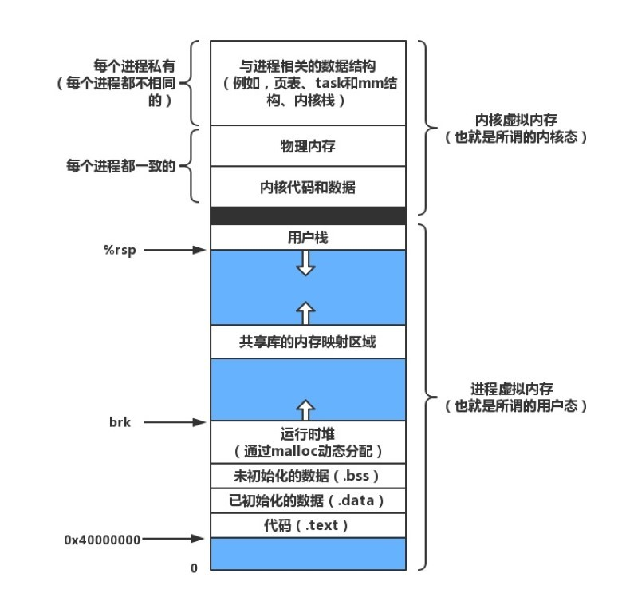
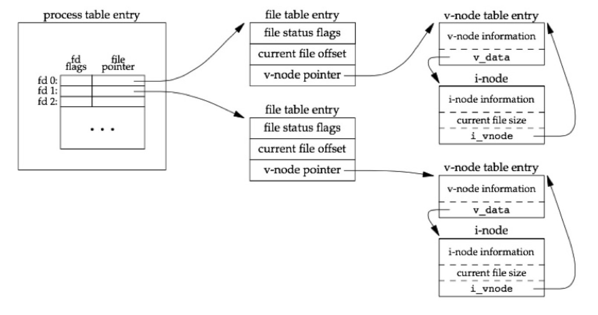
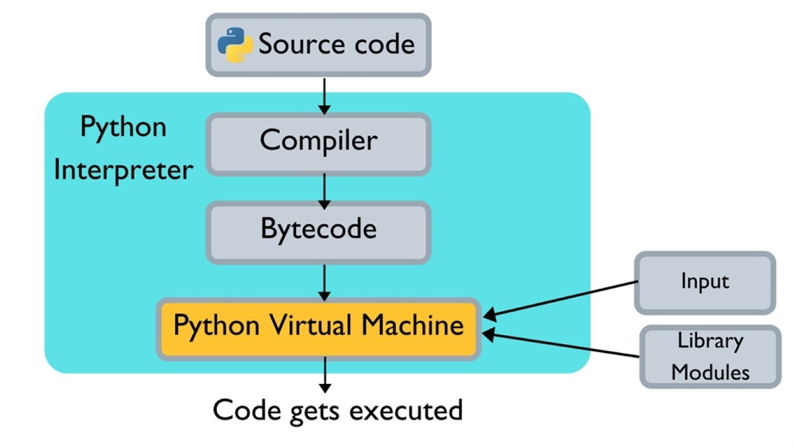
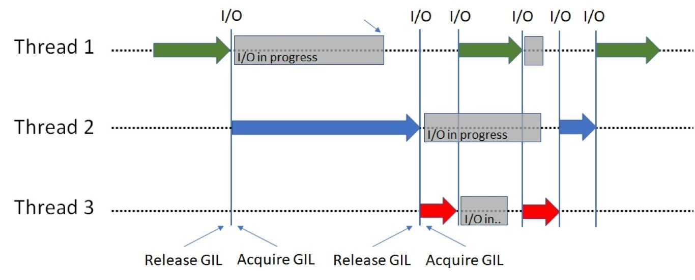
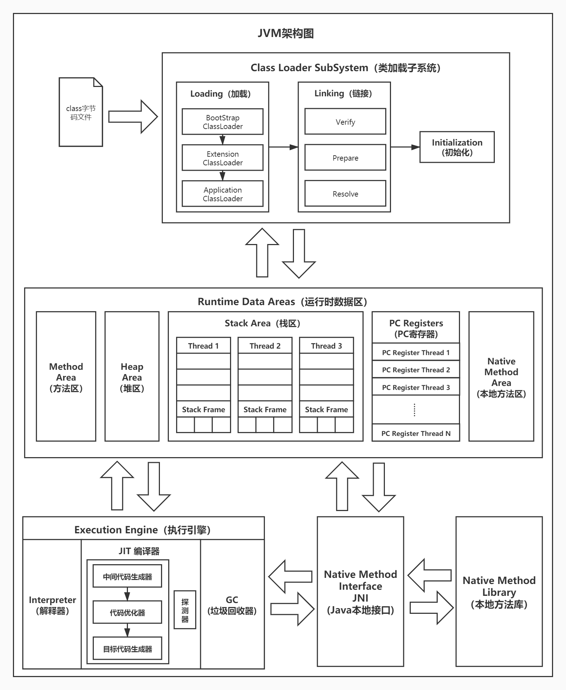
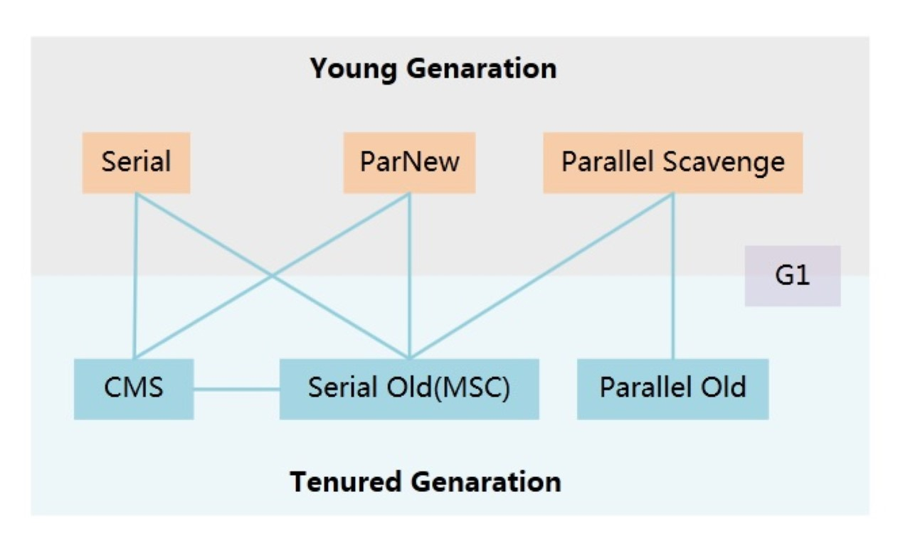
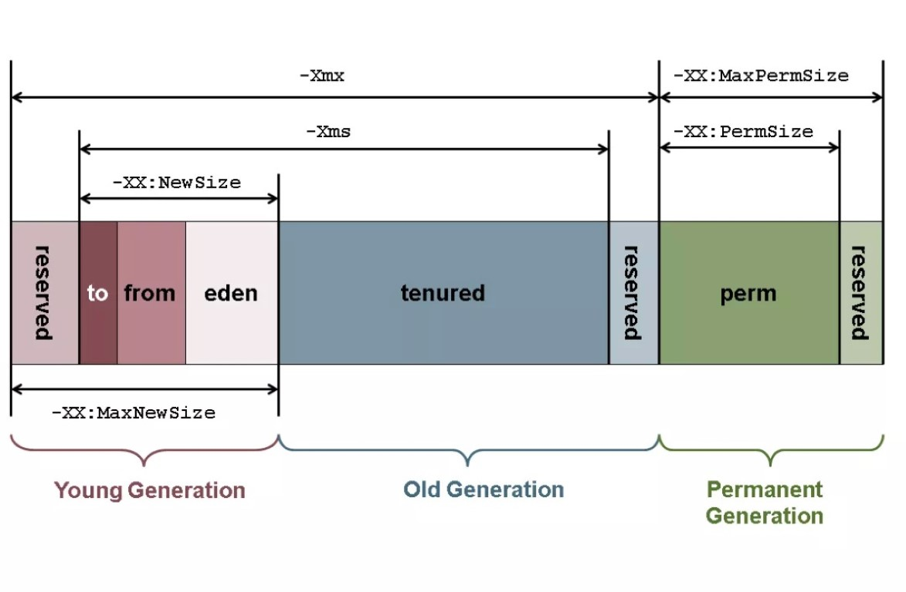

> 本系列参考了Github上诸多开源的学习资料：  
>
> [Snailclimb/JavaGuide](https://github.com/Snailclimb/JavaGuide)  
> [CyC2018/CS-Notes](https://github.com/CyC2018/CS-Notes)  
> [taizilongxu/interview_python](https://github.com/taizilongxu/interview_python)  
> [zpoint/CPython-Internals](https://github.com/zpoint/CPython-Internals)  
> [donnemartin/system-design-primer](https://github.com/donnemartin/system-design-primer)  

# 前言

**简单介绍一下我自己**

我从毕业以后都算是在创业公司摸爬滚打，因此技能点一直比较散乱，大部分时候都处于摸着石头过河的状态。工作中除了深度的运维以外，其他都做过，不过也恰恰是因为运维的事情做的太少了，导致很多知识整合的也比较慢。下面我列举一些知识点，都会在这次的笔记中提到：

- 语言类：Python，Java
- 框架类：Django，系统设计，Thrift
- 数据库：Mysql，Redis，ElasticSearch，MongoDB
- 大数据：Spark，Flink，Kafka

**对，暂时没有算法**

理由并不是因为算法不重要，而是因为网络上已经有了各种总结，也有很多刷题和练习网站，想要提高必须一步一个脚印地刷题。推荐学习的内容有：算法复杂度（结合各类排序）、图的深度宽度优先遍历、堆栈和链表、动态规划、递归与递推、二分查找、二叉树等内容。

# 操作系统

**为什么操作系统基础重要**

操作系统其实是一门计算机的基础课，也是最应该学好的课，因为太多的东西都可以在操作系统中找到影子，很多系统的设计都可以借鉴操作系统中对应功能的设计。从这个角度来看，软件开发就是在不停地重复造定制化的轮子，或者说必须站在成熟系统的基础上，才有可能做出优雅的设计、开发出健壮的系统。

## 虚拟内存

虚拟内存是操作系统中最重要的概念之一，但是这里把它作为所有系统的开篇，原因是绝大部分程序员都忽略了虚拟内存这个概念。

### 虚拟内存是什么

维基百科中这么定义[虚拟内存](https://zh.wikipedia.org/wiki/%E8%99%9A%E6%8B%9F%E5%86%85%E5%AD%98)：

> 虚拟内存是计算机系统内存管理的一种技术。它使得应用程序认为它拥有连续可用的内存（一个连续完整的地址空间），而实际上，它通常是被分隔成多个物理内存碎片，还有部分暂时存储在外部磁盘存储器上，在需要时进行数据交换。与没有使用虚拟内存技术的系统相比，使用这种技术的系统使得大型程序的编写变得更容易，对真正的物理内存（例如RAM）的使用也更有效率。

假设没有虚拟内存的存在，所有的程序直接访问实际内存，那么会有许多问题：

1. 由于直接访问物理内存，那么所有的程序都不可能突破物理内存大小的限制
2. 更致命的问题是对于每个程序来说，都可以直接读取其他程序的内存，并且要小心避开它们否则会导致天下大乱

这也可以理解为虚拟内存产生的背景，假设每个程序员都要考虑这些问题，那么程序员应该早就秃了，而且各类安全问题应该永远也解决不完。想要解决上面说的这些问题，可以引用一句大佬话：

> All problems in computer science can be solved by another level of indirection. 
> 计算机科学里的任何问题都可以通过额外增加一个中间层来解决。  
> —— Butler Lampson  
> [Wiki：Fundamental theorem of software engineering](https://en.wikipedia.org/wiki/Fundamental_theorem_of_software_engineering)

操作系统的设计中在硬件和程序之间增加了虚拟内存这个中间层，让每个进程访问的虚拟内存都相互独立，从而避免了相互访问、相互影响的问题，所有的程序都可以被看作在一块独立的内存中运行。

### 实现虚拟内存

为了实现虚拟内存，需要解决以下几个问题：

**物理地址和虚拟地址**

- *物理地址*：计算机系统的主存（包含内存、硬盘、其他IO等等）被组织成一个连续的长度为 $M$ 的字节数组，每一个字节都有唯一的物理地址。
- *虚拟地址*：现代CPU通过生成一个虚拟地址来访问主存，在使用虚拟地址访问内存之前，会被转换成实际的物理地址。

有了虚拟地址以后就解决了上面提出的问题2，即每个程序都不能随便访问其他程序的内存地址了，因为有操作系统级别的防御。

**虚拟页（页式管理）**

与物理内存类似，虚拟内存也可以被组织成一个连续的长度为 $N$ 的字节数组。为了方便管理，系统将寻你内存分割成许多个大小为 $P$ 的虚拟页，物理内存也分割成许多个大小为 $P$ 的虚拟页，这样可以方便地管理虚拟内存，并将虚拟内存与物理内存进行映射。

一个虚拟页可能在物理内存上，也可能在其他主存上（比如硬盘等），当一个访问一个虚拟页但是它不在物理内存上时，在CPU会发生系统级别的**缺页中断**：CPU暂停运行当前程序并将相应的页面或段调入到内存，然后继续执行原先的程序。

**Linux虚拟内存系统（段式管理）**



段式管理把虚拟内存的整个数组分割成多个不连续的分段，这里面就包含了我们熟知的：代码、数据、堆、共享库以及栈。段式管理的底层数据结构是一个链表，其中的每一个节点都代表了一个不相连的分段，这样每一个段都是相互独立的，并且可以动态增长。

另外操作系统可以对部分段的虚拟内存进行共享，但是在操作系统层面杜绝程序对该段的修改，这样既保证了安全性，又提高了创建进程和使用系统调用的效率，减少了额外开销。

**缺页置换算法**

当系统发生缺页中断时，需要把页调入到物理内存中，如果物理内存空间不足，那么就必须替换物理内存中已有的页。这种情况和现代的缓存系统非常类似，或者说现代缓存系统基本都使用了下面置换算法的一种或几种：

- FIFO（First In First Out），先进先出，总是淘汰最早进入系统的页
- LRU （Least Currently Used），最近最少使用，每个页记录一个最近访问时间T，每次淘汰T最小的页
- LFU （Least Frequently Used），最不经常使用，每一个页记录一个访问次数C，每次淘汰C最小的页

这里还有一种不能实现的算法：OPT，最优置换，这种算法每次选择的被淘汰页将是以后永不使用的，或者是在最长时间内不再被访问的页，但是由于后续的页使用情况是无法预知的，因此这种算法只能作为衡量缺页置换算法效率的标准。

### 题外话：局部性原理

乍一看可能会觉得分页和调度的这种方式对性能有很大损失，但是实际上并不会，这是由于**局部性原理**的存在

> 局部性原理：在某个较短的时间段内，程序执行局限于某一小部分，程序访问的存储空间也局限于某个区域。

基于这个理论，计算机里面的存储从快到慢分为了好多层：寄存器、高速缓存、内存、硬盘、网络等等。根据这个理论，在数据仓库处理数据的时候，也可以把数据按照冷热程度不同，分开存储以节约成本。

## 进程和线程

进程：进程是操作系统对一个正在运行的程序的一种抽象，在一个系统上可以同时运行多个进程，而每个进程都好像实在独占地使用硬件。

线程：现代的系统中，一个进程实际上可以由多个称为线程的执行单元组成，每个线程都运行在进程的上下文中，并共享进程的代码和全局数据。

### 进线程区别

进程和线程的区别主要体现在几个方面：

1. 资源，进程拥有独立的资源，线程本身不拥有资源，由进程决定其资源
2. 调度，线程是CPU调度的基本单位，在进程内切换线程不会引发进程切换
3. 开销，切换进程的开销要比切换线程的开销大得多，因为进程是独享虚拟内存和其他资源的
4. 通信，由于进程的独立性，需要引入额外的通信方式，而线程则是要处理共享内存的并发问题

**并行和并发**

并行指的是同时执行多个任务，对于多核CPU来说这是可行的，但是对于以前的单核CPU来说，只存在并发的概念。因为每个程序看似单独占用所有硬件，但本质是由CPU管理时间片而导致的假象，这种多个程序同时执行的方式被成为并发。由于并发的存在，就引入了上下文切换的概念。

### 上下文切换

在Linux系统中按照特权等级，把进程的运行空间分为内核空间和用户空间（在[虚拟内存](#实现虚拟内存)的图例中也有相关内容）：

- 内核空间具有最高权限，可以直接访问所有资源
- 用户空间只能访问受限资源，必须通过系统调用陷入到内核中，才能访问特权资源

进程上下文切换：由于进程是由系统内核管理的，进程上下文切换只能发生在内核态（处于内核空间的进程）。因此从一个进程切换到另一个进程至少要经过下面的步骤：

- 保存用户态资源，进入内核态
- 保存内核态资源，切换到另一个进程并进入用户态
- 刷新进程的虚拟内存和用户栈

线程的上下文切换相比进程而言代价就小得多，因为线程本身也不拥有虚拟内存区域，也不需要进行到内核态再到用户态的切换。但是进程本身的栈和寄存器等也是需要进行切换的，因此也会有一定的开销，所以如果没有多核心的优势，单线程才最快的。

### 进程通信

由于不同的进程之间拥有不同的虚拟内存，因此它们也是不能直接访问其他进程内存中的内容的，想要在进程之间交换信息，就必须引入进程的通信方式：

1. 管道（Pipe）和命名管道（Named Pipe），消息队列（Message），信号量（Semaphore），内存映射（Mapped Memory）这几种方式大概知道就行，都是数据本机的多进程通信，很多概念也被引入到了线程的并发中
2. 信号（Signal），系统通知进程某个事件发生时会发送一个信号，进程也可以给自己发信号，在设计分布式系统的时候，可以对系统的停止信号做出相应，从而优雅地结束服务
3. 共享内存（Shared Memory），速度最快的同步方式，可以让多个进程访问同一块物理内存，但是需要信号量等外部同步机制
4. 套接字(Sockets) ，即进行网络IO同步，这也是最常见的通信方式，只有它可以让不同机器上的进程进行通信

## 并发模型

假象一个有两个客户端，一个服务器的场景，来介绍三种不同的并发模型：

### 进程并发

构造并发程序最简单的方法就是进程，对于案例中的场景来说，可以这样处理：

- 由一个主进程监控所有的客户端请求
- 当一个请求到来时，新建一个子进程并让其处理客户端请求

优点：模型清晰，共享了文件表但不共享其他内容；子进程的虚拟内存相互独立，不容易出问题  
缺点：共享信息困难，并且进程间通信的速度也很慢；进程新建和切换代价高昂，导致并发量上不去  

### 线程并发

线程并发对于进程并发来说，最大的区别只在于监听的是主线程，而新建的是子线程，并且还可以使用线程池做优化，从而重复地使用线程以减少新建线程的开销。

优点：相对进程线程更轻量，因此效率也更高，可以获得更高的并发量  
缺点：一旦有共享数据或者内存，就会引发各种并发和同步问题，导致bug难以排查（相信写过多线程代码的同学一定深有体会）  

### IO多路复用

IO多路复用是一种事件驱动模型，它基于Linux文件系统提供的非阻塞文件IO接口实现。服务的主进程是一个无限循环，它检测两种事件：

1. 有客户端请求到达时，将请求插入到请求池，并等待描述符进入可读状态
2. 当请求池里有描述符已经可以读取时，读取内容并处理

优点：由于网络请求大部分时间都在等待IO，因此如果处理请求速度很快（即大部分时间都在IO上），那么效率极高  
缺点：编码困难，事件处理会让代码变得复杂、逻辑产生割裂；另外也不能充分利用多核处理器  

## 文件系统

文件就是字节序列，每个IO设备，包括磁盘、键盘、显示器、网络等等都可以看成时文件。文件这个简单而精致的概念是非常强大的，因为它向应用程序提供了一个统一的视图，来看待各式各样的IO设备。

### 文件描述符



在Linux系统中，每个文件都会在系统的v-node表中保存一项记录，里面包含了文件访问、大小、类型等信息。此时如果有一个进程打开了某个文件，那么会在两个表中加入相应内容：

1. 打开文件表，包含文件位置、引用计数和到v-node表的指针，这是所有进程共享的表
2. 描述符表，包含打开文件的偏移量、读写状态和一个到打开文件表的指针，这是进程独有的

一个进程可以多次打开同一个文件，这就会在描述符表中建立多个描述符，父子进程就是通过复制描述符来共享文件资源的。打开文件表中会有一个引用计数，直到引用为零时，才可以删除表格中的这一项，因此打开文件后一定要正确关闭从而释放资源，否则会导致引用计数无法归零从而产生内存泄漏。另外每个文件都有最大支持的描述符数量限制，如果超过这个限制会遇到系统报错，当然这个限制也是可以调整的。

#### 有趣的小问题

有一个运维同学发现某台服务器上的日志文件大小增长迅速，就快把硬盘塞满了。他干了这么两件事情：

- 先是打开了一个ssh使用`tail -f`命令查看这个文件的情况，果然开始疯狂刷屏
- 然后打开了另外一个ssh，直接删除了这个日志文件，并且确认了文件已经被删除了

最后神奇的事情发生了：那个读取进程还在刷屏，并且空间并没有释放，最后还是把硬盘塞满了。这个问题就非常好的体现了操作系统里面进程的隔离性和文件的设计方式，具体是什么原因就留给读者自己思考。

# Python

Python的语言体系相比Java而言知识点更细碎，因为Python本身的语言哲学就是一切从实用性出发，给我最深印象的Python书是[《Python Cookbook》](https://book.douban.com/subject/26381341/)，里面记录了大量的语法糖和黑科技，就和Python语言本身的特性一样，都极具实用性。后面笔者会尽量将其中的难点挑出，而其他大众化的问题则会略过。

## 语言特性

### 可变与不可变对象

Python中的基础容器有四种：dict、set、list、tuple，其中只有tuple是不可变对象，因此也只有它可以作为dict的Key，另外基础类型：int、str、float等都是不可变对象，这听起来似乎有点奇怪，比如：

```python
i = 10
i += 1
```

看起来变量i从10变成了11，但是实际上并不是这样，在Python语言中所有的代码都会转化成字节码，再交给Python虚拟机运行，如果使用Python自带的dis命令就可以看出，常量在虚拟机运行时是先载入到内存里，再赋值给变量的，而数字之类的内容都属于常量的一部分，它们也会参与引用计数和垃圾回收，通过下面的例子可以方便理解：

```python
x = 1
y = 1
id(x)  --- 9784864 (这个id在不同的虚拟机中会不同)
id(y)  --- 9784864 (和x的结果一样，它们指向同一个常量)
```

### 元类（Metaclass）

简单来说，元类就是类的类，类定义了一个对象应该有哪些统一的属性和表达，元类则定义了类应该有哪些统一的属性和表达。除了这个所说的定义以外，Python中的元类还有以下特别之处：

- 假设A1类继承于A类型，那么A1类型的元类必须继承于A类型的元类
- 类和元类都可以当作方法直接调用，调用类可以获得一个实例，调用元类可以获得一个类

在Python3中，所有的类最终都继承于Object，另外所有的类都有一个默认元类Type，因此Type继承于Object，而Object又是Type的实例，这听起来有点拗口，并且还会有一个先有鸡还是先有蛋的问题，可以通过代码琢磨它们的关系：

```python
isinstance(object, type)  --- True
isinstance(type, object)  --- True
issubclass(type, object)  --- True
issubclass(object, type)  --- False
```

一般来说，在日常代码中不太会用到元类，但是在框架或者ORM系统中就很常见了，比如Django的ORM就是使用元类实现的。另外，像注册工厂、策略模式等都可以通过元类类实现。

### 命名空间（Namespace）

在Python中是按照命名空间来组织变量的，比如：全局命名空间中的系统函数、某个模块中的模块级变量、某个函数中的内部变量等等。但是和其他语言不同的是，Python里面的命名空间是动态的，也就是说，命名空间与代码块并不是完全对应的关系，在运行的过程中，完全可以修改其他命名空间中的变量。

**nonlocal和global标识符**

当一个变量在当前命名空间中找不到时，会向外层命名空间中寻找，但是如果看源码就会发现，Python在外部命名空间向内部命名空间传递变量时，传递的是变量的引用而不是变量本身，因此在并不能在命名空间内部直接修改外部变量的值，比如：

```python
def setC():
    # global c
    c = 2

c = 1
setC()
print(c)  --- 1
```

这段代码将global c的注释去掉，程序就可以获得想要的结果了，否则是会报错的，通过global描述符会告诉解释器c并不是一个局部变量而是在全局命名空间中，类似的还有在python3加入的nonlocal标识符，它告诉解释器变量在外层命名空间中。

PS：Python的官方文档里有关于[类和命名空间](https://docs.python.org/3/tutorial/classes.html)的详细解释，推荐阅读。

### 类方法的绑定关系

首先，类本身也是一种特殊的命名空间，这在官方文档中有相应的介绍，而实例的命名空间是类命名空间的子空间，因此类的方法和变量会有一种神奇的绑定关系：

- 类方法会绑定在类的命名空间下
- 类变量会通过init函数绑定在实例的命名空间下，并且self就是实例本身

这么说非常拗口也难以理解，可以通过一个例子来描述它：假设有类A和它的实例a，在调用a.func()时，Python虚拟机首先会找a的命名空间里面有没有func这个成员，发现没有，然后就会去找A的命名空间，发现有func这个成员，同时是一个类绑定的方法，那么就会修改调用参数，最后相当于进行了一次A.func(a)调用。Python使用这种巧妙的方法，实现了面向对象很重要的一个特性：动态绑定。

**classmethod和staticmethod**

这两个装饰器由Python内核提供，它们会改变类绑定方法的调用方式，使其在调用是传入的是A或者不传入额外参数，从而实现了类方法和静态方法的效果。

### AOP和装饰器

大名鼎鼎的AOP在Spring的框架中到处都在使用，面向切面的基本思想是在一个方法调用时，可以动态地添加一些额外操作（对应的是动态代理的设计模式），比如：根据配置文件内容，决定是否要将某个方法的运行时间、结果和报错记录到日志中。

在Python中想要实现一个AOP的话其实很简单，只要使用装饰器的语法糖就可以了：

```python
def log(func):
    def wrapper(num):
        print("before func")
        func(num)
        print("after func")
    return wrapper

@log
def print_num(num):
    print(num)

print_num(3)
```

在上面这个例子中，装饰器语法糖的本质是：将原有的print_num函数，替换成log(print_num)数，在装饰器内又是一个闭包结构，最后返回了一个代理以后的新函数。

## Python虚拟机

计算机、Python虚拟机或者JVM，其存在的目的是让使用者可以通过编码的方式解决所有的可计算问题，它们本质上都是[图灵机](https://zh.wikipedia.org/zh-cn/%E5%9B%BE%E7%81%B5%E6%9C%BA)的一种具体实现。Python虚拟机也有许多种具体的实现，比如：cpython、pypy，Jython等等，这里所描述的虚拟机通常指的都是cpython。



简单描述一个Python脚本放入cpython虚拟机后的执行过程：

1. 首先会代码会经历一个预编译过程，将代码转化成字节码
2. 字节码和汇编代码很类似，每一行会包含两个部分：对应的操作码和参数
3. cpython虚拟机会逐行加载字节码，然后使用一个巨大的for循环逐条执行，最终得到结果

在cpython执行字节码的时候，还会涉及到一些基本概念，比如：系统栈（临时存放系统常量和返回结果）、方法栈（保存当前调用方法的上下文）、堆内存（方法栈中保存的都是变量的指针，最终内容会存在堆内存中）等等。

### GIL线程全局锁

GIL是一把在cpython中最著名的锁，它也几乎是Python多线程程序的死亡宣告，想用Python多线程加速计算的话可能适得其反。想要了解Python的多线程机制，就必须理解GIL的存在，那么不妨从它诞生的环境开始了解它：在Python诞生之初，那还是一个单核CPU的时代，因此设计者本着实用思想，并没有对多核心做额外的优化，多线程存在的价值仅仅是为了能让程序并发运行。



要知道，复杂的线程同步机制本身是会伤害单线程程序运行效率的，那么既然都只有一个CPU能运行，不如简单直接地加一把CPU级别的锁，保证同时只有一个线程在使用CPU就可以了，这种设计在当时看来也是非常高效优雅的，直到多核心CPU的出现和大力发展。

由于GIL的存在，每一个字节码在执行时都是原子的，因此cpython内部的许多模块都是无锁的，比如大名鼎鼎的内存管理和GC，也因此在使用Python多线程的时候，大部分系统库天生就是线程安全的，也不需要考虑多线程竞争问题。

#### 为什么不放弃GIL

即使升级到了没有向前兼容的Python3，cpython也没有放弃GIL，这个问题本质有两个原因：

**性能问题**：如果要删除GIL，那么势必要把原来cpython中不支持多线程的部分都加入多线程的支持，这种操作会大大影响单线程运行时的性能，有人在1999年就发布过一个删除了GIL的解释器版本，实测后多线程程序的确加速了，但是代价是单线程程序效率减少了40%，这种代价所有人都无法接受，就不了了之了。

**历史问题**：许多库都专门为cpython设计，因此不少也依赖于GIL来保证它们的线程安全性，一旦GIL消失，那么估计很大比例的Python库都将无法使用，试问谁会愿意用一个找不到库的Python语言呢？

**规避GIL的影响**

其实GIL本身没有非常可怕，它的限制仅在于想要通过多线程处理并行计算时，对于网络请求一般不会产生太大的影响（在执行IO任务时，对应线程会自动释放GIL，等待直到IO完成，会再次获取GIL并执行之后的逻辑），那么想要高效使用Python多线程的话，可以有几个方法：

- 切换到多进程库，使用多进程来进行计算
- 使用生产者消费者模型，启动多个消费者进程
- 将核心部分更换为C语言实现，并在C语言中释放GIL

### 垃圾回收（GC）

在[《深入理解计算机系统》](https://book.douban.com/subject/26912767/)中介绍虚拟内存时，还介绍了两种编程语言可以提供的动态内存分配器：

1. 显示分配器，要求必须在代码中显示地释放之前申请的内存，否则会导致泄露（C语言和C++使用的方式）
2. 隐式分配器，要求分配器自动检测不在使用的内存，自动释放（Python和Java都使用这种方式）

为了实现隐式分配器，cpython做了以下设计：

#### 引用计数

在cpython的实现中，每个对象都是一个PyObject对象，这个对象的结构很简单，其中只有一个参数：ob_refcnt用于统计当前对象被引用的次数。在整个cpython虚拟机中，这个引用计数都被小心地维护着，每次有引用新增时，计数加一，引用被删除时，计数减一。当引用计数为零时，则直接触发一次垃圾回收，回收这个没有任何引用的对象。

**引用计数的弊端**：引用计数有一个很小的额外开销，但是没有用的垃圾对象会被立刻回收，因此有很好的回收效果。不过更严重的问题在于引用计数无法解决循环引用的问题，比如：

```python
class A:
    pass

a1 = A()
a2 = A()
a1.next = a2
a2.next = a1
```

在这种情况下，a1和a2的引用计数都是2，如果在local_namespace里面删除这两个对象，它们的引用计数都是1，都不会触发系统的垃圾回收，cpython中通过加入分代回收机制来解决这个问题。

#### 分代回收机制

其实分代回收包含了两个算法：

**分代回收**：在cpython中默认包含3代，如果某个对象在当前代的垃圾回收中存活，那么自动移动到下一代中。垃圾回收时，选择好需要回收的代之后，会把它和比它年轻的代都合并，再进行回收。

**标记清除**：标记清除的本质是利用搜索标记出那些不可达的对象，并且进行垃圾回收，这种方法需要遍历整个堆内存。假设将所有要回收的部分合并，称为yong，不回收的部分称为old，cpython中的标记清除算法实现有以下细节：

1. 首先遍历yong中所有对象并且删除它们之间的引用计数，即消除所有yong内变量之间引用关系的影响，当引用计数为0时，把对象加入到待删除链表中
2. 然后从外部引用开始，再次遍历所有yong中的对象，如果它的引用计数大于0，那么找到它引用的所有对象，重新加上引用计数，如果这些对象已经在待删除链表中了，把它们捞回来
3. 最后回收所有待删除链表中的对象，cpython虚拟机中的整个GC流程就完成了

# Java

Java是一种非常严谨和工整的语言（当然它也在发生着变化，尤其Java8加入了非常多的流式操作以后，也变的灵活起来），我在大学里通过[《Java编程思想》](https://book.douban.com/subject/2130190/)第一次系统地学习了Java编程语言，这本书从面向对象编程开始讲起，和Java语言本身一样，都非常的严谨工整。

## 语言特性

### 反射机制

Java中的反射机制可以类比Python中的元类，在Java中每个类都有一个Class对象，包含了与类有关的信息。当编译一个新类时，会产生一个同名的.class文件，该文件内容保存着Class对象，获取Class的方法大致有下面几种：

```java
// 通过类获取
Class alunbarClass = TargetObject.class;

// 通过类名获取
Class alunbarClass1 = Class.forName("cn.javaguide.TargetObject");

// 通过实例获取
Employee e = new Employee();
Class alunbarClass2 = e.getClass();

// 通过类加载器获取
Class clazz = ClassLoader.LoadClass("cn.javaguide.TargetObject");
```

获取了Class信息后，就可以通过反射来直接操作对象，比如：给成员变量赋值、调用成员方法、直接创建一个新对象等。使用反射机制的动态类加载为Java增添了许多灵活性，和Python中的元类比较相似的是：日常开发中很少会用到，但是在框架和ORM中就会经常出现，比如JDBC中使用反射加载数据库驱动，另外Spring中的AOP和IOC都和反射有关。

但是这种灵活性不是没有代价的，主要问题有两个：

1. 性能劣势，反射的内容JVM无法预知，因此也无法进行优化，要比静态代码中的类慢很多
2. 安全问题，反射机制甚至可以直接操作对象的私有变量，这会导致很多意外情况，并且被反射的类也失去了编译时异常的机会，所有的异常都会在运行时抛出

### 动态代理

#### 设计模式：代理模式

代理模式是设计模式的一种，一般所讲的代理模式都是静态代理，简单来说就是创建一个代理对象来屏蔽对正式对象的访问，这样就可以在不改变原有对象的基础上提供新功能的扩展，与之相类似的还有**适配器模式**。

不过恕我直言，工作的这几年中，还没有要一定要使用静态代理的场景，尤其在针对已有代码做扩展的时候，直接使用静态代理很容易被人当成是不愿意对原有代码进行重构，而强行加的补丁。

#### 动态代理：JDK动态代理和CGLIB的选择

动态代理就和Python中的装饰器非常相似了，它们都是可以实现AOP这种设计模式的。在Java中，动态代理还有两种常见的实现方式，即Java原生支持的JDK动态代理和第三方开源库CGLIB支持的动态代理：

- **JDK动态代理**：为了使用JDK动态代理，首先需要创建一个接口，然后继承系统的InvocationHandler，覆写其中的invoke方法来代理接口定义的方法，新增的功能可以直接写在invoke方法中
- **CGLIB动态代理**：使用CGLIB动态代理就不需要额外写接口，但是同样需要继承库提供的MethodInterceptor来实现动态代理，通过重写intercept方法，把新增的功能加入到intercept方法中

两种代理的对比：

1. JDK动态代理的被代理对象必须继承于某个接口，而CGLIB则是通过生成一个被代理类的子类来拦截调用，因此CGLIB不能支持final的类型和方法
2. 绝大部分时候JDK动态代理性能更强，并且随着JVM的升级，性能差距会进一步拉大，因此更推荐这种方式

### BIO、NIO和AIO

在进程读取文件的时候，必须发起一个系统调用，这个步骤会导致进入进程进入内核态，然后系统会将文件的内容放到用户态的虚拟内存里，进程回到用户态执行接下来的逻辑。这里就涉及一个问题了，因为IO是很慢的，那么在系统读取文件内容的这段时间里，进程该干什么呢？这里就引出了JVM三种文件读取模式：

**BIO（同步阻塞IO）**：在这种模式下，JVM发起read系统调用后就会一直等待数据读取，直到数据就绪才会返回。这就意味着如果没有数据就绪，这个读取操作将会一直被挂起，用户线程将会处于阻塞状态。

**NIO（同步非阻塞IO）**：这种模式对应了并发模型中的IO多路复用，一般的实现方式为服务器建立一个线程作为多路复用器处理请求，客户端发送请求会被注册到多路复用器上，多路复用器轮询到有请求完成IO步骤就会进行处理。在JDK1.4中新增了nio相关的包，并使用了Selector和Channel实现了多路复用器，另外还有许多性能上的优化，深度了解可以参考：[美团：Java NIO浅析](https://tech.meituan.com/2016/11/04/nio.html)。

**AIO（异步非阻塞IO）**：JDK7中更新了nio包，真正支持了异步IO模型，在这种模式下，所有读取完成之后的操作都由回调进行，也就是说不再是轮询IO状态的模式了，而是订阅-通知的模式。

## Java虚拟机

JVM在执行代码的整体流程上和Python虚拟机是类似的，在JVM中：编写好的Java代码通过Java编译器编译成字节码，然后交给JVM执行。不过由于JVM是一种标准，它并没有规定具体的实现，因此在整个JVM体系里面，使用到的技术要比Python虚拟机多得多，也复杂得多。

**即时编译编译器（JIT）**

不管是什么虚拟机，拿到字节码之后最终都是要转化成汇编和机器语言来执行的，在这个翻译的步骤中，实际上是可以加入很多优化的。因此，引入了JIT技术，这种技术会在字节码执行的时候，将一部分经常执行的字节码直接翻译成汇编或者机器码，同时对其进行优化并保存，下次再执行时就可以直接使用编译和优化过的代码了，这可以大大加速Java代码的执行。

不过使用JIT进行编译和优化也是需要时间的，因此一般都会采用直接执行和JIT混合的方式，这样既保证了字节码可以没有延迟地直接运行，又让经常运行的代码得到很好的效率。由此也会引出如何配置JIT优化的话题，不过那个太深入了，不在本次讨论的范围内。

### JVM模型

由于JVM只是一种标准，因此它也有许多不同的实现（比Python多了很多），其中最著名也是最常用的是HotSpot虚拟机，它由三个主要的大模块组成：类加载器、运行时数据区和执行引擎。



#### 类加载器

Java的动态类加载功能是由类加载器子系统负责处理的，当JVM在运行时（注意不是编译时）首次引用一个类时，它读取对应的class文件并加载、链接和初始化该类的所有信息。类的加载一般分为三个步骤：

1. 加载，把class字节码文件从各个来源通过类加载器装载入内存中
2. 链接，这里又有三个步骤：验证类的安全性和合法性、为类变量分配内存并赋初值、将常量池内的符号引用替换为直接引用
3. 初始化，在这个过程中执行类的初始化，调用init方法，这个方法由JVM生成，一般由类的静态代码和静态变量初始赋值构成

**双亲委派模型**：在JVM中，系统提供了三种有父子关系类加载器，当一个类需要被加载时，双亲委派模型要求类加载器先询问父加载器是否可以加载，如果不能加载才由当前加载器加载。这样的目的是为了保障每个类都只会被加载一次，当然也是可以不遵守双亲委派模型的，比如希望使用不同版本的库的时候。

#### 运行时数据区

运行时数据区域主要包含三个部分：

1. 方法区：所有类级别数据将被存储在这里，包括静态变量，每个JVM只有一个方法区
2. 堆区：所有的对象和它们相应的实例变量以及数组将被存储在这里，每个JVM只有一个堆区
3. 栈区：对每个线程会单独创建一个运行时栈，另外每一个函数调用都会在栈内存生成一个栈帧（Stack Frame），所有的局部变量将在栈内存中创建

由于方法区和堆区的内存由多个线程共享，所以存储的数据不是线程安全的。栈区，另外还有PC寄存器（保存每个线程当前执行指令的地址，方便线程切换时恢复）和本地方法栈（保存非Java语言实现方法的运行信息）都是每个线程私有，是线程安全的。

#### 执行引擎

Java代码转化成的字节码将由执行引擎执行，执行引擎会读取字节码并逐段执行。

执行引擎的部分又可以分为三块：解释器、JIT编译器和垃圾回收器。前面两个在最开始介绍[Java虚拟机](#Java虚拟机)时已经描述过，解释器运行速度慢但是可以立刻运行，JIT编译器运行速度快但是需要等待；垃圾回收器负责对使用的内存进行GC，在JVM里有非常多种实现，因此会在之后单独描述。

此外还有两个组件：Java本地接口（JNI）是一种编程框架，使得Java虚拟机中的Java程序可以调用本地应用或者本地库；本地方法库一般是由其他语言实现的，为了方便Java和系统调用进行交互，为JNI提供了可调用的方法。

### 垃圾回收（GC）

在JVM中，发生垃圾回收的区域重点区域是堆区，由于在HotSpot中采取了分代回收的策略，因此整个堆区都是按照分代思路来设计的，包含了：新生代、老年代和永久代（JDK8中是元空间），其中新生代又可以分成Eden、From Survivor（FS）、To Survivor（TS）空间。

#### 不同的GC算法

和Python虚拟机不同，JVM中没有使用引用计数算法，因此所有的回收都依赖可达性分析，而Python中使用的标记-清除算法我们已经说过了，剩下还有两种：标记-整理（标记完成后将存活的对象进行整理和压缩）和标记-复制（标记完成后将存活的对象复制到新区域），这三种算法都有自己的限制：

- 标记-清除：会造成大量的碎片，当碎片增多后可能导致非常频繁的GC
- 标记-复制：理论上极限情况需要一倍额外的空间来保存复制过去的对象，内存使用效率很低
- 标记-整理：需要完全标记所有对象以及它们各自的大小后才能进行整理（标记-复制就不需要，因为可以在发现对象存活的时候直接复制）

#### 不用的GC区域

针对GC区域的不同，JVM的GC可以分为：

- Minor GC / Young GC，针对新生代的GC
- Major GC / Old GC，针对老年代的GC，目前仅有CMS有这种模式
- Mixed GC，针对整个新生代和部分老年代的GC，目前仅有G1有这种模式
- Full GC，针对整个新生代和整个老年代的GC

#### 垃圾收集器

如果说GC算法是内存回收的方法论，那么收集器就是具体实现了，与Python虚拟机不同的是，JVM提供了大量的收集器来应对不同的使用场景。总的来说，不同的垃圾收集器都实现了不同的GC算法、适用于不同的GC区域，并且它们之间还有限制组合关系，如下图：



弄清楚每一种垃圾收集器的优劣并且根据场景选择，就可以对JVM进行调优，但是这就是一个非常复杂的问题了，因为笔者还没有遇到过这种场景，就不再深入了。

#### 一般GC流程

大部分垃圾收集器对于新生代GC采用了标记-复制的算法，主要流程为：将Eden空间和FS空间合并进行标记算法，找出存活的对象并保存到TS空间，完成后交换FS和TS空间的指针。这里面还会涉及到几个问题：

- **内存效率**：为了提高内存的使用效率，默认Eden、FS和TS空间的比例为8:1:1，这里必须知道一个类似于局部性原理的前提：在Java中绝大部分对象生命周期都很短，因此在新生代中大部分都是垃圾对象
- **空间不足**：一旦在新生代发生空间不足的情况，对象都会直接被移动到老年代中，比如：TS空间不足无法放得下所有被复制的对象
- **晋升通道**：对象从新生代到老年代有一个晋升机制，即每次存活后对象年龄+1，到达一定阈值时进入老年代，这个默认值时8，即某个对象发生八次新生代GC后仍然存活，就会被放到老年代

由于老年代没有额外的空间，因此老年代的GC会采用标记-整理或者是标记-清除的算法，这两种算法的大致流程都差不多，就不赘述了。

#### 与堆区有关的参数

对JVM的调优涉及了非常多的知识，比如JVM内存模型、GC算法和各种可用参数等，这里仅以图示列出了和堆区有关的参数，具体调优建议精读[《深入理解Java虚拟机》](https://book.douban.com/subject/34907497/)有关调优案例和分析的章节。



PS：JDK8开始，元空间取代了永久代，所以相应的JVM参数变成-XX:MetaspaceSize及-XX:MaxMetaspaceSize。

## 线程并发

TODO

### 原子对象

### 锁相关

### 线程池
