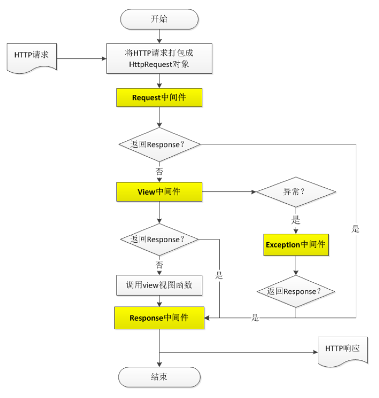
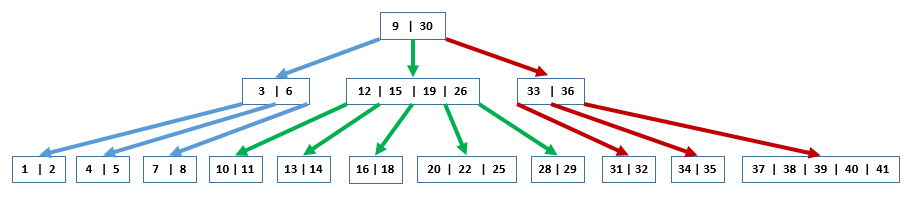
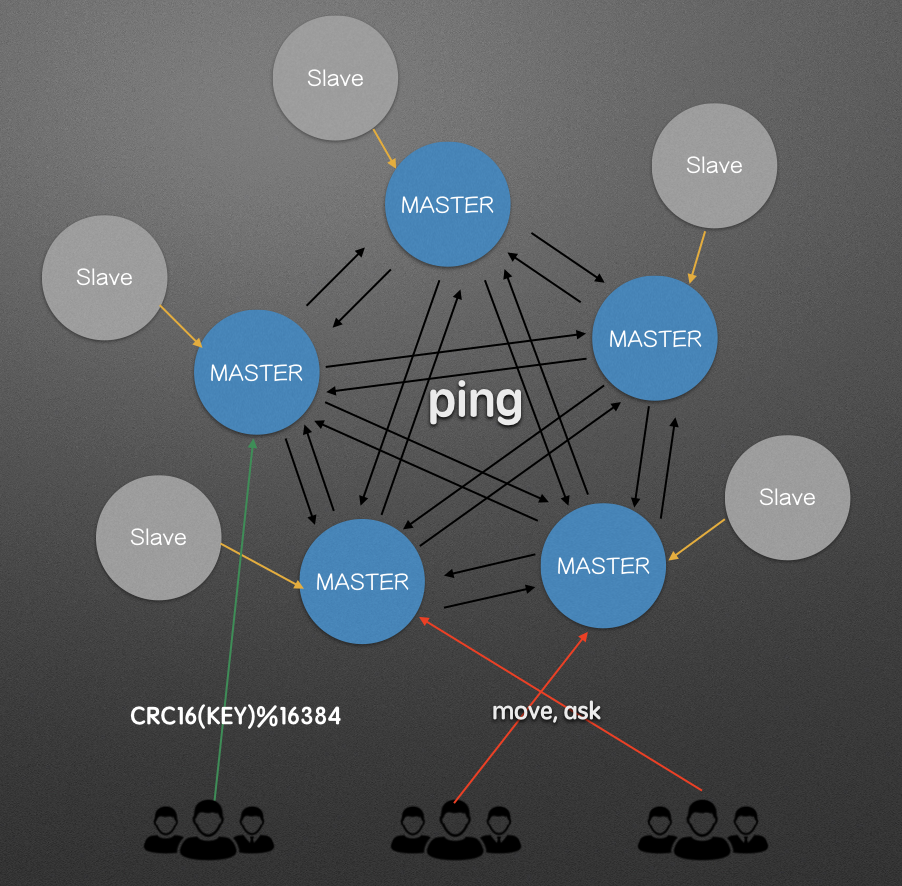
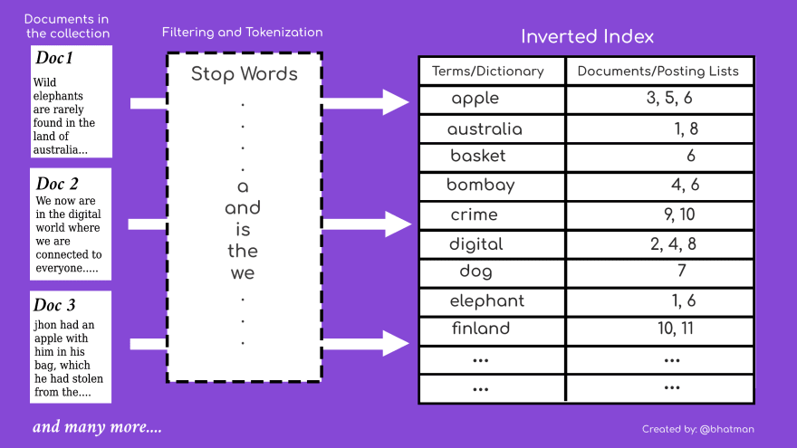

> 本系列参考了Github上诸多开源的学习资料：  
>
> [Snailclimb/JavaGuide](https://github.com/Snailclimb/JavaGuide)  
> [CyC2018/CS-Notes](https://github.com/CyC2018/CS-Notes)  
> [taizilongxu/interview_python](https://github.com/taizilongxu/interview_python)  
> [zpoint/CPython-Internals](https://github.com/zpoint/CPython-Internals)  
> [donnemartin/system-design-primer](https://github.com/donnemartin/system-design-primer)  

# Django

## 基础架构

### 基于Python的Web框架

#### WSGI

WSGI的全名是：[Python Web Server Gateway Interface](https://zh.wikipedia.org/wiki/Web%E6%9C%8D%E5%8A%A1%E5%99%A8%E7%BD%91%E5%85%B3%E6%8E%A5%E5%8F%A3)，即用Python语言定义的一种Web服务器到Web应用框架之间的一种接口协议，这么说可能还是比较拗口，那么可以先来看一下HTTP的大致流程：

1. 浏览器发起请求到HTTP服务器，然后服务器返回请求所对应的文本
2. 浏览器接到请求的文本，再根据文本生成浏览器里面展示的内容

所以最简单的一个Web服务就是一个静态文件的服务器，即根据url直接找到文本返回就可以了，但是如果使用Python作为后端服务器，那么就会有一个动态的流程了，WSGI就是定义这种流程的一个规范，如果没有这个规范，想要实现一个HTTP服务器可能就得花个把月去了解HTTP协议的全部内容了。


有了WSGI以后，想要实现一个基于Python的动态Web服务器就很简单了，参照文档编写代码就可以了，详细内容可以参考：[FullStack Python - WSGI Servers](https://www.fullstackpython.com/wsgi-servers.html)。

#### uwsgi和uWSGI

这两个东西的名字实在是太值得吐槽了，虽然只是大小写的区别，但却完全不同：

- uWSGI是针对WSGI传输协议的一种实现，是一个Web服务器
- uwsgi是uWSGI服务器包含的一种自有传输协议，与WSGI没啥关系

当红的基于Python的Web框架都自己实现了WSGI，不需要依赖uWSGI就可以直接运行，但是Django官方文档也有说明，因为效率问题绝对不能用在生产环境，使用uWSGI进行部署可以参考官方文档：[Django - 如何用 uWSGI 托管 Django](https://docs.djangoproject.com/zh-hans/3.1/howto/deployment/wsgi/uwsgi/)。

但是一般uWSGI还会和Nginx进行混合部署，因为Nginx有非常优秀的静态文件性能，可以让静态文件由Nginx代理，动态接口再由Nginx转发到uWSGI服务器。

#### ASGI

在Python3中，加入了新的关键词async和await，代替了原有的yield实现，形成了新的[协程模型](https://docs.python.org/zh-cn/3/library/asyncio-task.html)。这种新编码方式的出现，为异步服务器提供了遍历，因此[ASGI](https://asgi.readthedocs.io/en/latest/)诞生了，它本质上就是一个支持异步服务器版本的WSGI。

一般情况下还是推荐使用WSGI，不过如果想要使用WebSocket的话，ASGI可能就是一个比较好的选择了，尤其Django官方支持的WebSocket库Channels就指定了必须使用ASGI协议。但是目前ASGI还不是特别成熟，性能也容易遭遇瓶颈，因此还是推荐单独部署WSGI和ASGI，再由Nginx转发请求。

### 处理HTTP请求的基本流程

在Django系统中处理HTTP请求时，很重要的一点是它的中间层系统，它的中间层设计类似于一个针对请求的AOP，许多第三方插件都是通过中间层来实现的。最开始在Django的WSGIHandler中会将WSGI封装的environ转化成Reqeust，之后的处理流程大致如下图：



一般常见的使用到中间件的情况有：

- 针对登录鉴权等用户信息的额外处理，会加在Request中间件里面
- 报错系统的设计可能需要把内部Exception转化成到前端报错，可以在Exception中间件中实现

# 系统设计

目前通常所说的系统设计都是分布式环境下的系统设计，微软有一套很好的教程，讲述了在分布式环境下构建应用需要用到的概念和技术，笔者做了搬运工，可以参考：[Architecting Distributed Cloud Applications](/2020/12/31/architecting-distributed-cloud-applications/)。

# Mysql

Mysql是目前最流行的关系型数据库，它最常见的数据库引擎是InnoDB，即一种支持事务的数据库引擎。不同的引擎都会支持不同的功能，也有不同的优缺点，比如另一种引擎：MyISAM，它的索引和查询速度更快，但是不支持事务，下面的内容默认属于InnoDB引擎。

## 索引

索引的目的是为了更快地找到对应的数据，其实在日常的代码中就经常使用到和索引有关的结构，比如：Python对象底层都是一个dict，而dict对应的实现就是哈希表；Java中的HashMap、HashSet以及TreeMap和TreeSet都是非常常用的容器。

### B树和B+树

B树和B+树广泛应用于各类的数据库中，它们都是树形数据结构的一种，并且都属于[搜索树](https://zh.wikipedia.org/wiki/%E6%90%9C%E7%B4%A2%E6%A0%91)。



搜索树有一个非常重要的特性：它的中序遍历是有序的，由于这个特性，如果希望寻找一个 $key$，那么可以从根开始查找，根据 $key$ 和当前节点保存值的大小关系去查找对应子树，直到找到 $key$ 或者确认它不存在，最终查找单个值的复杂度上限不会超过树的深度。

假设这是一个拥有 $N$ 个节点的 $M$ 叉树，那么它的平均深度应该是 $log_mN$ 的量级，除非发生它退化成一根线的极端情况，此时它的深度就是 $N$ ，因此查询效率也会退化到 $O(N)$。为了避免这种情况的发生，我们在维护排序树的时候，需要对其进行平衡操作，使其的深度维持在 $log_mN$ 的量级，这就引出了[平衡树](https://zh.wikipedia.org/wiki/%E5%B9%B3%E8%A1%A1%E6%A0%91)。

平衡树的门类下面有非常多的实现，其中还有极其出名的红黑树，Java中的TreeMap底层就是这种数据结构。另外，B树和B+树也都是平衡的，需要注意的是，维持树的平衡也是消耗时间的，因此每一次插入理论上来说并不是等价的。

#### 关于索引的疑问

> 首先有第一个问题：为什么不使用红黑树？

早期计算机都是使用的机械硬盘，对于机械硬盘来说每次读取的寻道时间都很长，所以要尽量减少读取硬盘数据的次数，另外硬盘还有个[4K对齐](https://zh.wikipedia.org/wiki/4K%E5%AF%B9%E9%BD%90)的说法，即一般情况下单次读取硬盘最少要读取4K（一个扇区）的大小。因此，最好的方法是让每个节点都刚好是4K大小，这样可以充分利用硬盘资源，那么二叉树结构就不适用了，因为根本用不完这么大空间。

> 然后是第二个问题：为什么InnoDB引擎使用了B+树作为索引？

B+树和B树的区别在于：B+树的数据全部都存储在叶子节点上，其他节点只存储索引信息，叶子节点之间还会有指针相连。那么它们各自的优点也很明确了：B+树针对rang类型的查询会有优势，而B树则对随机查询单个节点更快。因此，对于NoSql的数据库MongoDB，就选择使用了B树，这里并没有孰优孰劣，只是适用的场景不同。

> 然后是第三个问题：为什么推荐使用自增ID作为主键？

产品侧的原因是随着产品迭代可能会出现需要换主键或者主键重复的情况出现，这就很麻烦。对于技术侧来说，主要原因还在索引上，每张表都只会有一个聚簇索引（保存数据的那个索引，同时也是主键所在的索引），如果主键是个随机值，那么每次插入都可能涉及很多的平衡操作，导致效率变差，如果只是递增ID的话，平衡操作就更少，效率也更高。

#### 查询优化

由于B树的排序性质，对于多列索引和字符串索引，可以免费获得其前缀索引。但是，对于那些从中间列开始查询，或者从字符串中间开始查询的内容，就不会命中任何索引了，这也是B树索引导致的，更多的Mysql查询优化建议参考：[《美团技术团队-MySQL慢查询优化》](https://tech.meituan.com/2014/06/30/mysql-index.html)和[《高性能Mysql》](https://book.douban.com/subject/23008813/)。

### 哈希索引

哈希索引的底层数据结构是[哈希表](https://zh.wikipedia.org/wiki/%E5%93%88%E5%B8%8C%E8%A1%A8)，因为这个结构在各种语言里都非常常见，就不赘述它的具体实现了。与B树索引不同的是，哈希索引只能在 $=key$ 这样的条件下生效，对于大于小于这种结构则不支持，相应地，在查找单个 $key$ 时可以视为 $O(1)$ 的复杂度。在Mysql中，只有MEMORY引擎支持哈希索引。

#### 自适应哈希索引

但是在InnoDB中，可以创建一个自适应哈希索引，这并不是一个严格意义上的索引，因为它并不会索引全部数据。它只对热点数据自动生成一个哈希索引作为缓存，同样也只在 $=key$ 这种条件下生效，可以参考官方文档：[Mysql - Adaptive Hash Index](https://dev.mysql.com/doc/refman/8.0/en/innodb-adaptive-hash.html)。

## 事务

### 完美事务：ACID

并不是所有的事务都满足ACID特性的，[事务本身](https://en.wikipedia.org/wiki/Database_transaction)的定义并不包含ACID的所有特性，ACID指的是：

- 原子性：A（atomicity），事务中的操作，要么全部执行，要么全部不执行
- 一致性：C（consistency），事务执行的前后，数据库完整性没有被破坏
- 隔离性：I（isolation），事务是相互独立的，中间状态对外不可见
- 持久性：D（durability），事务导致的数据修改是永久的

其中比较容易引起混淆的是原子性和一致性，其中原子性有别于Java中的原子性，Java中的原子性是包含了线程之间的隔离性的；而一致性也区别于分布式CAP理论中的一致性，这里的一致性包含了关系数据的完整性和业务逻辑的一致性。这里还有一个问题：为什么原子性不能保证一致性？当两个事务交叉进行的时候，如果没有隔离性，那么其中一个就可能会覆盖另一个的结果，从而破坏一致性。

### 制定标准：隔离等级

由于不同的数据库事务的实现方式都不同，在并发情况下可能会发生这么几个问题：

- 脏读：事务A还没有提交，事务B已经读取到了A的修改（破坏隔离性）
- 不可重复读：事务A在事物中多次读取一个自己没有修改的值，但是结果不同（破坏一致性）
- 幻读：事务A在事务中进行了多次读取，中间突然出现了了在前一次没有读到的数据（破坏一致性）

为此，ISO提出了[事务隔离等级](https://zh.wikipedia.org/wiki/%E4%BA%8B%E5%8B%99%E9%9A%94%E9%9B%A2)的概念，这里一共有四个隔离等级，分别解决了上面的三种并发问题：

|           隔离级别           | 脏读     | 不可重复读 |   幻读   |
| :--------------------------: | -------- | :--------: | :------: |
| 未提交读（Read Uncommitted） | 可能发生 |  可能发生  | 可能发生 |
|  已提交读（Read Committed）  | -        |  可能发生  | 可能发生 |
| 可重复读（Repeatable Read）  | -        |     -      | 可能发生 |
|    序列化（Serializable）    | -        |     -      |    -     |

### InnoDB的锁机制

锁机制一直是一个非常复杂的主题，它不仅仅涉及具体的实现，更涉及实现之上的抽象。类似Java的AQS是对锁系统最底层的实现，在其上再进行抽象，开发出众多的工具类，形成一整套的锁机制，方便使用，下面我们来看各个维度的锁机制。

#### 根据锁的范围分类

> 只有明确指定主键或者范围才能触发InnoDB的行锁，否则会执行表锁。

**无锁**：

```mysql
# 明确指定主键，但不存在该主键的值（没有数据，当然不会有锁）
SELECT * FROM products WHERE id=-1 FOR UPDATE;
```

**行锁**：

```mysql
# 明确指定主键
SELECT * FROM products WHERE id=3 FOR UPDATE;
SELECT * FROM products WHERE id>100 FOR UPDATE;
```

行锁中有三种算法：

- Record Lock（普通行锁）：键值在条件范围内且存在的数据行加普通行锁，对应第一行代码
- Gap Lock（间隙锁）：键值再条件范围内但是数据不存在加间隙锁，对应第二行代码，假设 $id>100$ 这个条件没有命中任何数据
- Next-Key Lock（混合两种锁）：综合前两种情况，加Next-Key锁，对应第二行代码，假设 $id=101$ 有一条数据，但是后面没有数据

**表锁**：

```mysql
# 主键不明确
SELECT * FROM products WHERE name='Mouse' FOR UPDATE;
SELECT * FROM products WHERE id<>'3' FOR UPDATE;
SELECT * FROM products WHERE id LIKE '3' FOR UPDATE;
```

表锁又可以分为：

- 意向锁：一个事务在获取行锁的时候，需要先获取其操作对应的表级意向锁，从而提高效率，这么说可能有点抽象，具体可以参考：[百度百科-意向锁](https://baike.baidu.com/item/%E6%84%8F%E5%90%91%E9%94%81)
- 自增锁：在事务中插入自增类型的列时获得自增锁，这个是为了防止在事务中连续插入时产生自增列需要不连续的问题

#### 根据锁的实现分类

> 共享锁和排他锁是锁具体实现的类型，对应就有行共享锁、行排他锁；意向共享锁、意向排他锁等。

- **共享锁**：一个事务获取共享锁之后，阻止其他事务获取排他锁，类似Java的读锁

- **排他锁**：一个事务获取排他锁之后，阻止其他事务获取任何锁，类似Java的写锁

PS：用了排他锁之后，其他事务也是可以无锁读数据的。

#### 根据使用方式分类

> 根据使用场景来说，预计会出现冲突使用悲观锁（不冲突也有性能损失），预计不会出现冲突用乐观锁（出现冲突可能要多次重试）

- 悲观锁：显示地使用事务或者行锁表锁来控制数据
- 乐观锁：一般会加入一个单独的version列，通过业务逻辑来进行处理，有可能需要手写回滚代码

### InnoDB的事务实现

InnoDB中的事务实现包含了两个部分：锁和MVCC版本控制，其中MVCC在RR和RC两个隔离等级下生效。MVCC是一个版本控制机制，它在每个事务读取时生成一个版本的快照，从而避免了脏读，详细了解可以参考：[官方文档](https://dev.mysql.com/doc/refman/8.0/en/innodb-multi-versioning.html)和[美团博客](https://tech.meituan.com/2014/08/20/innodb-lock.html)。本质上MVCC是一种乐观锁，有很多人说它和Next-Key锁的结合在RR的隔离级别下解决了幻读问题，笔者查阅了很多资料以后，发现其实完全是这样，真正正确的描述时：InnoDB在当前读下解决了幻读，但是快照读的话还是会有幻读的。

## 运维

### binlog

Mysql的binlog是一种[二进制日志](https://dev.mysql.com/doc/refman/8.0/en/binary-log.html)系统，它一般会用于以下两种场景：

- 主从复制：在这种模式下需要使用binlog文件进行数据库的状态传递
- 数据备份：某些恢复操作会使用到binlog文件，比如使用mysqlbinlog工具恢复数据库状态

打开数据库的binlog大概会导致1%的性能损失，在数据丢失的时候可能会有奇效。因为一般完整备份周期都比较长，中间发生了异常之后会导致数据有很大的回滚，即会导致[RPO](https://en.wikipedia.org/wiki/Disaster_recovery#How_RTO_and_RPO_values_affect_computer_system_design)很糟糕，但是配合上binlog恢复以后，理论上可以恢复到有binlog支持的任意时刻。

### 高可用

首先有一种最基础的高可用实现：主从复制模式，这种模式和分布式环境中的主-从比较类似，由主服务器负责读写，而从服务器只负责读，数据由主服务器向从服务器进行同步，在Mysql中数据同步的方式就是binlog同步。假如主向从同步时不需要确认的话会出现一个问题：如果主从之间的连接断开，那么会导致数据不一致，这种方式被称为**异步复制**。

为了解决异步复制的问题，引入了**同步复制**：可以在数据写入时加入从库的确认环节，主库收到确认后再返回给客户端，但是这样就引入了大量延迟。为了解决延迟问题引入了**半同步复制**：主库不需要收到完整的确认，而是从库收到binlog之后就发送确认，这大大减少了延迟问题，也是最常见的方式。

#### MMM

MMM（Master-Master replication manager for MySQL）架构使用了多个主服务器，由mmm-manager管理整个集群，每个节点都由一个mmm-agent服务向mmm-manager发送心跳包，当其中一个主库发生故障时，立刻切换到备份的主库进行写操作。但是这种方式也有诸多问题，比如：mmm-manager本身是个单点故障，mmm-agent在每个节点上也是单点，如果挂掉会导致系统误判等等。

美团对MMM这种架构进行了改进，具体可以参考：[美团 - 数据库高可用架构的演进与设想](https://tech.meituan.com/2017/06/29/database-availability-architecture.html)。

#### MHA

MHA（Master High Availability）架构里有两个角色：Manager和Node，一个Manager可以管理多个Mysql集群，它会定时探测集群中的master节点，当发现master出现故障时，会自动将数据最新的slave提升为新的master，然后将剩余的slave指向新的master。

爱奇艺对MHA架构进行了改进，具体可以参考：[爱奇艺技术团队 - 爱奇艺 MySQL 高可用方案概述](https://mp.weixin.qq.com/s/_rlHJKrYXyiXgqUEwTwS9A)。

#### MGR

MGR（MySQL Group Resplication）是在Mysql5.7中官方提出的一种插件，在普通主从模式里使用的**半同步复制**还是有可能导致一致性问题，因此MGR使用了Paxos算法来保证集群的一致性，它有两种模式：

- 单主模式，该模式下需要选举推出主节点，其他节点可以提供读服务，主节点宕机后会重新选举
- 多主模式，没有主节点也没有选举，任意一个节点都可以支持读写操作，节点宕机后自动切换到其他节点

在MGR中会有非常复杂的机制保证事务能在集群中正常运行，具体可以参考官网文档：[Mysql - Group Replication](https://dev.mysql.com/doc/refman/8.0/en/group-replication.html)。

#### 基于业务的切分

当业务量增大时，一个集群是无法抗住压力的，因此必须要做一些基于业务的分库分表操作。比如订单量非常大，导致系统已经撑不住高负载时的并发量，可以对userID进行哈希计算，得到库id和表id，由于事务只在用户级别发生，因此事务可以得到保障，而库和表就可以进行动态扩展了。

可以参考大众点评的技术博客：[美团 - 大众点评订单系统分库分表实践](https://tech.meituan.com/2016/11/18/dianping-order-db-sharding.html)。

# Redis

## 架构

### Redis为什么这么快

Redis是一个基于内存和单线程IO多路复用的数据库，这种架构是其速度的来源：

- 单线程的执行器保证了没有线程切换的开销，也不会有并发问题
- IO多路复用保证了在单线程的情况下，也有非常高的并发效率
- 内存存储数据与高效优雅的数据结构实现，共同保证了每一步操作都非常快速，CPU不会成为性能瓶颈

某些情况下可能需要对于一个单机的Redis有一个很好的性能估计，可以参考Redis官方的讨论：[How fast is Redis?](https://redis.io/topics/benchmarks)，在我的小笔记本上使用benchmark命令的话，如果设置pipeline为16差不多可以获得70W+的并发，如果不打开的话也有7W+的并发量。

```bash
redis-benchmark -r 1000000 -n 2000000 -t get,set,lpush,lpop -P 16 -q
SET: 755572.31 requests per second
GET: 829187.44 requests per second
LPUSH: 830909.81 requests per second
LPOP: 832292.94 requests per second

redis-benchmark -r 100000 -n 200000 -t get,set,lpush,lpop -P 1 -q
SET: 74046.65 requests per second
GET: 74183.98 requests per second
LPUSH: 73827.98 requests per second
LPOP: 73882.52 requests per second
```

#### IO多路复用

IO多路复用这种并发模型在[操作系统](#io多路复用)和Java的[NIO](#bionio和aio)中都有涉及，在Redis中使用的IO多路复用器的基本原理都和它们类似，Redis为每个IO多路复用函数库（比如select、epoll、evport等）都实现了相同的API，程序会在编译时自动选择系统中性能最高的IO多路复用函数库来作为Redis的底层实现。


#### 事件处理器

在IO多路复用器的背后是文件事件分派器，再之后连接了各种处理器，整个系统架构是一个单线程处理结构，因此也不需要考虑线程切换和锁的问题，事件处理器整体分为三种类型：

- 连接应答处理器，它对客户端来的socket进行应答
- 命令请求处理器，当客户端socket可读的时候，读取客户端的命令，并且交给命令执行器执行，这一步会修改数据库里的数据内容
- 命令回复处理器，当有命令回复需要传达给客户端的时候，该处理器运作，并对socket执行写操作

**时间事件**：除了文件事件外，Redis还有一些时间事件需要处理，比如：更新服务器统计信息、尝试执行AOF和RDB等，对于这些事件会放在一个链表中，周期性地扫描该链表进行执行。

#### 使用多核CPU

显然，Redis的单线程架构是没有办法利用多核CPU的，但是一般情况下CPU并不会成为Redis运行的瓶颈。如果想要利用多核心CPU的话，官方推荐的方案是直接创建多个Redis实例来构建一个集群：[Redis - exploit multiple CPU / cores](https://redis.io/topics/faq#redis-is-single-threaded-how-can-i-exploit-multiple-cpu--cores)。

其实Redis早就不是曾经的单线程了，有许多操作也是在多线程下执行的，比如：

- 惰性删除：如果删除的对象非常大， 那么会引起主线程的卡顿，因此引入了惰性删除会在另一个线程中对对象进行删除操作
- AOF Sync：如果开了AOF的话Redis会定期同步日志到磁盘，这个操作也很慢，也单独起了一个异步线程来处理

**Redis6的多线程**

Redis6中新增了IO线程，让Redis是不是单线程的这个问题变得更加迷惑了。之前版本的Redis中最耗时的任务都运行在一个线程中，虽然CPU并不是瓶颈，但是对于系统IO的操作，还是占用了很大的时间，因为读写socket这个系统调用依旧是同步操作。

因此，在Redis6中加入了多个IO线程来处理读取和写入的问题，但是本质上worker线程还是一个，因此说Redis是单线程的还是没有毛病的。在性能提升方面，开启多个IO线程差不多可以让单机的Redis吞吐量翻倍，具体可以参考：[博客 - redis io thread多线程的性能瓶颈](http://xiaorui.cc/archives/6918)。

结论是：官方并不推荐开启IO多线程，还是更推荐多实例集群的方式来使用多核CPU，原因在于开启多实例吞吐量提升要比IO多线程好的多，也更容易扩展，虽然运维难度增加了，但是是值得的。

### 数据类型

基本类型有五种：

- String，可以是任意字符串，也可以是数字，也可以支持自增等操作
- Hash，与Java中的HashMap类似，即哈希表
- List，双向链表，支持头尾插入和删除操作，也可以用作简单的消息队列
- Set，集合，并且支持交集、并集、差集等操作
- SortedSet，有序集合，与集合类似，但是每个元素都会关联一个分数，元素会按照分数从小到大排序

Redis中，除了这五种基本类型以外实际上没有其他实现，每种类型根据数据量的大小又可能对应多种底层实现，之后Redis对于它们又做了更多的封装，从而实现了更多的功能。

#### 类型实现

大多数类型细节都和常见的数据结构保持一致，不同的是Redis在底层加入了许多减少空间使用的算法，这里仅列举与常见的数据结构有差别的内容。

**渐进式rehash**

在Redis中的Hash结构和Java中的一样也会有扩容的需求，不同的是由于Redis是单线程系统，如果需要扩容的数据内容本身已经很大了，那么在扩容的时候一次性进行移动会导致这次请求时间过长，从而卡住其他操作。

因此Redis在Hash扩容以后并不是一次性迁移数据的，它会保留新旧两张哈希表，每次查找时迁移一部分数据到新哈希表中，直到剩余的数据足够少了，才会一次性将剩下的数据全部迁移走并销毁旧哈希表。

**跳表**

跳表对应的数据结构是红黑树，它只在SortedSet这一种数据结构中使用到了，跳表可能对很多人比较陌生，其具体实现可以参考：[wiki - 跳表](https://zh.wikipedia.org/wiki/%E8%B7%B3%E8%B7%83%E5%88%97%E8%A1%A8)。相比较红黑树而言，跳表的优势在于有一样的渐进复杂度，并且Range查找的效率更高还可以很好的根据内存要求定制，但是跳表查找单个值的复杂度不稳定，最差可能退化到 $O(n)$。

**压缩列表**

压缩列表（ziplist）是一种经过特殊编码的双向链表，它支持 $O(1)$ 的时间在头尾进行push和pop操作，它与普通链表不同，它在内存里直接使用了一整块内存作为存储，并且每个节点是不定长的，这样的好处是把空间使用降到了最低点。在Hash和SortedSet中，如果数据量很小，那么底层就会用压缩列表来实现，具体内容可以参考：[Redis设计与实现 - 压缩列表](https://redisbook.readthedocs.io/en/latest/compress-datastruct/ziplist.html)。

#### 节约内存

其实节约内存的方式就是利用好Redis提供的五种基础类型，尽量减少直接使用Key-Value对的情况，并尽量减少Key和Value的长度，比如：[保存一个图片ID和发布人的键值对](https://cloud.tencent.com/developer/article/1181846)，如果能将图片ID进行切分，每个再保存成一个Hash，就可以大大减少内存占用。

## 应用

推荐：[Redis命令参考](http://redisdoc.com/index.html)。

### 使用布隆过滤器

在使用爬虫的时候，经常会遇到一个问题：如何判断一个url到底有没有爬取过，这里引入[布隆过滤器（Bloom Filter）](https://en.wikipedia.org/wiki/Bloom_filter)，即类似于Set但是不需要执行删除操作，另外使用二进制01串来检索从而大大减少内存占用。在Redis中对应的结构为Bitmap，这种结构由基础的String封装而来，相比Set大大减少了内存的占用，如果担心碰撞，还可以使用多个哈希函数的方式来减少碰撞几率。

### 分布式锁

分布式锁是目前项目中主动使用Redis最多的一个场景，主要是启动了多个定时任务进程时，防止多个定时任务同时执行一个脚本。它的基本实现是多个进程使用setnx争抢一个key，并同时设置key的expire时间，由争抢到的进程去执行脚本，在执行完之后删除key。

[Redlock](https://redis.io/topics/distlock)是一个基于Redis集群的分布式锁，它会对集群中的机器都进行拿锁操作，获取到一半以上的锁才算成功拿到锁，另外还要照顾到超时、释放和重试等问题，推荐直接参考官方文档实现或者使用第三方库。

## 运维

### 持久化

推荐：[Redis Persistence](https://redis.io/topics/persistence)。

#### RDB

RDB（Redis Database）可以将某个时刻Redis的所有数据以快照的形式保存到一个文件中。

Redis使用了[子进程](https://draveness.me/whys-the-design-redis-bgsave-fork/)来实现RDB备份，这里又涉及到了操作系统的子进程的问题，当从父进程fork出子进程之后，虚拟内存空间的内容与父进程保持一致，另外操作系统还提供了**写时复制**的功能，保证了fork时的效率。

#### AOF

AOF（Append Only File）将每一个Redis接受的写入操作保存到日志中，当数据库重启的时候，可以恢复到最新状态。

### 高可用

#### 主从复制

通过执行或者设置slaveof设置，可以让一个Redis实例去[复制](https://redis.io/topics/replication)另外一个Redis实例的数据，从而实现一个基本的主从模式（当然也可以复制从服务器），复制分为两种操作：

- 从服务器向主服务器发送SYNC命令，主服务器在后台执行BGSAVE命令，生成RDB文件后发送给从服务器，从服务器将同步到RDB文件生成时的状态
- 当从服务器断线重连之后会产生部分复制的情况，主从服务器都会维持传递数据的offset，当这个offset不相等时，会进行部分复制，传递offset偏差对应的数据

当完成复制操作之后，主从会维持心跳，并且主服务器会广播所有的操作给从服务器，从而实现主从模式。另外，可以让从服务器承担一部分的读取服务，从而减轻主服务器的压力，但是这种主从模式是异步复制的，因此也没有强一致性保障。

#### 哨兵

光有主从是不能解决高可用问题的，当一个主服务器宕机时，需要自动选择一个从服务器替换，才可以保证写服务不中断。哨兵就提供了故障转移的功能，另外哨兵还提供了：监控和通知的功能。但是至少需要三个哨兵实例，才可以保证哨兵系统的健壮性，哨兵系统本身使用了Raft算法来进行领导选举。

PS：主从和哨兵是**不能保证数据不丢失**的，它们的组合只能保证系统的可用性。

#### 集群

[Redis集群](https://redis.io/topics/cluster-tutorial)模式是官方提供的另一种高可用方案，包含了：槽指派、重新分片、动态扩缩容、故障转移等功能。



**槽指派**：Redis集群将所有的key分配到16384（[为什么：与心跳包的大小有关](https://github.com/redis/redis/issues/2576)）个槽位上，然后将这些槽位分配到Redis实例上，所有的槽必须分配完毕集群才处于可用状态，任意槽没有对应的实例都会导致集群宕机

**重新分片**：当集群写压力增大时，可能需要新增节点，并且将槽重新指派，从而实现动态扩容，重新分片就是这样一种操作，在重新分片的过程中集群不需要下线，之后集群会自动迁移槽对应的数据

**故障转移**：集群中的节点分为主节点和从节点（与主从模式类似，但是从节点支持动态分配），当某个主节点进入下线状态时，它的从节点进行自动替换，从而实现故障转移功能

#### 一致性哈希

[一致性哈希](https://zh.wikipedia.org/wiki/%E4%B8%80%E8%87%B4%E5%93%88%E5%B8%8C)是一种环形哈希算法，它与Redis集群本身并没有太大关系，但是经常与Redis的槽分配方案进行比较。假如仅仅把Redis当作缓存使用，而不需要用到持久化，那么可以使用多个Redis实例与一致性哈希结合的方案，当机器下线时，一致性哈希可以保障系统依旧可用。


另外，一致性哈希经常用在这样的场景下：需要将带有编号的客户端每次都放到同一个服务器上执行，并且还需要支持扩缩容操作。至于为什么Redis没有采用一致性哈希的方案，笔者找了半天并没有什么收获，后来看到有人提了个[issue](https://github.com/redis/redis/issues/7451)，下面最新的回答是因为槽分配实现起来简单啊，咋说呢，听着也挺合理的。

# ElasticSearch

## 基础概念

### 索引、类型和文档

- **索引（index）**：可以类比Mysql中的数据库，ES中的索引也是用于存放具体数据的
- **类型（type）**：可以类比Mysql中的表，用于对文档进行定义
- **文档（document）**：可以类比Mysql中的每一列数据

其实每次看到这种解释都会有一种比较奇怪的感觉，原因在于ES毕竟是一种NoSql数据库，这种类比并不恰当，另外在之前的使用中也不会有人在一个index里面放多种不同的数据，那简直会变成一场噩梦，尤其再多种类型还有同名字段但类型不同的情况下，因此在ES的新版本中，彻底将type这种抽象移除了（官方文档传送门：[ES - Removal of mapping types](https://www.elastic.co/guide/en/elasticsearch/reference/current/removal-of-types.html)）。同时官方推荐了两种替代方案：一个是为每一种类型创建一个index，另一种是在index中新增一个type字段，用来标识到底是哪种类型的文档。

### 保存关联属性

既然是NoSql数据库，就不得不提处理一对多和多对多关系，这在Redis中是完全没有考虑的，但是在ES里很早就被纳入了设计中，在ES里面有三种基础的方式可以用于处理数据之间的关联关系：

- [扁平化](https://www.elastic.co/guide/en/elasticsearch/reference/current/flattened.html)，直接将需要关联的对象放在文档的内部，这么做会引发一个问题：由于倒排索引的特殊性，在ES中的数组其实是不关心顺序的，在查询的时候会导致出现非常奇怪的命中
- [内嵌文档](https://www.elastic.co/guide/en/elasticsearch/reference/current/nested.html)，新建一个内嵌文档的类型，可以解决上面提到的奇怪命中的问题，但是内嵌文档会有很大的性能损失，因为ES在系统里会将内嵌文档和原文档拆开，再使用Join操作将它们同时返回
- [父子文档](https://www.elastic.co/guide/en/elasticsearch/reference/current/parent-join.html)，有多对多关系的时候可能就需要使用到父子文档，这种方式比内嵌文档更彻底，就完全是分开的文档，通过关联关系连接在一起，当然也有更严重的性能损失，官方推荐只有在可以节约大量存储的时候使用这种模式

当然除了官方推荐的三种方式以外，还可以自己用一些反模式的骚操作，比如增加冗余之类的，不过不变的是要在查询效率和存储空间之间进行权衡。

### 结果分页

有很多类似表格和列表的内容，前端都需要进行页码统计和翻页操作，还可能会额外支持直接跳转到X页的操作。对于Mysql来说可以使用count和limit命令来实现这两个操作，在ES中对应的是from和size命令，不过在ES中这个命令很容易遇到报错的情况，默认ES最大支持的分页深度是10000，这个值可以通过配置增大，但是增大也会导致查询效率大大下降（其实这在Mysql中也一样）。

原因在于假如要返回第9900条到10000条之间的数据，那么数据库就必须将前面的内容都拿到，否则的话无法精确统计到第9900条到10000条，这个问题在分布式的ES上会更严重，为了精确找到9900条到10000条之间的数据，必须让每个shard都返回至少10000条数据再重新排序。因此分页的话不建议采用这种方案，可以采用以下方案：

- search_after，只能处理下一页这种需求，必须提供上一页最后一个项目的具体字段，并且这个组合字段不能重复，否则可能会漏掉一些结果
- scroll，这种方案会让ES提供一个结果的快照，避免分页的时候多次进行查询，但是快照也就意味着不适用于高实时性的场景

## 索引

### 倒排索引

索引实际上是建立一个数据结构，方便通过Key查询到对应的Value。[倒排索引](https://zh.wikipedia.org/wiki/%E5%80%92%E6%8E%92%E7%B4%A2%E5%BC%95)可能在一般的数据库中不常见，但是在搜索引擎中是一种非常常见的数据结构，如果把文章ID看作Key，文章内容看作Value的话，倒排索引就是需要建立一个Value到Key的反查关系，方便通过文章的内容来查找文章的ID。



上图是一个倒排索引的样例，这里涉及了一个非常重要的步骤：分词，在分词之后对每个词和文章ID建立一个映射关系，就形成一个倒排索引的结构了，此时需要查询包含一些关键词的文章，只要去找关键词对应的文章ID即可。

### FST数据结构

倒排索引最简单的结构应该是一个Key是String类型，Value是Set类型的哈希表。不过哈希表的结构会使用大量的存储空间，尤其在ES中为了加速，许多内容是需要放到内存中的，因此在具体实现的时候，ES采用了FST的数据结构。

FST是一种相对复杂的数据结构，它可以看作是一个字典树的变种，了解字典树的话可以知道，在英文环境下这种数据结构就是一棵26叉树，每个节点存放一个字符，下面的节点存放下一个字符，这样就可以共享非常多的节点，但是相应的查找时间也增加了。FST则在字典树的基础之上，对每个路径增加了权重，使得结果可以进行排序，如果说字典树对应Dict的话，FST就对应OrderedDict，详细内容可以参考博客：[申艳超 - 关于Lucene的词典FST深入剖析](https://www.shenyanchao.cn/blog/2018/12/04/lucene-fst/)。

## 分布式架构

### 备份工具

ES官方提供了一种基于快照的[备份工具](https://www.elastic.co/guide/en/elasticsearch/reference/7.12/backup-cluster-data.html)，这种方式类似于Docker的镜像仓库，需要提前创建一个快照仓库，然后就可以向仓库推送快照，仓库可以建立在本地也可以建立在远程，并且快照是增量更新的，不用担心备份多了的容量问题。

不过官方没有提供类似Mysql的binlog和Redis的AOF工具，进行一次快照时，最终快照保存的内容会是基于开始时间到结束时间中间的某个状态，所以也不是稳定的，相比较其他数据库来说，ES的备份工具还是有待加强，可能也是考虑到很少有用ES作为主数据库的。

#### Translog选项

在之前有说过，由于数据并不是实时存储到磁盘中的，因此ES引入了Translog防止意外断电导致的数据丢失问题。这种方式比较类似Mysql的binlog和Redis的AOF，不过笔者暂时没有搜到利用这种文件进行恢复的相关文章，官方文档：[ES - Translog](https://www.elastic.co/guide/en/elasticsearch/reference/current/index-modules-translog.html)。与Mysql分布式方案相似的是，在ES的集群中各个分片与副本进行同步的时候，也是通过复制Translog并重放Translog中所有的操作来进行的。

### 高可用：集群、节点和分片

分片（Shard）是ES分布式中最基础也是最重要的概念，在ES中的index在物理机上就表示为多个分片的集合，这些分片相互独立并且每个都拥有自己的索引。另外，每个分片都可以设置副本（replica）来满足高可用的需求，因此分片又可以分为两类：主分片和副本分片。每个index的主分片数量必须在index创建的时候就设置好，但是分片副本数量是随时可以修改的。

一个集群会由多个工作节点构成，ES会自己管理每个分片在集群中保存在哪些节点上，用户并不需要关心，当集群进行扩缩容的时候，分片会在节点上自动进行流转，具体可以参考官方文档：[ES - Clusters, nodes, and shards](https://www.elastic.co/guide/en/elasticsearch/reference/7.12/scalability.html)。

#### 节点角色

在ES中的节点有非常多的角色，在启动ES时是可以配置节点的角色的，当然也可以不配置，由ES集群自己决定，具体各种角色的介绍可以查看官方文档：[ES - Node roles](https://www.elastic.co/guide/en/elasticsearch/reference/current/modules-node.html#node-roles)，其中最常用的两种节点是：

- Master-eligible node（候选主节点），这种角色并不是每个节点都是主节点，而是其中一个节点为主节点，当主节点宕机时，可以立刻进行选举从Master-eligible的节点中再选出一个节点作为新的主节点
- Data node（数据节点），这种节点保存着分片的数据内容，另外客户端也可以对任意一个数据节点发起请求，并不需要经过主节点

### 主节点和数据写入

在ES中，主节点的角色其实是相对轻松的，它只负责管理索引、分配分片和确保子节点状态的工作。前面一节已经介绍了在集群中每个Shard都被分配到不同的节点上，也因此对于客户端来说，每次的请求和新增数据等请求，连接到集群的任意一个数据节点都可以完成。

#### 写入一条数据

当一条数据需要写入ES集群时，第一件事情就是需要直到它应该写到哪个分片中，ES中根据以下公式来计算：

```python
shard = hash(routing) % number_of_primary_shards
```

其中routing是一个可变值，默认时文档的_id字段，number_of_primary_shards是等待写入index的分片数量。还记得之前提到的index的分片数量不允许修改么，从这里就可以看出不能修改的原因。另外这里的计算并没有使用一致性哈希，是因为分片最终是落到硬盘上的，新增分片后导致的数据迁移量会非常巨大，很可能拖垮整个集群，还不如让用户手动迁移数据了。

知道需要写入哪个分片后，找到分片所在的节点写入就可以了，在集群中的每个节点内都保存了[Cluster State](https://www.elastic.co/guide/en/elasticsearch/reference/7.12/cluster-state.html)信息，该信息只能由主节点进行修改，其中就包含了每个index的分片所在的位置，然后这条数据就可以找到对应的节点写入就可以了。这种方案比较像HDFS文件系统的分布式方案，区别在于ES集群写入操作也完全不用主节点参与了。

#### 近实时搜索

向一个ES集群写入一条数据并不是实时的，这是由底层框架Lucene决定的，它并不是传统意义上的数据库，而是一个搜索引擎。不过ES对Lucene做了诸多优化，在官方的介绍中，把它称为近实时搜索：[ES - Near Real Time Search](https://www.elastic.co/guide/en/elasticsearch/reference/7.12/near-real-time.html)。写入数据会先写入到文件缓存中，ES会有一个周期任务定时刷新缓存（默认周期是1秒），但即使刷新缓存也不是立刻写入硬盘，因此断电有可能导致ES损失分钟级别的数据，ES通过Translog（类似Mysql的binlog）来防止这种情况。

### 领导选举

#### Bully算法

旧版本（7.0以前）的ES采用的是类Bully算法，它的基本说明如下：

- 每个节点都有一个唯一ID，任何时刻当前的Leader都是ID最大的那个节点
- 当Leader进入宕机状态时，进行选举，从候选人中选出新Leader

Bully算法的基本选举流程：

1. 假设当前节点发现主节点已经宕机，那么向所有比自己ID更大的节点发送选举消息
2. 如果一个节点接收到了比自己ID更小节点的选举消息，那么需要进行回复，否则无需回复
3. 如果当前节点没有收到任何回复，那么它自己成为主节点，并向所有节点宣布，开始接收其他节点的状态并更新Cluster State信息
4. 如果当前节点收到任何回复，那么它将等待新的主节点发送的消息，如果等待超时则发起一轮新的选举

#### 假死和脑裂问题

单纯的Bully算法有两个核心问题很难解决：

- **假死**：如果主节点并不是宕机而只是网络问题，也会导致其他节点开始选举，如果选举完成后主节点再次加入，那么会导致主节点反复变更
- **脑裂**：假设一种特殊的网络故障出现，将整个集群完整的分为两个子网，那么它们会分别进行选举，从而产生两个互不相干的主节点

ES集群在Bully算法上做出了一点改进，从而避免了这两种问题的产生：

- 延迟选举：选举并不会在检测到主节点宕机后第一时间进行，而是会先询问其他节点是否也发现主节点宕机，如果超过半数以上的节点都发现主节点宕机，才会进行选举，这种方式也间接导致了旧版ES的故障转移时间可能会比较长
- 多数票选：针对脑裂问题，ES要求一个节点想要成为主节点，必须获得一定数量的票数，默认为必须大于节点总数的一半（可以通过参数自行设置），但是这种方式也意味着一个集群的节点数量至少要三个，否则就无法进行故障转移了

#### 新版本的选举

在7.0以后的版本，ES修改了领导选举算法，并抛弃了以前被称为Zen Discovery的集群协调子系统，与之相关的配置和功能也就都被改变了。新版本的算法并不是简单的使用了某种共识算法（比如Paxos、Raft等），而是对ES的情况进行了综合考量（比如需要平滑升级、融入ES的健康检查、方便的扩缩容等）。

官方也有相关博客：[ES - A new era for cluster coordination](https://www.elastic.co/blog/a-new-era-for-cluster-coordination-in-elasticsearch)，但是博客中也没有介绍具体实现的细节，因此要想再深入探究估计只有阅读源码了，在这里就不深入了。

# MongoDB

## 基础概念

### 数据库、集合与文档

这三个内容看起来非常眼熟，和ES中的索引、类型和文档结构几乎如出一辙，这也是因为它们都属于**基于文档**的Nosql数据库，它们存储的最低层抽象都是以文档为单位的，之上再建立其他的抽象，同时也都对应了Mysql中的库、表和行。除了基于文档的数据库以外，常见的还有：

- **基于Key-Value**的数据库，代表为Redis，存储结构以哈希为主
- **基于列**的数据库，代表为Hbase，有别于传统的行式存储（Mysql），列式存储将每一列的数据存储在一起
- **基于图**的数据库，目前笔者还没有用到，对图结构会有额外的优化

还有其他的存储方式，具体可以参考：[Wiki - NoSQL](https://zh.wikipedia.org/wiki/NoSQL#%E5%88%97%E5%AD%98%E5%82%A8)，不过这些存储方式本质上和是不是SQL数据库没有直接联系，只不过目前这些存储方式在NoSql数据库中更常见。

#### 原子操作

在MongoDB中是没有事务支持的，因此不能要求它保证ACID，但是关于单个文档的操作，本质上都是原子的，比如：创建、修改、删除等。另外，MongoDB中还提供了针对单个文档的原子操作：findAndModify，并且提供了重命名、自增等各种子操作，官方文档：[MongoDB - findAndModify()](https://docs.mongodb.com/manual/reference/method/db.collection.findAndModify/)。

### 保存关联属性

在MongoDB中保存关联属性和ES中保存的方式有很多相似点，当保存一个关联关系时，有以下方案可以选择：

- 嵌入式关系，类似于ES中的扁平化，直接将另一个文档嵌入到当前文档中，实现一对多关系
- 引用式关系（包含手动引用和数据库引用），用ObjectID代替嵌入内容，需要手动拉取两次才可以获得相应的文档内容

### 数据文件

#### BSON格式

BSON格式文件其实是一种二进制JSON格式（Binary JSON）文件，它的名字本身就是英文名的缩写，不过因为要适配MongoDB，它支持的字段类型和JSON略有不同，同时效率要比JSON本身高多了，具体支持的类型可以参考官方文档：[MongoDB - BSON types](https://docs.mongodb.com/manual/reference/bson-types/)。

#### 命名空间

在数据保存到文件之后，文件的组织是以命名空间（Namespace）为单位进行的，在MongoDB里，每个集合或者索引都拥有自己的命名空间。命名空间通常是一个对使用者透明的抽象概念，但是在把数据保存到系统中时，它又是一个非常具体的概念。

每个命名空间会被切割成好多个数据文件，被称为区段（extent），区段可以保存在不同的地方，在磁盘上不一定是连续的，但是尽量要求连续，并且最后一块区段会有一部分预分配的额外空间，整体和操作系统中的内存管理很类似，参考文档：[MongoDB权威指南 - 命名空间与区段](https://www.d5.nz/read/MongoDB2/text-part0049.html)。

## 索引

### B树索引

### 额外支持的索引

#### 哈希索引

#### 地理位置索引

#### 文本索引

## 分布式架构

### 备份工具

### 三种架构方案

#### 主从（Master-Slaver）

#### 副本集（Replica Set）

#### 分片（Sharding）

### 分片的实现

#### Shard

#### Mongos

#### Config Server
