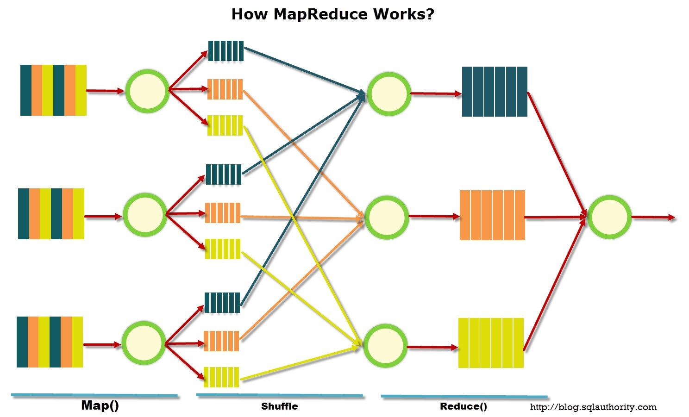
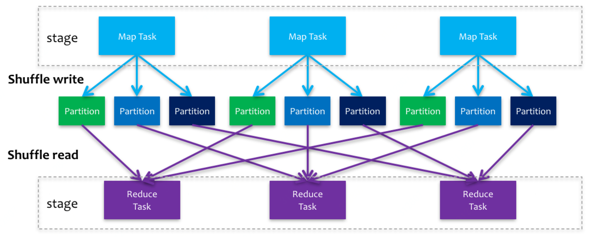

> 本系列参考了Github上诸多开源的学习资料：  
>
> [Snailclimb/JavaGuide](https://github.com/Snailclimb/JavaGuide)  
> [CyC2018/CS-Notes](https://github.com/CyC2018/CS-Notes)  
> [taizilongxu/interview_python](https://github.com/taizilongxu/interview_python)  
> [zpoint/CPython-Internals](https://github.com/zpoint/CPython-Internals)  
> [donnemartin/system-design-primer](https://github.com/donnemartin/system-design-primer)  

# Hadoop

由于Spark的某些功能和模式都深度依赖于Hadoop，因此需要先对Hadoop提供的组件有一些基础的了解。

## 功能组件

### HDFS（分布式存储）

[HDFS（Hadoop Distributed File System）](http://hadoop.apache.org/docs/current/hadoop-project-dist/hadoop-hdfs/HdfsDesign.html)是Hadoop下的分布式文件系统，具有高容错、高吞吐量等特性，可以部署在低成本的硬件上。HDFS 遵循主/从架构，由单个 NameNode（NN） 和多个 DataNode（DN） 组成：


**NameNode（NN）**：负责执行有关文件系统命名空间的操作，例如打开，关闭、重命名文件和目录等。它同时还负责集群元数据的存储，记录着文件中各个数据块的位置信息。

**DataNode（DN）**：负责提供来自文件系统客户端的读写请求，执行块的创建，删除等操作。其中每个文件会被分成一系列块，每个块由多个副本来保证容错率，块的大小和副本数量可以自行配置。

在写入时，客户端访问NN并告知需要分片的块大小和副本数量，NN返回存放文件的各个DN的地址，客户端开始依次上传文件块，各个DN拿到文件块之后还会自动执行复制操作，当完成所有块之后，NN会更新文件信息并标记文件上传完毕。在读取时，客户端告知NN需要读取的文件名，NN返回存放文件的各个DN地址和所有块信息，客户端并发地从DN中获取块并拼接成原文件。

#### S3和HDFS

[Amazon S3](https://docs.aws.amazon.com/zh_cn/AmazonS3/latest/dev/Introduction.html)是当下非常流行的一种对象存储工具，它由亚马逊开发并提供支持，另外大多数云服务提供商提供的对象存储服务都会实现一份S3的API协议，因此它逐渐成为了一个通用的标准。由于它是一个对象存储工具，本质上是对Key-Value的存储，而HDFS本质上是一种文件系统，这是这两种存储之间本质的不同。

因为S3有亚马逊稳定的支持并且理论上来说可以无限扩展存储空间，因此被广泛采用，现在Hadoop官方也已经支持了对S3进行存取，并且这种对象存储很容易在各个云服务商之间进行迁移。不过对于某些计算框架，比如MapReduce，在计算时中间数据还是必须存储在HDFS上，另外中间数据存储在S3上也会有比较大的性能问题，因此一般会在输入输出时接入S3。

在某些场景下可能要用到私有化部署，部分敏感数据不允许存储到云上，此时可以使用[minio](https://docs.min.io/cn/minio-quickstart-guide.html)作为私有云的对象存储服务，它也支持使用S3一样的API来使用，可以方便地对接到Hadoop生态系统上。

### MapReduce（分布式计算）

[MapReduce](http://hadoop.apache.org/docs/current/hadoop-mapreduce-client/hadoop-mapreduce-client-core/MapReduceTutorial.html)是一个分布式计算框架，编写好的程序可以提交到Hadoop集群上用于并行处理大规模的数据集，这种分布式框架主要由三个基本的步骤组成：



- 首先系统将输入的数据拆分成独立的块，将这些块交给编写好的Map函数进行处理
- 之后系统会根据返回的内容进行排序，这个阶段由系统操作，被称为Shuffle（使用类MapReduce的框架基本都包含这一步骤）
- 排好序的数据再交给编写好的Reduce函数进行处理，最后集合结果，进行输出

MapReduce是一种专门处理Key-Value的计算框架，因此所有的Map和Reduce函数都以Key和Value作为输入，Shuffle阶段会根据Key来进行排序，另外Hadoop也支持使用标准IO接入其他语言的Map和Reduce函数。在使用这种框架时所有的中间数据都必须落到磁盘，并且每一个步骤必须完全支持完毕才可以执行下一个步骤，比如必须对所有的数据块都执行了Map函数之后才会进入Shuffle阶段，这些问题都导致了MapReduce框架性能非常受限。

### YARN（分布式调度）

[YARN（Yet Another Resource Negotiator）](http://hadoop.apache.org/docs/current/hadoop-yarn/hadoop-yarn-site/YARN.html)是hadoop2.0引入的集群资源管理系统，用户可以将各种服务框架部署在YARN上，由YARN进行统一地管理和资源分配。YARN的诞生让Hadoop的资源管理成为一种事实上的标准，许多处理引擎都开始依赖YARN。


#### Container

在YARN中最基础的概念应该是Container，它是对资源（比如内存、CPU、网络和磁盘等）的一种抽象，和Docker中的Container概念比较类似，容器会被NodeManager进行启动、管理和监控，由ResourceManager负责调度。

#### ResourceManager

ResourceManager（RM）是负责资源调度的组件，整个YARN只有一个RM，它包含了两个基本组件：

- Scheduler负责集群中Application的调度，实际就是为应用分配资源，资源以Container的形式进行分配
- ApplicationManager负责对应用进行管理，当客户端提交一个任务到YARN之后，会由Scheduler分配对应的Container，然后由ApplicationManager拉起一个ApplicationMaster进程并进行管理

在YARN中调度器是插件化的，也就是说可以自己开发调度器并对特定场景进行优化，这是一个非常深入的主题，笔者也没有接触过，可以参考博客：[美团 - YARN调度性能优化实践](https://tech.meituan.com/2019/08/01/hadoop-yarn-scheduling-performance-optimization-practice.html)。

#### ApplicationMaster

ApplicationMaster由ResourceManager中的ApplicationManager负责启动和管理（监控、失败重启等），那么对于客户端提交的一个具体任务的进度和状态，由ApplicationMaster负责监控和管理。对于比较小的任务，可能只需要一个ApplicationMaster去执行就可以了，对于更大的任务ApplicationMaster还会再向RM申请资源，获得新的Continer来运行。

#### NodeManager

NodeManager是YARN在每个实例上的监控代理，它负责管理自己的容器，并且监控它们的资源使用情况，以及向RM提供心跳包来监控整个集群的资源使用情况。

#### 扩容和容错

了解完YARN的构造之后，应该就知道它的扩容是相对容易的，如果加入了新的机器，在上面运行NodeManager之后，加入到现有集群的RM中，就可以实现扩容，并且这种扩容完全不影响现有调度。

容错的话分为两种情况：

- ResourceManager宕机，早先的版本这是一个单点故障，但是新版本中已经使用了Zookeeper实现了高可用，具体可以参考官方文档：[ResourceManager High Availability](https://hadoop.apache.org/docs/current/hadoop-yarn/hadoop-yarn-site/ResourceManagerHA.html)，本质就是启动两个RM，并利用Zookeeper实现故障转移
- NodeManager宕机，这种情况危害要小得多，由于每个NodeManager都有心跳包，当RM检测到心跳包超时了，那么就会将这个NodeManager实例上运行的所有Container标记为Killed状态，并且广播给所有的NodeManager，如果短时间后NodeManager恢复了，就可以撤销标记，但是还是有可能会导致任务重跑

## Zookeeper

[Zookeeper](https://zh.wikipedia.org/wiki/Apache_ZooKeeper)曾经是Hadoop的一部分，但是因为太过优秀，现在已经是一个独立的项目了，它是一个分布式协议的框架，专门用来解决分布式环境下的一致性问题。

### 使用场景

#### 基本功能

Zookeeper提供了一个类似于Linux文件系统的树形结构，该树形结构中的每个节点称为znode。每一个znode可以保存一个值，从路径的角度来看，这就是一个Key-Value结构，它们也拥有上下级结构，删除上层节点会连带删除下层节点，节点有两个维度：

- 持久节点：一旦创建就永久保存，即使集群重启；临时节点：创建它的Session结束时就会被自动删除
- 非顺序节点：多个客户端创建非顺序节点只能有一个创建成功；顺序节点：创建出的节点带有序号，多个客户端创建都能成功只是序号不同

上面两个维度可以相互组合，也就是说一共有四种节点类型。另外Zookeeper还提供了订阅数据变化、订阅子节点变化等订阅功能，客户端可以在数据变化时收到通知，从而立刻做出反应。

#### 领导选举

简单介绍一个通过Zookeeper实现领导选举的方案：

- 所有实例都创建同一个临时非顺序节点，创建成功的实例成为领导
- 所有实例监听节点状态，一旦节点被删除，立刻尝试再次创建
- 当领导实例宕机，由于是临时节点，该节点会被删除，可以立刻通知到其他节点

#### 分布式锁

解决方案和领导选举类似，也可以通过争抢特定节点实现，但是对于实例特别多的情况，广播起来可能会有性能问题，可以做出改进：

- 所有实例都创建同一个临时顺序节点，创建都可以成功，由序号最小的实例拿到锁
- 每个实例都监听正好数字比自己小的节点，一旦前序节点被删除，那么自己获得锁
- 宕机情况和之前的方案一致，前序节点会被删除，就可以拿到锁了

#### 消息队列

Zookeeper本身并不是一个消息队列框架，但是也可以作为消息队列来使用，如果手上没有随时可用的消息队列且对性能要求不高的话，可以考虑以下方案：

- 创建一个持久非顺序节点作为消息队列
- 生产者在消息队列下面新建持久顺序节点作为消息，内容就放消息的内容
- 消费者从消息队列下面获取子节点，如果没有那么进行子节点监听，有的话就拿到最小的消息节点并删除，同时处理消息

### 核心设计

TODO

# Spark

Spark和MapReduce一样，也是一种分布式计算框架，它对MapReduce的几点问题做出了改进：Spark现在支持更复杂的DAG图任务，并且可以有效利用内存，并不是所有的数据都要走硬盘IO，在运行效率上要比MapReduce快得多。

## RDD

[RDD（Resilient Distributed Datasets）](https://zh.wikipedia.org/wiki/Spark_RDD)弹性分布式数据集是Spark对于数据最基本的抽象，它是一种不可变的数据集合，每一个RDD都是从数据源或者从另一个RDD通过转换操作而来。在Spark2.0中，对RDD进行了更高层的封装，形成了DataFrame和DataSet两个API。

一个RDD由一个或者多个分区（Partitions）组成，对于RDD来说，每个分区会被一个计算任务所处理，用户可以在创建RDD时指定其分区个数，如果没有指定，则默认采用程序所分配到的CPU的核心数。

### 创建、操作与缓存

**创建**

创建RDD一般通过读取外部数据源实现，也可以直接通过内存中的数据来创建。在实际业务中，一般都会从类S3这样的对象存储中进行读取，最后的结果保存到各类数据库中。

**操作**

Spark将RDD的基本操作定义为两种类别，分别是：

- Transformations，从现有数据集中执行转化函数创建新的数据集
- Actions，在数据集上运行函数并获取返回结果

在Spark中，Transformations本身不会被主动执行，只有在对应的Actions执行时，才会执行，这和MapReduce有很大的区别，这种惰性计算更类似于函数式编程中的惰性求值。另外，RDD内部也会保存相互之间的依赖关系，当部分数据丢失后，可以利用这种依赖关系重新计算丢失部分的数据，而不需要对RDD内所有的分区进行重新计算。

**缓存**

Spark非常快的一个关键原因在于它有缓存功能，缓存之后如果后面的操作还用到了该数据集，那么就可以直接从缓存中获取，而不需要再从头进行计算。一般来说缓存分为：内存、硬盘和JVM缓存，可以根据不同的需要进行缓存设置，在Sprak可以使用persist和cache函数来对数据集进行缓存，其中cache就等价于persist(StorageLevel.MEMORY_ONLY)。

### 理解Shuffle

在MapReduce中，Shuffle的步骤是Hadoop框架将Map函数的输出整体进行排序，从而可以交给Reduce函数执行的过程。在这一过程有两个缺陷：一是要求Map函数的输出是可排序的，第二对于某些操作并不需要排序，全排序的策略会影响性能。



因此在Spark中的Shuffle步骤有所不同，在Spark中通常不会进行跨分区操作，但是遇到reduceByKey等转换时，就必须从所有的分区读取数据并查找所有键对应的值，然后汇总在一起以计算每个键的最终结果，这就是Spark中的Shuffle。在Spark的版本变迁中，Shuffle也经历了多个版本的迭代，不过如果不使用排序的方式进行Shuffle的话，会用到HashMap进行去重，这样的问题是很容易导致OOM，因此最后还是选择了[优化之后的Sort Shuffle](https://zhuanlan.zhihu.com/p/67061627)。

但是不管在哪Shuffle的操作影响都很大，因为它涉及到大量的磁盘IO和网络IO操作，因此使用时要非常注意，以下操作可能导致Shuffle：

- 涉及到重新分区操作：如repartition和coalesce
- 涉及到ByKey的操作：如groupByKey和reduceByKey，但countByKey除外
- 涉及到Join的操作：如cogroup和join。

**宽依赖和窄依赖**

窄依赖指的是父RDD的每个分区只被一个子RDD分区引用，此时子RDD分区只对应常数个父RDD分区；宽依赖指的是每个父RDD分区都可能被多个子RDD分区引用，子RDD分区通常会对应所有的父RDD分区。在窄依赖的情况下进行RDD的变换操作时，是不需要进行Shuffle的，比如对于两个根据同样Key进行分区的父RDD进行join操作，也不会导致Shuffle，同样的还有map、filter等操作。

窄依赖在数据重算时，还有更多的优势：由于它只依赖部分父RDD，因此只需要重新计算一部分父RDD的结果即可，而宽依赖通常需要重算所有的父RDD，因此窄依赖在重算时会有更高的效率。

### PageRank案例

[PageRank](https://zh.wikipedia.org/zh-hk/PageRank)是一个用于计算网页权重的算法，它根据网页的应用关系进行迭代计算，最终将网页的权重趋于稳定值，在这其中需要使用一个For循环进行迭代，迭代中使用join操作变换RDD，其中的核心代码可能长这样：

```scala
for (i <- 1 to iters) {
  val contribs = links.join(ranks).values.flatMap {
    case (urls, rank) =>
      val size = urls.size
      urls.map(url => (url, rank / size))
  }
  ranks = contribs.reduceByKey(_ + _).mapValues(0.15 + 0.85 * _)
}
```

这个案例中的关键在于对计算的优化，包含了按照一定的迭代数量进行缓存和对数据倾斜的优化，具体可以参考博客：[从PageRank谈Spark应用程序调优](http://sharkdtu.com/posts/spark-app-optimize.html)。

### 数据倾斜

数据倾斜几乎是在做Spark数据处理时一定会遇到的，而解决方案往往要根据实际使用的算子和处理的数据来决定，笔者之前遇到的情况基本都是在GroupBy的时候，因为数据不平衡导致的（比如和地域有关的，绝大部分数据都是北京上海的）。一开始使用增大并行度的方案，最后改成了两段式聚合，取得了比较好的效果，进阶版的可以看美团的博客：[美团 - Spark性能优化指南](https://tech.meituan.com/2016/05/12/spark-tuning-pro.html)。

## 内核解析

### 核心组件

在看核心组件之前，可以先来看看提交一个Spark任务有哪些主要的配置项：

> driver-cores —— driver使用内核数，默认为1
> driver-memory —— driver内存大小，默认512M
> executor-cores —— 每个executor使用的内核数，默认为1，官方建议2-5个
> num-executors —— 启动executors的数量，默认为2
> executor-memory —— executor内存大小，默认1G


可以看到配置的参数中最主要涉及两个模块：

**Driver**：运行程序的main方法，创建SparkContext对象，另外还负责：将用户程序转化成Job、在Executor之间调度任务、跟踪Executor的执行情况等。

**Executor**：每个Executor都是一个JVM进程，负责在Spark中执行具体的任务，并向Driver汇报任务进度，由于它们都运行在不同的JVM进程中，它们之间是相互独立的也不能直接共享数据。

### 任务运行的基本流程

Spark有好几种不同的[集群运行模式](https://spark.apache.org/docs/latest/cluster-overview.html)，它们都建立在不同的底层之上，比如：Standalone（Spark自己提供的调度方案）、YARN集群、Mesos集群和Kubernetes集群，不过在不同的集群上，许多模块和概念的含义是相同的：

- Application：用户提交的Spark程序，在集群中由Driver和数个Executor构成
- Cluster Manager：集群的资源管理器，在不同的集群中不同，比如：在YARN中就是ResourceManager
- Worker Node：在集群中运行Application代码的节点
- Job：在对RDD进行Actions操作时触发，Job之间按照顺序执行
- Stage：根据RDD的关系将Job切分成Stage，各个Stage之间按照顺序执行
- Task：Spark中的执行单元，在RDD执行计算时，每个分区都会有一个对应的Task
- DAGScheduler：根据Job构建DAG，并提交Task给TaskScheduler
- TaskScheduler：保存Task并将其分配给Excutor运行

在不同的集群上由于架构不同，运行的方式会有一些区别，但是大体都包含这几个步骤：

1. 代码提交到Driver，生成SparkContext，并交给资源管理器分配资源
2. 资源管理器指定Worker Node启动Executor进程，每个Executor发送心跳给Driver
3. 资源分配完毕后SparkContex结束初始化，然后执行代码，遇到Actions算子时触发Job
4. Driver将Job传递给DAGScheduler，生成DAG并划分Stage，再根据并行度生成Task，分发给Executor
5. Executor接收到Task之后，会执行Task中的代码，作用在RDD分区上
6. 当所有的Task都执行完毕之后，整个Application执行完成，SparkContext生命周期结束

在不同平台上的运行流程可以参考博客：[掘金 - Spark内核解析](https://juejin.cn/post/6844904047011430407)。

# Flink

TODO

# Kafka

TODO

# Kubernates

TODO