# SR-IOV

一般来说，在unraid中使用虚拟机可以有三种网络使用方式：直通网卡，虚拟网卡和SR-IOV，前两种比较常见，而第三种就比较少见了，因为第三种还需要硬件的支持，是一种基于pice的硬件虚拟化技术：[Overview of Single Root I/O Virtualization (SR-IOV)](https://docs.microsoft.com/en-us/windows-hardware/drivers/network/overview-of-single-root-i-o-virtualization--sr-iov-)。

它由硬件提供底层支持，因此对于网卡来说性能和CPU占用都好于虚拟网卡，但是比直通网卡略逊一筹。其中pcie硬件成为PF，被它虚拟出来的硬件称为VF，另外由于这是一种pcie虚拟化技术，显卡也是适用的，只不过对于显卡的支持并不好，而网卡的SR-IOV在服务器上是很常见的，已经很成熟了。

在中文社区也有关于SR-IOV的讨论，但是我在打开的过程中遇到了很多问题，中文博客中都没有提到，最后是找到了unraid官方论坛的教程：[HOW TO: USING SR-IOV IN UNRAID WITH 1GB/10GB/40GB NETWORK INTERFACE CARDS (NICS)](https://forums.unraid.net/topic/103323-how-to-using-sr-iov-in-unraid-with-1gb10gb40gb-network-interface-cards-nics/)，终于解决了我的疑问。

## 确保硬件支持

既然是一种硬件虚拟化技术，首先需要确保硬件是支持虚拟化的，这里的硬件包括了：CPU、主板以及网卡，三者缺一不可。在上面提到的教程里面，详细讲了选择硬件的要点，一般来说最新几代的CPU和主板都是支持的，不放心的话可以去官网查看，当然如果已经买了就不用多想了，支持就是支持，不支持只能黄硬件了。另外主要的问题是网卡，一般来说纯血的洋垃圾万兆网卡都是有这个功能的，但是得小心国内组装的新网卡，它们虽然全新但是可能阉割掉了网卡芯片的SR-IOV功能。

在unraid中，可以通过系统信息查看CPU和主板是不是支持虚拟化和硬件直通：

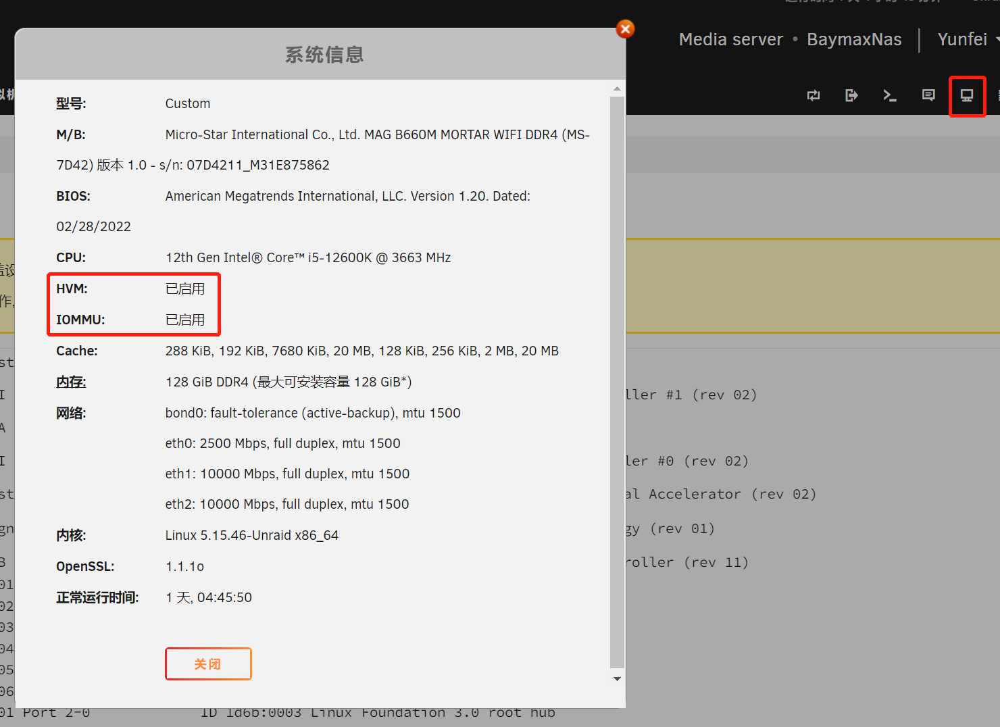

另外可以把鼠标悬停在想要使用SR-IOV的网口上，查看这个网口是否支持SR-IOV技术，下面的图可以看出我买的乐扩2.5G网卡没有SR-IOV支持，但是洋垃圾HP530是有的：

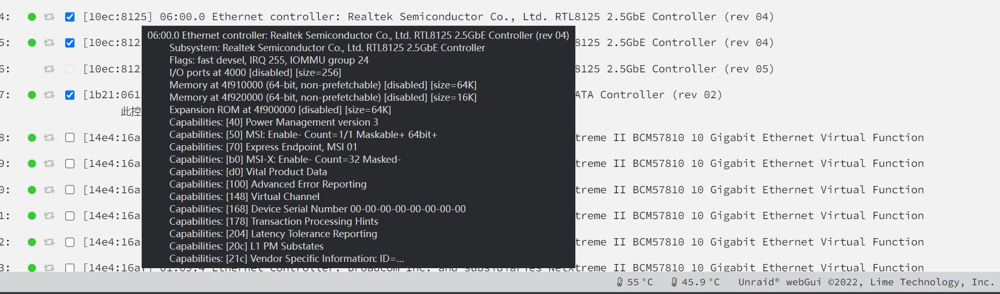

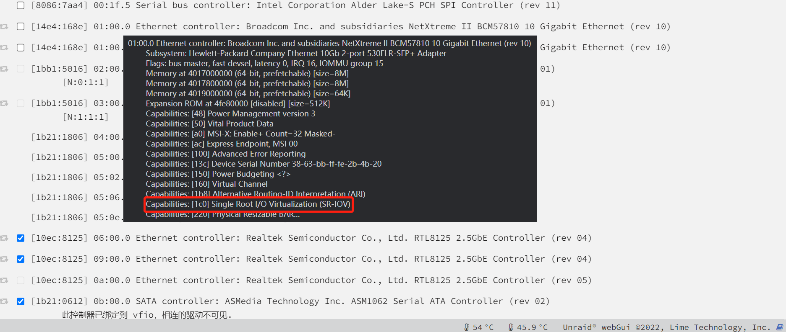

## 如何开启SR-IOV

首先，国内博客通常缺少了两个步骤，这也是我之前没能成功打开SR-IOV的关键：

1. 某些主板需要在BIOS进行设置，一个是可能需要打开主板的SR-IOV功能，另外一个是针对可以打开SR-IOV的设备，通常在BIOS的高级选项中，会出现对应的设备，当我的网卡插到系统上时，就出现了两个额外的网口选项（我的万兆网卡是两个光口），里面可以设置每个网口最多能打开多少个VF
2. 另外，需要打开SR-IOV的网口不能直通，它的PF必须在unraid系统中，并且**端口需要处于打开状态**，否则修改直通文件时，可能会遇到权限不对、参数不对等各种奇怪的报错，可以在unraid的网络设置中，查看网口的开关情况：

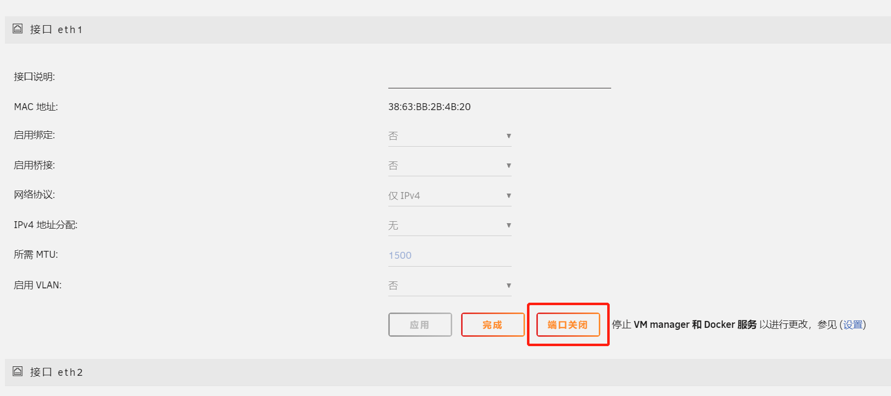

上图中可以通过端口打开/关闭来打开和关闭端口，一般来说插着网线的话会自动打开，但是如果使用SR-IOV的话还是建议在go脚本中加入相关代码来保证在开机时端口就处于打开状态。

### 在unraid启动脚本中设置参数

首先通过 主界面 -> Flash -> Syslinux配置 找到unraid的启动设置，在配置中加入：```intel_iommu=pt```，这是仅针对intel cpu的，如果是amd的cpu则把intel换成amd即可，如果还不行可以加入更通用的设置：```iommu=on```，一般来说跟专用的配置项会对unraid的性能产生更小的影响。国内很多博客里面都是非常长的一串代码，加入时务必小心，可能导致unraid无法开机等各种bug，就需要把U盘插到其他电脑上来修改配置了，如果仅需要使用SR-IOV的话，加入这项配置即可。

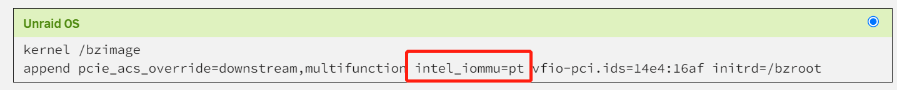

### 使用命令行打开SR-IOV

首先通过命令查看需要打开的网口最大支持多少个VF：```cat /sys/bus/pci/devices/0000:01:00.1/sriov_totalvfs```，需要把devices后面的id换成想要打开SR-IOV的网口，我这里值是64（我的系统可以在BIOS中修改这个值）：

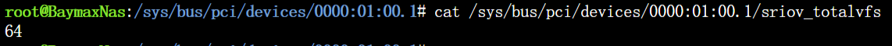

直接修改同一个目录下面的sriov_numvfs文件来打开SR-IOV：```echo 8 > /sys/bus/pci/devices/0000:01:00.1/sriov_numvfs```，把数字换成自己想要打开的虚拟网口数量即可，当然这个数量不能超过系统的限制，一般来说如果没有任何报错的话，说明已经成功了：

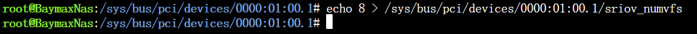

通过lspci命令可以再次查看打开SR-IOV之后的pcie设备情况：

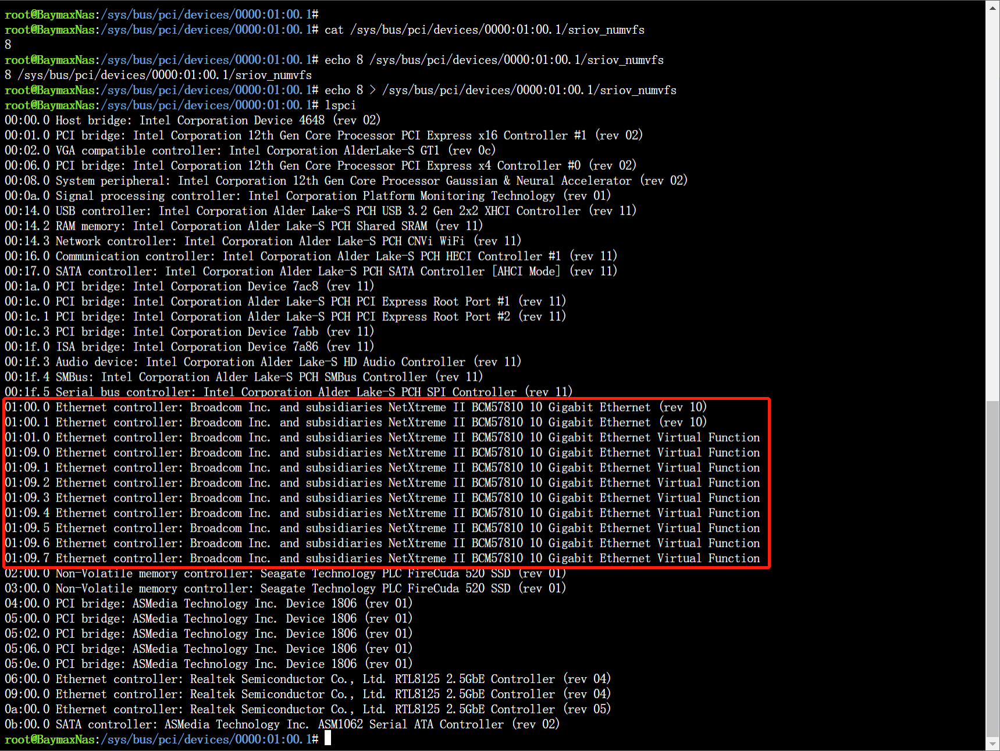

可以看到我们的系统里面多了一堆后缀带着Virtual Function的网口，大功告成！我们已经对这个网口打开了SR-IOV，但是还是需要一些额外步骤才能把它直通到我们的虚拟机中去。最关键的问题在于：打开VF的过程是单次且动态的，因此必须在系统启动时就设定好，否则每次重启unraid都有可能失效，另外在我的机器上这些VF的mac地址都是一串0，可能会被一些系统当作僵尸，也需要修改。

### 修改脚本并直通网卡

首先由于这些VF都是动态的，因此使用系统自带的屏蔽插件并不能很好地把这些网口从unraid系统中屏蔽掉，因此还需要在Flash中修改启动参数，加入对网口的屏蔽，在系统中找到这些网口的地址信息，通常VF都在同一个地址段内：

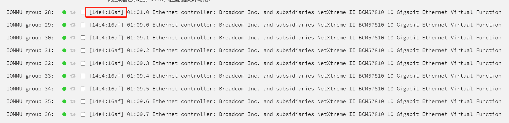

在启动参数中加入```vfio-pci.ids=14e4:16af```命令来对它们进行屏蔽，从而能够直通给虚拟机：

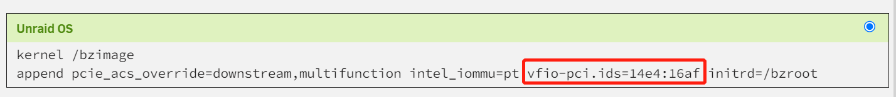

为了方便我们使用，在```/boot/config/go```脚本中加入三种命令，分别是：打开网口、设置VF数量、设置对应VF的mac地址，在我的系统里是这一段代码（代码中的地址、参数和mac都需要根据实际情况修改）：

```bash
# add VFs
ifconfig eth1 up
ifconfig eth2 up

echo 1 > /sys/bus/pci/devices/0000:01:00.0/sriov_numvfs
echo 8 > /sys/bus/pci/devices/0000:01:00.1/sriov_numvfs

ip link set eth1 vf 0 mac bc:05:78:10:00:00
ip link set eth2 vf 0 mac bc:05:78:10:01:00
ip link set eth2 vf 1 mac bc:05:78:10:01:01
ip link set eth2 vf 2 mac bc:05:78:10:01:02
ip link set eth2 vf 3 mac bc:05:78:10:01:03
ip link set eth2 vf 4 mac bc:05:78:10:01:04
ip link set eth2 vf 5 mac bc:05:78:10:01:05
ip link set eth2 vf 6 mac bc:05:78:10:01:06
ip link set eth2 vf 7 mac bc:05:78:10:01:07
```

完成以后，重启unraid，享受新的网卡吧，如果碰巧买的就是支持SR-IOV的网卡，就可以白嫖一波性能了！

## 最后的坑 —— 虚拟机支持

其实一般来说，支持网卡本身的，都可以支持网卡的VF，因为这已经是服务器上非常成熟的技术了。但是，依旧有系统不支持这个功能，我直通了一个VF给TrueNas虚拟机，希望组一个ZFS系统。但是一开始下载的是TrueNas Core版本，死活安不上网卡，后面查了各种信息才发现是TrueNas Core使用的FreeBSD内核不支持我网卡的VF，最后换成Linux内核的FreeNas就完全没有任何问题了。

由于家里的内网是2.5G布网，还没有10G网口的台式机，用笔记本的2.5G口测试随便都能打满2.5G的网速，折腾了一番总算有了满意的结果：

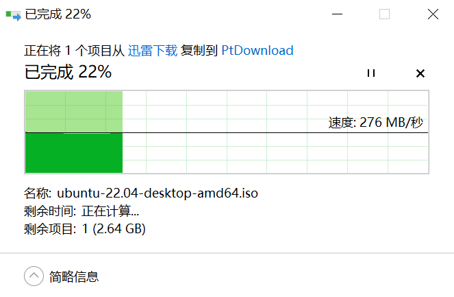